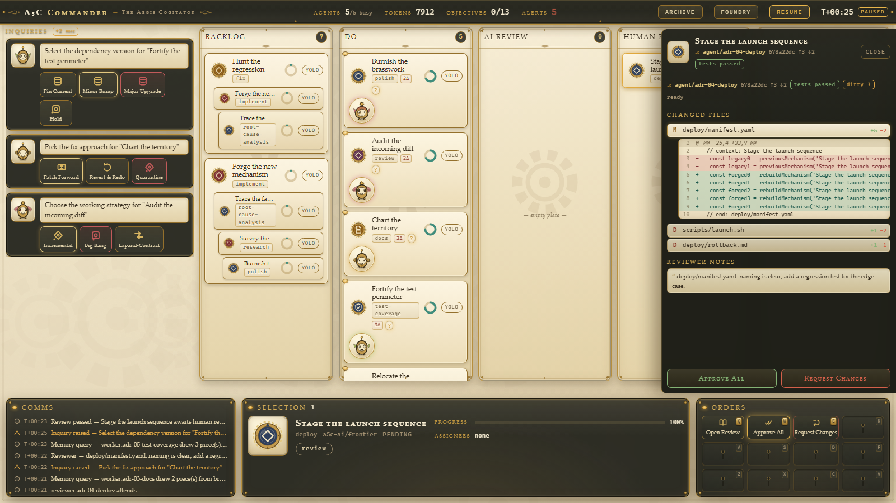

# A5C Commander — The Aegis Cogitator

A steampunk **kanban board** for orchestrating fleets of AI agents. Tasks are brass-framed parchment cards moving across five lanes — **Backlog → Do → AI Review → Human Review → Approved** — with subtask stacks fanned beneath their parents. You drag a card into DO and a clockwork-creature worker agent materializes on it (agents spawn on demand and despawn when their card moves on; there is no idle fleet). Work completes and the card **auto-glides** to AI Review with a FLIP-style animation; reviewers spawn, render a verdict, and the card either bounces back to DO with feedback, lands in HUMAN REVIEW for you, or — if its **yolo toggle** is on — skips you entirely and routes straight to APPROVED, where an integration agent visibly rebases and merges it to a brass-sealed terminal state. Agents ask questions through the **Inquiry Dock**, a chat-like stack of multi-option breakpoint bubbles (each option an engraved icon + caption). Human review happens in a side **diff panel** (changed files, verdigris/garnet inline diffs, reviewer notes, Approve All / Request Changes). An **Archive** overlay visualizes the shared memory graph the agents query and write back to. v3 runs entirely on a mocked, seeded, deterministic backend — but every frame mirrors the real gateway/kradle/babysitter contracts, so the mock swaps for a live backend without touching UI code. (The free-roam RTS map of v1 is gone; the board superseded it.)



## Quickstart

```bash
cd apps/commander
npm install
npm run dev          # Vite dev server on http://localhost:5199 (strictPort)
```

| Command | What it does |
|---|---|
| `npm run dev` | Dev server on port 5199 |
| `npm run build` | `tsc --noEmit` + `vite build` |
| `npm run preview` | Serve the production build |
| `npm run typecheck` | TypeScript strict check, no emit |
| `npm run test` | Vitest unit tests (`vitest run`) |
| `npm run test:e2e` | Playwright e2e (chromium; auto-starts the dev server) |

One-time before e2e: `npx playwright install chromium`.

URL param: `?seed=<n>` seeds the simulation PRNG (mulberry32). Default seed is `42`. Same seed, same board.

## Concept mapping

| Kanban concept | Orchestration concept | Backing contract |
|---|---|---|
| Card | Task / dispatch | `CommanderTask` (kradle `AgentDispatchRun`-shaped, `src/contracts/kradle-resources.ts`) |
| Subtask stack | Task hierarchy | `metadata.labels['kradle.a5c.ai/parent-task']` linkage |
| Column | Task lifecycle stage | board column ids `backlog`/`do`/`ai-review`/`human-review`/`approved` (`src/game/board.ts`) |
| Agent avatar on a card | Agent session, spawned on demand | `SessionEntry` + `RunEntry`, `session.start` / `session.message` `ClientFrame`s (gateway protocol v1) |
| Card auto-move | Run lifecycle transition | sim-driven; rendered via FLIP animation with `is-moving` class |
| Yolo toggle | Skip-human-review routing | sim verb `setYolo` (sim-local; see protocol gaps below) |
| Inquiry Dock bubble | Breakpoint / hook request with options | `hook.request` frame with `InquiryPayload` (question + 2–5 options); answered via `hook.decision` + `optionId` |
| Human-review panel | Write-back change approval | `AgentApproval` + patch artifact (`PatchArtifact` shapes, `src/contracts/kradle-workspace.ts`) |
| Archive overlay (`M`) | Shared agent memory ("the Company Brain") | kradle memory resources: `AgentMemoryRepository`/`AgentMemorySource`/`AgentMemoryQuery`/`AgentMemoryUpdate` + ontology graph records (`src/contracts/kradle-memory.ts`) |
| Inspector Process tab | Babysitter run observation | `JournalEvent` envelope, event-type union, `ObservedRunState`, `pendingEffectsByKind` (`src/contracts/babysitter-run.ts`) |

Task kinds map to worker adapters: implement/fix/migrate → claude-code, review → codex, root-cause-analysis/test-coverage → pi, docs/research → gemini-cli, polish/deploy → codex. Reviewer agents always use a different adapter than the worker.

## Controls

### Pointer

| Input | Action |
|---|---|
| Click card | Select (SelectionPanel + contextual CommandCard) |
| Double-click card / agent avatar | Open the Inspector (Transcript / Process / Workspace tabs) |
| Drag card (pointer-based, no DnD library) | Legal user moves only: **backlog → do** (start work), **backlog reorder**, **human-review → do / ai-review / approved** (verdict by drag). All other movement is automatic. Legal drop lanes glow amber; invalid drops snap back. Parent cards drag their whole stack; child mini-cards and merged cards are not draggable. |
| Click card in HUMAN REVIEW | Opens the review side panel |

### Keyboard (`src/game/input.ts`)

| Input | Action |
|---|---|
| `Esc` | Cascade: foundry/archive → review panel → steer modal → inspector → clear selection (modals close without clearing the selection) |
| `Space` (tap) | Jump to the latest alert's card and pulse the Inquiry Dock |
| `M` | Toggle the Archive overlay (only when no other modal is open) |
| `N` | Toggle the Foundry — Commission Task is its only tab; agents are never created manually under v3 |
| `Q W E R / A S D F / Z X C V` | Command card hotkeys, row-major onto the 3×4 grid (suppressed while a modal is open; modified letters stay with the browser) |
| `Ctrl+Enter` (in the steer modal) | Transmit; `Esc` closes without clearing the draft |

All keys are inert while typing in an input. Digits and the v1 camera/marquee/control-group grammar are unbound — the map era is retired.

## Architecture

```
src/
  contracts/    Mirrored wire types — adapter-events.ts (@a5c-ai/comm-adapter events),
                gateway-protocol.ts (gateway WS protocol v1 + REST entries),
                kradle-resources.ts (kradle CRDs; CommanderTask = AgentDispatchRun shape),
                kradle-memory.ts (memory CRDs + ontology graph, queryGraph results),
                kradle-workspace.ts (workspace status, patch artifacts, AgentApproval),
                babysitter-run.ts (journal events, ObservedRunState, pendingEffectsByKind)
  backend/      CommanderBackend interface (types.ts) + mock/ — seeded PRNG,
                scenario seeding, tick-driven kanban Simulation, MockBackend transport
  microagent/   Microagent interface (contextual CommandSpecs + deterministic
                procedural IconSpecs) + rule-based mock — commandGen, iconGen,
                optionIconGen (engraved glyphs for inquiry options)
  game/         Zustand store (single store), board logic + drag legality (board.ts),
                input grammar (input.ts), command/hotkey arbiter (commands.ts),
                inquiries, review, diff, memory layout, alert queue, views
  components/   WarRoom shell, board/ (KanbanBoard: lanes, cards, stacks, pointer DnD,
                FLIP moves), hud/ (top bar, selection panel, command card, ticker,
                ChatDock = inquiry dock), panels/ (inspector, review panel, foundry,
                memory overlay, steer modal, workspace view)
```

Data flow: the `MockBackend` wraps a deterministic `Simulation` ticking every 250 ms. Each tick emits `ServerFrame`s (`run.event` frames carrying mirrored adapter events plus `hook.request` inquiries); `bindBackendToStore` buffers the frames and flushes them together with the sim views in **one store commit per tick batch**; React re-renders from that single commit. No `Date.now()`, no `Math.random()` — the sim clock and one seeded PRNG are the only sources of time and chance.

### Swapping the mock for the real backend

The UI talks only to the `CommanderBackend` interface (`src/backend/types.ts`). To go live, implement it over a WebSocket speaking **gateway protocol v1** — the `ClientFrame`/`ServerFrame` unions in `src/contracts/gateway-protocol.ts` mirror `@a5c-ai/adapters-gateway` `protocol/v1.ts`, and `listAgents/listSessions/listRuns` map to the gateway REST surface. Then point the `Microagent` interface (`src/microagent/types.ts`) at a real LLM-backed generator for commands, card-seal icons, and inquiry-option icons. UI code does not change.

Documented **v1-protocol gaps** (sim-local extensions to raise upstream):

- **Board verbs** — protocol v1 has no board frames, so `moveCard` / `setYolo` / `createTask` ride a sim-local client command channel exposed on the sim API rather than `ClientFrame`s.
- **`hook.decision.optionId`** — the multi-option inquiry answer extends `hook.decision` with the chosen option id; the legacy approve/deny is the degenerate 2-option case.

Other wiring targets: the Archive maps to kradle-sdk `queryGraph()` / `AgentMemoryQuery` against real memory repositories; the Inspector Process tab maps to babysitter journal observation (`.a5c/runs/<runId>/journal/`); the human-review panel maps to `AgentApproval` + patch-artifact write-back.

## Test hooks API

Exposed on `window.__commander` before `connect()`, so a pause-on-boot poller wins the race against the first 250 ms auto-tick:

```ts
window.__commander = {
  sim: {
    pause(), resume(), tick(n), seed,            // drive sim time manually
    moveCard(taskId, column),                    // board verbs — the same
    setYolo(taskId, on),                         // deterministic channel
    createTask({ taskKind, title?, parentId? }), // user drags use
    answerInquiry(hookRequestId, optionId),
  },
  store,     // the Zustand store (getState())
  version,   // COMMANDER_VERSION
};
```

`data-testid` contract (summary): `kanban-board`, `kanban-col-<id>`, `card-<taskId>`, `card-yolo-<taskId>`, `card-agent-<unitId>`, `chat-dock`, `inquiry-<hookRequestId>`, `inquiry-opt-<hookRequestId>-<optionId>`, `review-panel`, `review-approve-all`, `ws-file-<index>`, `inspector` + `inspector-tab-transcript|process|workspace`, `memory-overlay` / `memory-silo-<name>` / `memory-node-<id>` / `memory-filter-<kind>`, `foundry`, `steer-modal`, `selection-panel`, `command-card` / `cmd-<commandId>`, `event-ticker` / `ticker-item`, `topbar-*`.

Determinism guarantee: same seed ⇒ identical scenario, identical frame streams, byte-identical procedural icons; **same seed + same verb sequence ⇒ identical board** (user drags are sim verbs too). `tick(20)` twice equals `tick(40)` once; pause blocks auto-ticking while manual `tick()` still advances. The e2e suites ride this: boot `/?seed=42`, pause, advance with `tick(n)` — no timing-based waits. SVG census rule: zero `<line>`/`<polyline>` elements document-wide, always (all curves are `<path>`).

### Retired v1 e2e suite

`e2e/retired-v1/` holds the v1 specs (boot, camera, selection, commands, alerts, stream) that covered the RTS map surfaces — camera pan/zoom, minimap, marquee selection, right-click dispatch/rally, control groups, idle-unit cycling. V3 retired those surfaces (the kanban board superseded the world map), so the suite is excluded via `testIgnore: ['**/retired-v1/**']` in `playwright.config.ts` and kept for reference. Still-valid v1 behaviors are covered by the active `v2-*.spec.ts` / `v3-*.spec.ts` suites.

## Workspace note

This app lives in `apps/` and is deliberately **not** part of the root npm workspaces (the root glob is `packages/*`). It carries its own `package-lock.json` so the root `npm ci` is untouched. Run all npm commands from `apps/commander/`; never run `npm install` at the repo root. When the real gateway backend is wired in (and this stops being a standalone mock), the graduation path is a move into `packages/*` as a proper workspace member importing `@a5c-ai/adapters-gateway` by name.
