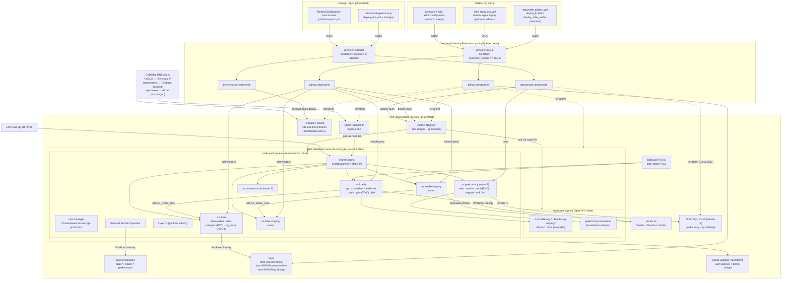

# 04 — Target architecture on GCP project `boot-464019`

> **Superseded 2026-09-16 by owner decision** (recorded in [`03-gcp-readiness.md`](./03-gcp-readiness.md) §3.2; applied in [`05-migration-plan.md`](./05-migration-plan.md) rev 2): **kradle starts from the chart bootstrap on GKE for both environments — no CR export/import, no freeze window.** §4.18, the state sentence of §2 #1, D-16 and D-21 are void (banners at each place); everything else in revision 2.1 stands and is executed as is. Also by owner decision: no feature branch (babysitter changes go to `staging`, then `main`; downtime acceptable) and `gcloud` is already authenticated on `boot-464019` (§1 A1–A5 answered in 03 §3.1: greenfield).

Date: **2026-09-16**, **revision 2.1** (revision 1 produced 11:24; reviewed in [`reviews/04-architecture-review-1.md`](./reviews/04-architecture-review-1.md), verdict NOT APPROVED; every finding F-1..F-11 is addressed in revision 2 — the index of changes is in §13. Revision 2 was reviewed in [`reviews/04-architecture-review-2.md`](./reviews/04-architecture-review-2.md), verdict **APPROVED** with required corrections N-1..N-3 and nits N-4..N-7; revision 2.1 applies all seven in place — §13 lists where — and is the revision [`05-migration-plan.md`](./05-migration-plan.md) executes). Produced by task `target-architecture` of the `azure-to-gcp-migration` run. Inputs: [`00-discovery-snapshot.md`](./00-discovery-snapshot.md), [`01-azure-inventory.md`](./01-azure-inventory.md) (+ `.json`), [`02-source-origins.md`](./02-source-origins.md) (+ `.json`, **as corrected 2026-09-16 11:18** — §1.19 geekonomy, §1.21 benchmarks), [`03-gcp-readiness.md`](./03-gcp-readiness.md), the company-repo audits (`C:\work\company\infra\*.md`, `artifacts/research/azure-finops-status-2026-09-05.md`), the local clones of `a5c-ai/babysitter` (branch `staging`, HEAD `57b13a4c5`), `a5c-ai/infra-seed` (`4e54c7a0`) and `a5c-ai/infra` (`08dbc879`), and — read through the GitHub contents API for this revision, nothing cloned — the private repos **`Benihakak/geekonomy`** (`infra/azure/main.bicep`, `infra/helm/geekonomy/values.yaml`, `docker-compose.yml`, `apps/worker/src/index.ts`, `apps/worker/package.json`, `scripts/azure/*`) and **`MantisOS/babysitter-benchmarks`** (`README.md`, `CLAUDE.md`, `infra/vm.bicep`, `scripts/fleet-vm.sh`, `data/trial-evidence/README.md`, `reports/`). This document is design only: nothing was created, changed or deleted in Azure, GCP or GitHub, and no secret **value** appears here — secrets are referenced by name and location.

The document is self-contained: a reader who did not follow the run can act on it. Where it disagrees with 00–03 it supersedes them. Two new source facts found while reading `MantisOS/babysitter-benchmarks` for this revision supersede 02 §1.24 and §1.25: the **tb-fleet VMs** and the **`babysitterarchive2608/trial-telemetry`** container are not orphans — both are owned by that repo (§2 #24, #25). 02 should be corrected accordingly by the next documentation pass; this document already uses the corrected origins.

---

## 0. Design in one page

| Topic | Decision (recommended default) | Where justified |
|---|---|---|
| Compute | **GKE Standard, zonal (`us-central1-a`), release channel REGULAR**, 2 node pools: `system` (e2-standard-4, autoscale 2–4, on-demand) and `agents` (e2-standard-4 **Spot**, autoscale 0–4, tainted for kradle dispatch Jobs and the geekonomy transcriber). One cluster, environments separated by namespaces. Autopilot and a second cluster are rejected with reasons. | §4.1, §8 |
| Registry | **Artifact Registry** `us-central1-docker.pkg.dev/boot-464019/a5c-images` (+ a separate repo `geekonomy` for the foreign-owned app). Every image is **rebuilt by CI from its git origin**; no `az acr import`, no image copy. Pull via the node service account — **no image pull secrets anywhere** (osb's image moves from ghcr to AR for that reason, §2 #12). | §4.2 |
| Ingress / TLS | Keep **ingress-nginx + cert-manager + Let's Encrypt HTTP-01**, on a reserved **regional static external IP** (`google_compute_address`). One ClusterIssuer name: `letsencrypt-production` (+ `letsencrypt-staging`). | §4.3 |
| DNS | **Keep GoDaddy manual records.** No Cloud DNS, no external-dns. Cutover = canary host → per-host A records (staging first) → one wildcard flip. RFC 4592 rule written down. | §4.4 |
| Databases | atlas ×2 and content-studio Postgres → **PD-backed StatefulSets (`standard-rwo`)** with a **source-controlled `pg_dump` CronJob to GCS** as the backup; gitea PVCs backed up by **Backup for GKE**. geekonomy → **Cloud SQL PG16 `db-f1-micro`** (like-for-like managed PG). Cloud SQL for bpx only if kept. Azure PG for hub is an orphan → decommission. `hub-redis-pvc` = cache, not exported. | §4.5–4.7, §4.17 |
| Secrets | **Secret Manager + External Secrets Operator (ESO)**. Every chart-less k8s secret becomes an `ExternalSecret` manifest in its origin repo. Every secret has a stated **value provenance** (regenerate at issuer / generate fresh) — **no value is read out of AKS**. Foreign-tenant Key Vaults are not migrated. | §4.8, §5 |
| CI auth | `google-github-actions/auth@v2` with **Workload Identity Federation** (no keys) + `get-gke-credentials`. One pool, **two providers**: `a5c-ai` (org condition) and `external` (explicit allowlist for `Benihakak/geekonomy` and `MantisOS/babysitter-benchmarks`). Org secret `KUBE_CONFIG` and both Azure SPNs are retired. Firebase deploys use `firebase-tools` over ADC, never a JSON key. | §4.9, §4.13, §5 |
| ARC runners | **Drop.** Only the dormant `a5c-ai/hub` CI used `hub-dev-runners`. Re-enable path kept in IaC (infra-seed `modules/addons/arc`) but disabled. | §4.10 |
| LLM providers | Azure OpenAI / Foundry mux is already dead (0 deployments). Replace with **Vertex AI** (Gemini, Claude on Vertex) through Workload Identity for in-cluster consumers, and **direct vendor keys** for CI lanes that need GPT/Claude models. geekonomy's transcriber → `local-faster-whisper` (D-25). The *product's* Azure/Foundry provider support stays. | §4.11, §4.17 |
| geekonomy (foreign repo) | **REBUILD-FROM-SOURCE-THEN-MIGRATE** from `Benihakak/geekonomy`: its existing Helm chart (extended) in namespace `geekonomy` on the shared GKE, Cloud SQL PG16, in-cluster Redis (it is a work queue), transcriber on the Spot pool; IaC in that repo (`infra/gcp/`); deploys through the `external` WIF provider. Cloud Run rejected (60-min request cap vs 240-min transcription calls). Keep-vs-retire is the owner's product decision (D-13). | §2 #19, §4.17 |
| Storage accounts / static sites / monitoring | Blob/Files data worth keeping → one **GCS archive bucket** (`boot-464019-azure-archive`). `babysitter-benchmarks` SWA is **rebuilt from `MantisOS/babysitter-benchmarks`** (`reports/*.html`) to **Firebase Hosting** site `a5c-benchmarks` at `benchmarks.a5c.ai`; the other static sites are dead → decommission. Monitoring → **Cloud Logging / Cloud Monitoring** + alert policies in terraform. `i.personoids.com` zone → delete. | §4.12–4.15 |
| IaC home | **`a5c-ai/infra`** — root `terraform/envs/gcp-boot` split into **two stages** (`platform`, `addons`) with separate state prefixes so `terraform plan` works on an empty project; module `terraform/modules/gcp-host`, consuming `a5c-ai/infra-seed` modules pinned by git ref. Foreign apps keep their own IaC (geekonomy: `Benihakak/geekonomy/infra/gcp/`). **Never click-ops.** | §7 |
| Cost | Wave 1 (kradle ×2, atlas ×2, platform) ≈ **$295–345/mo on-demand list**, ≈ $225–275 with a 1-year CUD; geekonomy adds ≈ $45–75; benchmarks ≈ $0 — versus the Azure residue of ~$760–1,160/mo list (invoiced **$0** under the 100 %-credit sponsorship). Model usage on Vertex is extra and budget-capped from day one. | §8 |

---

## 1. Assumptions that Phase B must re-verify (GCP was not readable)

`gcloud` on the migration workstation is not authenticated (03 §0) and the reuse audit (03 §3.1) is empty. This design therefore **assumes** the following about `boot-464019`. The first Phase B task runs `docs/migration/azure-to-gcp/raw/gcp/inventory.sh` and updates 03 §3.1; every assumption below that turns out false changes the plan (reuse instead of create — never a duplicate).

| # | Assumption | If false |
|---|---|---|
| A1 | No GKE cluster, VPC (other than `default`), Artifact Registry repo, WIF pool, Cloud SQL instance, Firebase project/site or reserved external IP exists in the project. | Import the existing resource into the new terraform root (`terraform import`) and keep its name; do not create a second one. |
| A2 | The project is linked to an open billing account (`billingEnabled: true`) with quota for ≥ 32 vCPUs and ≥ 2 in-use external IPs in `us-central1`. | Owner fixes billing / requests quota before `terraform apply`. |
| A3 | `aiplatform.googleapis.com` is already enabled (live-stack Vertex lanes bill this project, 03 §3.1). The other APIs in 03 §4 (+ `sqladmin`, `servicenetworking`, `firebase`, `firebasehosting`, `gkebackup`) are **not** enabled. | Terraform enables what is missing (`disable_on_destroy = false`). |
| A4 | No organization policy forbids external IPs on load balancers, Spot VMs, public GKE control planes or Firebase enablement (`constraints/compute.vmExternalIpAccess`, `constraints/compute.restrictLoadBalancerCreationForTypes`). | Adjust: internal control plane + IAP bastion, or a different LB scheme; GCS + Cloud CDN instead of Firebase (§4.13). Re-plan §4.3. |
| A5 | The org secret `GOOGLE_CLOUD_PROJECT` resolves to `boot-464019` (per 00 §4). | Point the CI variables at the correct project; nothing else changes. |
| A6 | The Google account that owns the project can grant the operator the roles in 03 §5.1. | Blocker B2 in 03 — stop until granted. |
| A7 | GCP list prices used in §8 (Sept 2026, us-central1) are approximate; no credits are assumed on the GCP side. | Re-run the estimate in the Pricing Calculator during Phase B; if the project has credits, note them in §8. |
| A8 | `firebase-tools` (pinned ≥ 13) authenticates from Application Default Credentials written by `google-github-actions/auth@v2` (an *external-account* credential file, not a key). | Verified in Phase B by a dry deploy of the benchmarks site from a PR; if it fails, the benchmarks target becomes GCS + Cloud CDN (§4.13 alternative) — still no JSON key. |

Nothing in this document is a fallback for an unverified assumption: where a value is unknown it is stated as unknown and assigned to a Phase B check or an owner decision (§10).

---

## 2. Disposition of every inventory system (26) — resource groups in Appendix A

Legend: **MIGRATE** = data/state moves to GCP as-is (only used for pure data archives — there is nothing else that may be "moved"); **REBUILD-FROM-SOURCE-THEN-MIGRATE** = the git origin is changed to target GCP, CI rebuilds and deploys it, then persistent data is exported/imported; **DECOMMISSION** = not carried to GCP (data export noted where any exists); **OWNER-DECISION** = the owner must answer the listed question; the recommended default is given and is what the plan assumes until answered. No dormant or broken system is marked MIGRATE. The 33 Azure resource groups are mapped row-by-row to these systems in **Appendix A**.

| # | System (01/02 id) | Origin status (02) | Disposition | Rationale / what happens to data |
|---|---|---|---|---|
| 1 | `kradle-prod` | ACTIVE | **REBUILD-FROM-SOURCE-THEN-MIGRATE** | Origin complete (`publish.yml#deploy_kradle` + `packages/kradle/charts`). Source changes §4 + §11. **State — superseded 2026-09-16: kradle prod starts from the chart bootstrap on GKE (admin org/user, sandbox repo); nothing is exported or imported; the AKS objects are abandoned with the cluster.** *(Original text, void:)* kradle CR objects in group `kradle.a5c.ai` are *business data*, exported and re-created through the **scripted, validated import** defined in §4.18 (`packages/kradle/core/scripts/cr-export.mjs` / `cr-import.mjs`; durable-kind allowlist; server-side schema validation; decision **D-16**). `Run`/`Dispatch`/session history is not imported. Gitea repos are on `emptyDir` today and are re-provisioned by the controller's reconcile loop from `Repository` CRDs (commits `4ed6bc159`, `acd20ba42`, `57b13a4c5`); on GKE gitea gets a PVC backed up by Backup for GKE (§4.5). **The cutover is a product release** (main HEAD at cutover, not the running `21ded0e5`) — D-24. Prod's atlas dataset — D-23. |
| 2 | `kradle-staging` | ACTIVE | **REBUILD-FROM-SOURCE-THEN-MIGRATE** | Same origin; **fresh state** on GKE (no CR import), first environment to cut over. Org namespaces become `kradle-org-staging-<org>` (§6). |
| 3 | `krate-legacy-residue` | ORPHAN | **DECOMMISSION** | Pre-rename chart gone from every tree; 100 `krate.a5c.ai` CRDs, empty namespaces, dead ACR repos. Nothing to source. |
| 4 | `atlas-prod` | ACTIVE | **REBUILD-FROM-SOURCE-THEN-MIGRATE** | Origin = heredoc manifests in `publish.yml#deploy_atlas_webui`; extracted into `packages/atlas/webui/deploy/` (§11). Data: `pg_dump` of the in-cluster PG16 (read-only `kubectl exec` on AKS) → GCS → `pg_restore` Job into the PD-backed StatefulSet. Daily `pg_dump` CronJob to GCS afterwards (§4.5). |
| 5 | `atlas-staging` | ACTIVE | **REBUILD-FROM-SOURCE-THEN-MIGRATE** | Same. Data dumped too. Kradle prod currently reads *this* database (C17); which dataset prod kradle sees on GKE is **D-23** — wave 0 records graph/row counts of both databases so the owner decides on facts. |
| 6 | `content-studio` | STALE (workflow disabled) | **OWNER-DECISION** (D-8, default: rebuild + migrate in wave 2) | Source is complete in `a5c-ai/company` but the deploy workflow is disabled and its AI path points at a deleted Azure OpenAI deployment. If kept: same pattern as atlas (PD StatefulSet + backup CronJob, ESO, AR, WIF) + provider swap (§4.11). DB dump is taken **regardless** of the decision. |
| 7 | `babysitter-web-staging` | STALE (Apr 2026) | **OWNER-DECISION** (D-11, default: **DECOMMISSION**) | Last deploy failed 2026-04-12; bundled PG/Redis have no PVC (nothing to export); `claude-web` values still reference a registry that no longer exists. If kept: rebuild from `a5c-ai/claude-web` with the §11 changes. |
| 8 | `a5c-app-prod` | STALE (origin archived) | **OWNER-DECISION** (D-10, default: **DECOMMISSION** after DB dump) | Origin is the **archived** `a5c-ai/app`; redis 0/1 since 2025-11; no CI. Migrating requires un-archiving and porting `scripts/deploy.sh`. The 10 Gi Postgres disk is dumped to GCS in any case. |
| 9 | `a5c-app-staging` | STALE (archived ×2) | **DECOMMISSION** | 1/2 broken since 2026-02; `a5c-install` origin archived 2025-09; HTTP-only ingress. DB dump taken with #8. |
| 10 | `aeq` (askExpertQuestion / bmux) | STALE (drifted) + MANUAL PG | **OWNER-DECISION** (D-9, default: decommission the abandoned `aeq` namespace; dump `aeqpg0316203042`; deploy **bpx** to GKE only if the product is wanted) | The live namespace is an abandoned older revision; HEAD deploys `bpx`/`breakpoints-pro.a5c.ai` and has failed since 2026-08-08. If kept: Cloud SQL PG16 (`db-f1-micro`, private IP over the platform's private-services range, §4.7) declared in `askExpertQuestion/infra/terraform` (replacing the azurerm root), WIF deploy. |
| 11 | `hub` | STALE (2025-09, `-dirty` images) | **DECOMMISSION** (with archive export, D-12) | `hub-backend` 0/3 for a year, images non-reproducible, repo dormant, in-cluster PG + 1 TiB share. Export: `pg_dump` of the 100 Gi PG (small actual data expected) and — only if the owner confirms the git data matters — the 1 TiB share to GCS Archive class. **`hub-development/hub-redis-pvc` (10 Gi Premium disk) is a cache: not exported, deleted with the RG.** Azure PG `psql-hub-development-westus3-v2` is unreferenced → dump + delete. |
| 12 | `osb-staging` | ACTIVE (`sleep infinity` pod) | **OWNER-DECISION** (D-14, default: do **not** migrate now; delete on Azure; redeploy to GKE on demand) | Source is complete (`a5c-ai/osb cd.yml`) and needs KUBE_CONFIG→WIF, `osb-secrets`→ESO, Foundry→provider change, **and its image path**: `build-images.yml` pushes `benchmark-cli` to AR `a5c-images` via WIF (node SA pulls it) — the `ghcr-pull-secret` created from `A5C_AGENT_GITHUB_TOKEN` is deleted, consistent with the no-pull-secrets rule (§4.2). It holds no state and does nothing until a benchmark is run. |
| 13 | `arc-runners` | STALE (hub terraform) | **DECOMMISSION** | Only `a5c-ai/hub` workflows use `runs-on: hub-dev-runners`; babysitter uses hosted runners. Re-enable path: `infra-seed modules/addons/arc` behind `arc_enabled=false` (§4.10). |
| 14 | `platform-addons` | STALE / ORPHAN mix | **REBUILD-FROM-SOURCE-THEN-MIGRATE** | ingress-nginx, cert-manager (+ `letsencrypt-production`/`-staging`), ESO, kyverno become terraform `helm_release`s in the `addons` stage of the new IaC (§7). Dropped: gatekeeper/azure-policy, `app-routing-system`, AppGW residue, KubeVela, the duplicate `letsencrypt-prod` issuer, `azure-files`/`managed-*` classes. |
| 15 | `aks-cluster-and-hub-rg` | STALE (unapplyable tf) | **REBUILD-FROM-SOURCE-THEN-MIGRATE** → then DECOMMISSION | The cluster is replaced by GKE from new IaC; nothing of the AKS RG is reused. Its terraform **state** (`a5ctfstorage`) is archived (#25) before the RG is deleted. |
| 16 | `acr-hub-registry` | STALE origin / ACTIVE producers | **REBUILD-FROM-SOURCE-THEN-MIGRATE** → then DECOMMISSION | Artifact Registry repo from IaC; **every image rebuilt by the origin's CI**. Dead ACR repos (`krate-*`, `claude-web*`, `budgets`, `onboard`, `tokens-dispenser`, `hub/*`) are not rebuilt. `geekonomyacrmkb5l5` (4 repos) → AR repo `geekonomy`, rebuilt by a new workflow in `Benihakak/geekonomy` (#19, §4.17). |
| 17 | `ai-accounts` (7 Azure AI) | MANUAL | **DECOMMISSION** | 0 deployments; every consumer is already broken. Replaced by Vertex AI + vendor keys (§4.11). No data. |
| 18 | `litellm-archive` (PG ×2 + storage) | STALE / MANUAL | **DECOMMISSION** (after dump to GCS) | Spend-log archive of the Aug–Sep 2026 engagement: `pg_dump` both servers + copy the file shares to `gs://boot-464019-azure-archive/litellm/`, verify checksums, delete. The proxy itself is not rebuilt (source `a5c-ai/mantis-proxy` stays as the origin if it is ever wanted as Cloud Run). |
| 19 | `geekonomy` | **ACTIVE (external repo `Benihakak/geekonomy`, manual deploy)** | **OWNER-DECISION on product grounds only — keep or retire (D-13); default: REBUILD-FROM-SOURCE-THEN-MIGRATE** | Source is complete (02 §1.19): Bicep + `scripts/azure/*.sh` for Azure, an existing Helm chart `infra/helm/geekonomy` (web + worker), Dockerfiles for `apps/{web,worker,transcriber,migrator}`. It is the only Azure workload that is both running and serving 200 today. Target (§4.17): chart extended and deployed by a **new workflow in that repo** to namespace `geekonomy` on the shared GKE; images to AR repo `geekonomy`; PG → Cloud SQL PG16 `db-f1-micro` (data: plain-SQL `pg_dump` → `gs://boot-464019-pg-dumps/geekonomy/` in wave 0 → `gcloud sql import sql`); Redis → in-cluster `redis:7-alpine` with a 1 Gi PVC (it is the `geekonomy:queue:rss_ingest` **work queue**, not a cache — `apps/worker/src/index.ts:323`; Memorystore rejected on cost, cache-loss tolerance is irrelevant because the RSS poll refills the queue); transcriber → `local-faster-whisper` on the Spot pool (D-25); LA → Cloud Logging; Bicep → terraform in `Benihakak/geekonomy/infra/gcp/`. Authenticates through the `external` WIF provider (§5.1). If retired instead: the wave-0 dump is the only artefact kept; the RG is deleted in the decommission phase. |
| 20 | `personoids-residue` | ORPHAN | **DECOMMISSION** | Idle legacy; cluster deleted 2026-04-19; KVs unreadable. Owner may export the AzureML code shares first (D-12 covers all "export before delete" items). |
| 21 | `static-sites` | mixed | per site — `babysitter-benchmarks` → **REBUILD-FROM-SOURCE-THEN-MIGRATE** from **`MantisOS/babysitter-benchmarks`** (keep-the-site yes/no is **D-15**); `a5c-website` SWA ×2, `a5c-proxy-894866`, `intuitive-website-new`, `a5cstatic`/`stlitellmproxy2026` `$web` → **DECOMMISSION**; `mantisb131bfc8` `$web` → **OWNER-DECISION** (D-26: export to GCS, then delete unless identified) | The SWA is the hand-uploaded (SWA CLI, 2026-08-18) publication of that repo's committed `reports/*.html` (six Terminal-Bench reports; the repo was pushed 2026-08-20). Target: a deploy workflow **in that repo** → Firebase Hosting site `a5c-benchmarks`, host `benchmarks.a5c.ai` (§4.13). No source is created in babysitter — there is exactly one origin. The `a5c.ai` apex is served by Vercel (not an Azure resource — out of scope). |
| 22 | `web-app-promoted-idle` | ORPHAN | **DECOMMISSION** | No response, no source, F1 tier (`asp-promoted-idle` plan deleted with it). |
| 23 | `dev-vms` (4 VMs + odoo storage) | MANUAL | **DECOMMISSION** | All deallocated; `vm-odoo-validation` past its `auto-delete-after`. Export `evidence` containers (`retain=true`) to GCS first. Dev boxes on GCP, if ever wanted, are Compute Engine instances declared in IaC (not part of this migration). |
| 24 | `tb-fleet` (8 VMs) | **MANUAL — origin found in this revision: `MantisOS/babysitter-benchmarks`** (`infra/vm.bicep` = the per-VM template, `scripts/fleet-vm.sh:9` `EXPECTED_VMS=(tb-fleet-0 1 2 4 5 6 7 8)` — exactly the eight RGs, `rg-tb-fleet-3` empty; `scripts/bootstrap-host.sh` = the `terminal-bench-bootstrap` extension; `scripts/deploy.sh` / `destroy.sh`) | **DECOMMISSION** | Deallocated since 2026-08-11; ~$112/mo of orphaned disks/IPs. Teardown is **source-owned**: the owner runs that repo's `scripts/destroy.sh` per fleet RG (it refuses `workload=babysitter-archive`, so the archive is safe). A future benchmark fleet on GCP is an `infra/gcp/` Compute Engine instance template + MIG **in that repo** (not in infra-seed — the fleet belongs to the benchmark project). |
| 25 | `archives-and-tfstate` | MANUAL (tfstate) / **`babysitterarchive2608` origin found: `MantisOS/babysitter-benchmarks` `data/trial-evidence/README.md:46-58`** (trial telemetry: 179 `*.ndjson.zst` + `BULK-MANIFEST.tsv`, **≈ 100.7 MB stored (compressed)** = 7.77 GB uncompressed; manifests `BULK-MANIFEST.tsv` + `MANIFEST.tsv.gz` committed, checksums are over the **uncompressed** originals) | **MIGRATE** (data → GCS) → then DECOMMISSION | `a5ctfstorage` (`tf-main`, `tfstate`, all blob versions) → `gs://boot-464019-azure-archive/tfstate/`; `babysitterarchive2608/trial-telemetry` → `gs://boot-464019-azure-archive/trial-telemetry/` verified **by decompressing each object before hashing** (`gcloud storage cat gs://…/trial-telemetry/<path>.zst \| zstd -d \| sha256sum` must equal column 1 of `BULK-MANIFEST.tsv` for every row — N-3; hashing the `.zst` objects would compare the wrong bytes), then **that README (and `CLAUDE.md:146`) is updated in the repo** to point at the GCS path with the `gcloud storage cat … \| zstd -d` form of its `az storage blob download` example — the pointer is source. `a5c-mantis-workshop` empty RG deleted. |
| 26 | `monitoring` | STALE / MANUAL | **REBUILD-FROM-SOURCE-THEN-MIGRATE** | Cloud Logging/Monitoring are on by default in GKE; the useful metric alerts plus a billing budget are declared as `google_monitoring_alert_policy` / `google_billing_budget` in the new IaC. Everything Azure-side (LA ×5, App Insights, Grafana, Prometheus rule groups, DCR/DCE) is decommissioned. |

Wave order (detailed in 05): **Wave 0** data exports from Azure (everything marked "dump"/"export" — the AKS cluster is `provisioningState=Failed` and may stop responding at any time, so exports precede all build work; includes the geekonomy PG dump and the atlas/atlas-staging count snapshot for D-23) → **Wave 1** platform (`platform` stage, then `addons` stage) + `kradle-staging` + `atlas-staging` → `atlas-prod` + `kradle-prod` → **Wave 2** owner-approved keepers (geekonomy, benchmarks site, content-studio, bpx, osb) → **Decommission** (only after owner sign-off, 01 §0 rule; Appendix A is its checklist).

---

## 3. Target topology



Not in the picture (decommissioned): AKS, ACR ×2, Key Vaults, Azure PG ×5, Azure Redis, Container Apps, Azure Files, ARC runners, gatekeeper, KubeVela, app-routing nginx, AppGW residue, Azure AI accounts, static web apps, VMs (dev + tb-fleet), Azure DNS `i.personoids.com`, Azure Monitor.

---

## 4. Component mapping — Azure → GCP → why → what changes in source

Every row names the source file(s) that change. Line numbers are those recorded in 02 (babysitter `staging` @ `57b13a4c5`).

### 4.1 AKS → GKE Standard (zonal)

| Azure | GCP | Why | Source change |
|---|---|---|---|
| AKS `aks-hub-development-westus3-v2` (1.30 EOL, Free tier, D2s_v5 ×4, identities missing, `provisioningState=Failed`) | **GKE Standard**, zonal `us-central1-a`, name `a5c-boot-gke`, REGULAR channel, VPC-native, Workload Identity on, private nodes + Cloud NAT, **public control plane with `master_authorized_networks_config` disabled** (GitHub hosted runners have no fixed IPs; an authorized list would have to contain `0.0.0.0/0`, which is the same thing — access is protected by IAM + WIF, not by IP), Cloud Logging/Monitoring SYSTEM+WORKLOADS, PD CSI, custom node SA, Backup for GKE agent enabled. Node pools: `system` e2-standard-4 (4 vCPU / 16 GiB) autoscale **2–4**, 50 GB pd-balanced boot; `agents` e2-standard-4 **Spot** autoscale **0–4**, taint `a5c.ai/agents=true:NoSchedule`, label `a5c.ai/pool=agents`. | See sizing below. Zonal: matches today's single-zone AKS, and the GKE free tier covers one zonal cluster's management fee. Standard over Autopilot: (1) kradle's per-run Jobs, the jitsi JVB `NodePort/UDP 10000` and the sidecar patterns need node-level control that Autopilot's admission restricts; (2) with ~30 small pods Autopilot's per-pod minimums make it cost about the same with less control; (3) a tainted Spot pool for bursty agent Jobs (and the geekonomy transcriber) is only expressible on Standard. Regional control plane rejected: +$73/mo (free tier does not apply) for HA the current setup never had. | `a5c-ai/infra` new root (§7) using `infra-seed modules/k8s-cluster` **with three module fixes**: (a) `location` must accept a zone (today `location = var.gcp.region` → regional cluster, 3× nodes); (b) `node_config.service_account` must be a custom SA (today it uses the default compute SA with `cloud-platform` scope); (c) add `private_cluster_config`, `logging_config`/`monitoring_config`, `addons_config.gke_backup_agent_config`, a second node-pool block with `spot = true` + taints, and `deletion_protection = true`. babysitter: `packages/kradle/installer/src/terraform/root.ts:115 renderGke()` stays the *product* installer's generator and is **not** used for the platform; the `deploy_staging_cloud` job stays dormant (no `A5C_CLOUD_*` vars are created for the platform cluster) until the installer consumes infra outputs instead of rendering a cluster. |

**Node sizing from current requests (01 §2).** Declared requests today total ≈ 7.4 vCPU / 13.3 GiB, but ≈ 4.6 vCPU / 8.5 GiB of that belongs to systems that are decommissioned (AKS kube-system agents 2.84 vCPU, hub-development 1.3, app-routing 1.0, gatekeeper 0.3, app/app-staging/staging 0.95, aeq 0.2). The migrating workloads (kradle ×2, atlas ×2, cert-manager) declare **no requests at all** — this is why vmss000000 sits at 105 % CPU and Next.js pods get OOM-killed. Setting requests is a mandatory source change; the proposed budget:

| Namespace / component | requests (cpu / mem) | Source of the value |
|---|---|---|
| kradle (per env): api 250m/512Mi, controllers 250m/512Mi, webhook-worker 100m/256Mi, web 250m/512Mi (limit 1Gi — OOMKilling seen), gitea 200m/512Mi, jitsi web 100m/256Mi, jicofo 200m/512Mi, jvb 300m/512Mi, prosody 100m/256Mi | **1.75 vCPU / 3.8 GiB** per env → 3.5 / 7.6 for two | `packages/kradle/charts/values.yaml:54,67,90,108` (`resources: {}` today) |
| atlas (per env): webui 250m/768Mi (limit 1.5Gi), postgres 250m/512Mi | 0.5 / 1.25 per env → 1.0 / 2.5 | new `packages/atlas/webui/deploy/` manifests (§11) |
| platform: ingress-nginx ×2 200m/512Mi, cert-manager 150m/384Mi, ESO 100m/256Mi, kyverno 400m/1Gi | 0.85 / 2.2 | helm values in `infra` root |
| GKE system pods (kube-dns, metrics-server, gke-metadata-server, fluentbit, csi, konnectivity, gke-backup agent) | ≈ 1.0 / 2.0 | GKE defaults |
| **Wave 1 total** | **≈ 6.4 vCPU / 14.3 GiB** | fits `system` ×2 (allocatable ≈ 7.8 vCPU / 26 GiB) with ≥ 20 % headroom; autoscale to 4 covers wave 2: content-studio (+0.5 / 1.5), bpx (+0.6 / 1.5), geekonomy web+worker+redis (+0.8 / 1.7 — `main.bicep:294-295,372-373`; transcriber goes to the Spot pool) |
| kradle dispatch Jobs (`adapters-agent`, sidecars 50m–500m / 128Mi–1Gi per `values.yaml:322-348`) and geekonomy transcriber (1 vCPU / 2 GiB, `main.bicep:514-515`) | bursty / 1 replica | `agents` Spot pool 0–4 via `nodeSelector`/`tolerations` set by the dispatch controller (§11) and by the geekonomy chart (§4.17) |

### 4.2 ACR → Artifact Registry

| Azure | GCP | Why | Source change |
|---|---|---|---|
| ACR `acrhubdevelopmentwestus3` (Standard, admin user on, scope-map tokens `aks-pull`/`content-studio-ci`, `acr-pull` secrets in 9 namespaces) + ACR `geekonomyacrmkb5l5` (Basic, admin user on) | AR repos **`us-central1-docker.pkg.dev/boot-464019/a5c-images`** (images `kradle-controller`, `kradle-web`, `adapters-agent`, `jitsi-agent-sidecar`, `atlas-webui`, + `content-studio`, `benchmark-cli` (osb, moved off ghcr), `bpx` when kept) and **`…/boot-464019/geekonomy`** (`geekonomy-web`, `-worker`, `-transcriber`, `-migrator`, written only by `geekonomy-deployer@`); DOCKER, regional, cleanup policy: keep 20 most recent per package + all tags matching `^v` | Images are **rebuilt from source by the same CI jobs**, tagged by commit SHA exactly as today. Pull uses the node SA's `roles/artifactregistry.reader` on both repos — there are **no image pull secrets** in the design: every `imagePullSecrets`/`acr-pull`/`ghcr-pull-secret` line is deleted, which is why osb's image must live in AR (§2 #12) rather than a private ghcr package. Admin users, tokens and the `AZURE_ACR_PULL_PASSWORD` secret disappear. | babysitter `publish.yml`: L1810-1841 (`az acr login`, `acr-pull`), L2287-2338 (buildx push targets), L2347-2368 (`acr-pull`), L2468-2469 (`KRADLE_AGENT_IMAGE`, `KRADLE_JITSI_AGENT_SIDECAR_IMAGE` defaults), L2479-2484 (`--set image.*.repository`, `global.imagePullSecrets`); replace with `gcloud auth configure-docker us-central1-docker.pkg.dev` after WIF auth and `vars.GCP_ARTIFACT_REGISTRY` as the repository prefix. Chart: `packages/kradle/charts/values.yaml` image defaults + drop `global.imagePullSecrets`. **The `acr-pull` copy into `kradle-org-*` namespaces is rendered by the chart, not by controller code**: `packages/kradle/charts/templates/assistant-org-secret.yaml:16` and `assistant-identity.yaml:19` iterate `.Values.global.imagePullSecrets` (also `deployments.yaml:40,229,428`) — removing `global.imagePullSecrets` is sufficient; there is no copy logic in `packages/kradle/core/src` (grep `acr`/`imagePullSecret` → no hits). Tests `packages/kradle/core/tests/deployment.test.js:506-515` (pins `AZURE_ACR_NAME`, `create secret docker-registry acr-pull`) rewritten in the same PR. Vendored `packages/kradle/core/.github/workflows/publish.yml:90-117` rewritten or deleted. osb: `build-images.yml` push target → AR via WIF; `cd.yml` `ghcr-pull-secret` step deleted. geekonomy: `scripts/azure/build-and-push.sh` (`az acr build`) → `docker buildx` push step in the new workflow (§4.17). |

Non-SHA tags (`latest`, `yolo-test`, `y2`) are not reproduced; `KRADLE_AGENT_IMAGE` must point at the SHA the same publish run built (it already receives `${GITHUB_SHA}`; only the `:latest` push at L2305/L2338 is dropped).

### 4.3 Ingress, TLS, static IP

| Azure | GCP | Why | Source change |
|---|---|---|---|
| ingress-nginx 4.13.1 (hub terraform, 1 replica) with Azure LB `135.234.117.214` + Azure health-probe annotations; second unused nginx (`app-routing-system`); AppGW residue | ingress-nginx (helm `ingress-nginx` ≥ 4.13) as terraform `helm_release` in the `addons` stage, 2 replicas, the Service pinned to the reserved **regional static external IP `ingress-a5c`** via the supported annotation `networking.gke.io/load-balancer-ip-addresses: ingress-a5c` (`controller.service.annotations`; `controller.service.loadBalancerIP` is deprecated since Kubernetes 1.24 and is not used), `externalTrafficPolicy: Local`, passthrough NLB (default). The IP is reserved in the `platform` stage before the cluster and exported to GitHub as `GKE_INGRESS_IP` for the DNS runbook. | Parity for 14 hostnames and HTTP-01; a static IP makes the DNS cutover a one-record change and survives cluster rebuilds. GKE Gateway / GCLB with Google-managed certs is a later optimisation, not a migration requirement. | `infra` `platform` stage: `google_compute_address`; `addons` stage: `helm_release.ingress_nginx`, `helm_release.cert_manager` (v1.15+; `installCRDs=true`), `kubectl_manifest` ClusterIssuers `letsencrypt-production` and `letsencrypt-staging` (HTTP-01, `support@a5c.ai`), copied from hub `terraform/modules/cert-manager/main.tf:47-95` semantics (see §7 for why `kubectl_manifest`, not `kubernetes_manifest`). Delete Azure-specific annotations in hub (not migrated) and claude-web's inline `letsencrypt-prod` heredoc if claude-web is kept (D-11). babysitter ingress heredocs/templates keep `cert-manager.io/cluster-issuer: letsencrypt-production` unchanged; the inert `external-dns.alpha.kubernetes.io/hostname` annotations are **removed** (no external-dns in the target; leaving them implies a controller that does not exist). |
| cert-manager v1.15.3 + 3 ClusterIssuers (`letsencrypt-prod` duplicate from claude-web) | one issuer pair | one source of truth | as above |

Certificates are **re-issued** on GKE (HTTP-01 works as soon as the hostname resolves to the new IP). TLS secrets are not copied from AKS — that would be a payload copy and is unnecessary; the cost is a few minutes of TLS failure per host during its cutover window (§4.4 mechanics keep this per host, staging first, with a canary host proving the issuer before any real host moves). Let's Encrypt limits (50 certs/registered domain/week, 5 duplicate certs/week) are far above the 15 hostnames.

### 4.4 DNS — keep GoDaddy manual records (recommended) vs Cloud DNS

**Recommendation: keep GoDaddy.** Reasons: (1) the apex and `www` are on Vercel and the zone contains records we cannot see from here (MX/TXT/verification) — delegating NS to Cloud DNS requires a full, verified zone export that this run has no API access to obtain; (2) today's operating model is already manual A records (external-dns has never run); (3) no Cloud DNS API, no `roles/dns.admin`, no external-dns pod, no DNS-01 secrets are needed; (4) the wildcard means the cutover is **one record**.

Two rules an operator must apply at every step (RFC 4592 closest-encloser and rollback state):

- **Rule 1 — an explicit label shadows the wildcard for everything beneath it.** Once an explicit record `kradle-staging.a5c.ai` exists, `gitea.kradle-staging.a5c.ai` no longer matches `*.a5c.ai` (the closest encloser is now `kradle-staging`, which has no wildcard). Therefore **every host under a label that gets an explicit record needs its own explicit record** — `kradle` + `gitea.kradle`, `kradle-staging` + `gitea.kradle-staging`, and `benchmarks` (whose explicit A/TXT records for Firebase are permanent).
- **Rule 2 — delete explicit records only after the wildcard change has propagated**, verified with `dig +short <random-label>.a5c.ai @ns41.domaincontrol.com` returning the new IP; otherwise a rollback of the wildcard would leave the explicit hosts on GKE and everything else on Azure — an acceptable but *conscious* intermediate state.

Cutover mechanics (GoDaddy, TTL minimum 600 s):

1. **Canary** (after the `platform` + `addons` applies print the static IP): add an explicit A record `gke-canary.a5c.ai` → `<GKE_INGRESS_IP>`; a canary Ingress in the `infra` `addons` stage (`kubectl_manifest`, default backend) requests a certificate from `letsencrypt-staging`, then from `letsencrypt-production`. This proves the HTTP-01 path on GKE **before any real host moves** (R-2). The canary record is deleted at the end.
2. **Pre-cutover** (staging): add explicit A records `kradle-staging`, `gitea.kradle-staging`, `atlas-staging` → `<GKE_INGRESS_IP>`. Explicit records win over the wildcard, so every other host still resolves to Azure. Wait for cert-manager on GKE to reach `Ready=True` for those three hosts; run the smoke/e2e jobs against them.
3. **Prod cutover**: add explicit A records `kradle`, `gitea.kradle`, `atlas` → `<GKE_INGRESS_IP>` after the prod data import (§2 #1, #4) is verified. Verify certificates + `/healthz` + a kradle login + an atlas query.
4. **Wildcard flip**: change `*.a5c.ai` A from `135.234.117.214` to `<GKE_INGRESS_IP>`; apply Rule 2, then delete the explicit per-host records from steps 2–3 (they become redundant). From this moment every unassigned label (`chat`, `docs`, `aeq`, `studio`, `bmux`, `app`, `hub`, `staging.web`, …) hits the GKE default backend (404) instead of Azure — the intended end state for decommissioned hosts; for wave-2 keepers (`geekonomy`, `studio`, `breakpoints-pro`) the host simply starts working when its ingress is created. `benchmarks.a5c.ai` keeps its explicit records (Firebase, §4.13).
5. **Rollback** (any step): reverse the single record; Azure ingress keeps serving until the decommission phase, which is why decommission is strictly last.

**Alternative (not recommended now, documented for completeness): Cloud DNS + external-dns.** Terraform `google_dns_managed_zone` `a5c-ai`, import *every* existing GoDaddy record (apex/www → Vercel, MX, TXT, CAA…), verify with `dig @ns-cloud-*.googledomains.com` for each record, then change the NS set at GoDaddy (24–48 h propagation), enable `dns.googleapis.com`, install external-dns (`infra-seed terraform/cloud/gcp/addons.tf:9-16`, GSA with `roles/dns.admin` via Workload Identity, `--txt-owner-id=gke-a5c-boot`, `--policy=sync` **only** for `*.a5c.ai` hosts the ingresses own) and switch cert-manager to DNS-01 for pre-issuance. Choose this only if the owner wants ingress-driven DNS; it is D-4.

`i.personoids.com` (Azure DNS zone, 5 A records to a deleted cluster + stale external-dns TXT): **delete** the zone and its RG `PersonoidsClusterDnsResourceGroup`; nothing on GCP.

### 4.5 Azure Files Postgres PVs (atlas ×2, content-studio) → PD-backed StatefulSets (recommended) vs Cloud SQL — and the backup mechanism

| Option | Monthly (approx.) | Source impact | Verdict |
|---|---|---|---|
| **PD-backed StatefulSet**: same `postgres:16-alpine` StatefulSet, `volumeClaimTemplates` on `standard-rwo` (pd-balanced) 10 Gi, **backup = daily logical dump CronJob to GCS** (below) | ≈ $1/instance (disk) + < $1 dumps | Remove the Azure-Files provisioning shell (`publish.yml:1863-1976`, `az storage account create/keys list/share create`, static PV, `atlas-postgres-static` class, `atlas-postgres-azure-file` secret, node-RG parsing L1897-1907), delete `vars.ATLAS_POSTGRES_STORAGE_ACCOUNT` / `secrets.ATLAS_POSTGRES_STORAGE_KEY`; company `postgres-pv.yaml` deleted, `postgres.yaml:65` class → `standard-rwo` | **Recommended for the migration.** The data is small (8 GB share quota; actual DB far smaller), single replica, no HA today; RWX was only ever needed because Azure disk CSI was broken. Zero application change, reproducible from the manifests. |
| Cloud SQL for PostgreSQL 16 (Enterprise, `db-f1-micro` / `db-g1-small`), private IP via the platform's private-services range, Cloud SQL Auth Proxy sidecar or PSC, automated backups + PITR | ≈ $10–30 per instance ×3 | StatefulSet + db-init Job removed; `DATABASE_URL` from Secret Manager; proxy sidecar added to `atlas-webui` Deployment; terraform `google_sql_database_instance` ×3 | **Deferred** (decision taken, §10 A). Real operational gains (PITR, no node memory), but it adds proxy sidecars and three more moving parts to a cutover that already changes identity, registry, cluster and storage. Revisit after cutover, when the atlas manifests live in their own directory and can be changed independently. |

**Backup mechanism (implementable, source-controlled) — Postgres PVCs.** A `CronJob` in `packages/atlas/webui/deploy/base/backup-cronjob.yaml` (kustomize overlays set the namespace and bucket prefix), schedule `0 3 * * *` UTC, `concurrencyPolicy: Forbid`, `successfulJobsHistoryLimit: 3`:

- init container `postgres:16-alpine` (same image as the StatefulSet, so client and server versions never drift): `pg_dump -Fc -h atlas-postgres -U $PGUSER $PGDATABASE -f /work/$(date -u +%Y%m%dT%H%M%SZ).dump && sha256sum /work/*.dump > /work/SHA256SUMS` (credentials via the same `atlas-postgres` secret the app uses, mounted as env from the ESO-materialised Secret);
- main container `gcr.io/google.com/cloudsdktool/google-cloud-cli:<pinned>`: `gcloud storage cp /work/* gs://boot-464019-pg-dumps/<namespace>/` — authenticated by **Workload Identity**: KSA `<namespace>/pg-backup` annotated to GSA `pg-backup@boot-464019.iam.gserviceaccount.com`, which holds only `roles/storage.objectCreator` on `boot-464019-pg-dumps` (write-only: a compromised namespace cannot read or delete other dumps);
- `/work` is an `emptyDir` (10 Gi limit); resources 100m/256Mi; `restartPolicy: OnFailure`, `backoffLimit: 2`;
- retention is the bucket lifecycle (delete after 180 d, §4.12); the bucket is versioned;
- **restore** is the already-defined `restore-job.yaml` (parameterised by object path) — the same Job used for the migration cutover. **Note 2026-09-16 (plan review 2, N-1):** the restore Job runs as its own KSA **`pg-restore`** (`pg-restore-sa.yaml`, `serviceAccountName: pg-restore`) bound to GSA **`pg-restore@boot-464019.iam.gserviceaccount.com`**, which holds `roles/storage.objectViewer` on `boot-464019-pg-dumps` only — `pg-backup@` stays write-only and can never read a dump; the two identities are disjoint (05 A.3/B.2, 06 X-E.24/X-E.24a); **acceptance test**: in wave 1 the newest CronJob dump of `atlas-staging` is restored into a scratch namespace and row counts compared — the backup is not considered working until this has passed once, and 06 repeats it quarterly;
- a log-based `google_monitoring_alert_policy` (CronJob `Failed` events in the namespace) notifies `support@a5c.ai` when a run fails.

The same manifest (different overlay) serves `atlas`, `atlas-staging` and `content-studio` (company repo `apps/content-studio/deploy/k8s/backup-cronjob.yaml`, D-8) and `bpx` if it stays in-cluster. Why not PD snapshots: a `google_compute_resource_policy` attaches to a *named* disk via `google_compute_disk_resource_policy_attachment`; the CSI-provisioned disk name is only known after the PVC binds, so terraform cannot declare it, and a `VolumeSnapshotClass` yields one-off `VolumeSnapshot`s, not a schedule — revision 1 was wrong on this. Logical dumps are also portable (PG minor versions, storage drivers, Cloud SQL later) and verifiable by row count.

**Backup mechanism — gitea PVCs (kradle, kradle-staging; 10 Gi each, `standard-rwo`).** Gitea's state is git repositories + its own DB on one PVC; the only application-level export (`gitea dump`) must run inside the gitea pod, which a CronJob cannot do without `pods/exec` RBAC and a kubectl image — fragile. Chosen mechanism: **Backup for GKE** — terraform `google_gke_backup_backup_plan` `gitea-daily` in the `platform` stage (`cluster` from the GKE resource, `backup_config { include_volume_data = true, include_secrets = false, selected_namespaces = ["kradle", "kradle-staging"] }`, `backup_schedule.cron_schedule = "30 3 * * *"`, `retention_policy.backup_retain_days = 14`), plus a `google_gke_backup_restore_plan` targeting the same cluster with `namespaced_resource_restore_mode = DELETE_AND_RESTORE` and `volume_data_restore_policy = RESTORE_VOLUME_DATA_FROM_BACKUP`. Restore runbook (06): `gcloud beta container backup-restore restores create … --backup=<name>` into a scratch namespace, then `git ls-remote` against the restored gitea Service. Acceptance test in wave 1 on `kradle-staging`. Cost ≈ $5–10/mo (management fee per protected pod + ≈ 20 GiB backup storage; re-verify under A7). Prosody's 3 Gi PVCs (jitsi) ride along in the same plan at no design cost. This is the second backup mechanism in the design — deliberately: logical dumps for Postgres (portable, verifiable, migration-compatible), volume backup for the one stateful app without an in-cluster dump path.

Data move at cutover (unchanged): `kubectl exec -n atlas atlas-postgres-0 -- pg_dump -Fc -U <user> <db>` (read-only against AKS) → `gs://boot-464019-pg-dumps/atlas/<date>.dump` (+ sha256) → on GKE the `restore-job.yaml` Job → row-count comparison recorded in the plan's verification step. The same for `atlas-staging` and `content-studio`.

### 4.6 In-cluster PG/Redis of the staging apps (babysitter-web-staging, a5c-app ×2) and hub's Redis

These systems are DECOMMISSION / OWNER-DECISION (§2 #7–#9, #11). If any is kept: bundled Postgres/Redis stay in-cluster on `standard-rwo` PVCs (claude-web chart `stagingPostgresql.persistence`, `stagingRedis.persistence`; app `k8s/base/postgres.yaml`/`redis.yaml` get an explicit `storageClassName: standard-rwo`) with the §4.5 backup CronJob. No Memorystore/Cloud SQL for staging-only apps. Redis in kradle does not exist (kradle has no Redis); a5c-app's Redis has been 0/1 since 2025-11 — nothing to export; **`hub-development/hub-redis-pvc` (10 Gi Premium) is hub's cache — not exported, deleted with `rg-hub-development-westus3`** (Appendix A). geekonomy's Redis is a work queue and is handled in §4.7/§4.17.

### 4.7 Azure PG flexible servers (hub, aeq, litellm ×2, geekonomy) + Azure Redis → Cloud SQL / in-cluster / decommission

| Server | Used by | Disposition |
|---|---|---|
| `aeqpg0316203042` (PG16 B1ms, manual, no IaC) | `aeq` namespace (abandoned revision) | `pg_dump` → GCS in wave 0. **If bpx is kept (D-9)**: `google_sql_database_instance` PG16 `db-f1-micro`, private IP over the platform's private-services range, in `askExpertQuestion/infra/terraform` (replace the azurerm root: `main.tf:39-100` AKS/ACR/PIP resources are dropped — the app runs on the shared GKE), `google_sql_user` + `google_sql_database`, password in Secret Manager `bpx-postgres`, `ExternalSecret` in `k8s/`; `deploy.yml` → WIF + `get-gke-credentials`. Else: delete after the dump. |
| `psql-hub-development-westus3-v2` (PG15, tf-owned, **unreferenced**) | nothing | dump (content unknown) → GCS, delete. |
| `litellm-pgdb`, `litellm-pgdb2` | archive | dump → GCS, delete (§2 #18). |
| `geekonomy-pg-mkb5l5` (PG16 B1ms, Bicep-owned `main.bicep:188-225`, db `geekonomy`, 5 firewall rules incl. personal IPs) | geekonomy web + worker (`DATABASE_URL`, `DATABASE_SSL`) | **Cloud SQL PG16 `db-f1-micro`** (`geekonomy-pg`), private IP only, automated backups on (7 d) — declared in `Benihakak/geekonomy/infra/gcp/` (§4.17). Wave 0: owner runs `pg_dump --no-owner --no-acl -Fp geekonomy \| gzip` from a host allowed by the server's firewall (the personal-IP rules exist for this) straight to `gs://boot-464019-pg-dumps/geekonomy/<date>.sql.gz` (+ sha256); cutover: `gcloud sql import sql geekonomy-pg gs://…/<date>.sql.gz --database=geekonomy` (the instance's service account gets `roles/storage.objectViewer` on that object); verification: per-table row counts before/after, then the `geekonomy-db-migrate` Helm hook runs the app's own migrations. If D-13 = retire: dump only, delete. |
| `geekonomy-redis-mkb5l5` (Redis Basic C0, `main.bicep:228-249`) | geekonomy worker: `geekonomy:queue:rss_ingest` queue (`apps/worker/src/index.ts:323`), web: `REDIS_URL` | **In-cluster `redis:7-alpine`** Deployment + 1 Gi PVC (`--appendonly yes`, as in the repo's `docker-compose.yml`) in the `geekonomy` namespace. No export: queue contents are transient and refilled by the RSS poll (`RSS_POLL_INTERVAL_SECONDS=300`). Memorystore Basic 1 GB (≈ $35/mo) rejected — it would cost more than the rest of the app. |

**Private services access (shared, platform-owned):** Cloud SQL private IP needs one `google_compute_global_address` (purpose `VPC_PEERING`, /20) + `google_service_networking_connection` on the platform VPC. These are VPC-level and are declared once in the `infra` `platform` stage (output `private_services_range`), used by the geekonomy and bpx instances that live in their own repos' terraform. VPC-native pods reach Cloud SQL private IPs directly — no Auth Proxy sidecar required; TLS enforced by `settings.ip_configuration.ssl_mode = ENCRYPTED_ONLY`.

### 4.8 Key Vault → Secret Manager + External Secrets Operator (recommended) vs GitHub-secrets-only — with value provenance

Today's model: 4 Key Vaults in foreign tenants (unreadable, unused by workloads), and **22 workload-referenced k8s secrets owned by no chart** created by `kubectl create secret --from-literal` inside workflows or by hand (01 §2.2). "GitHub-secrets-only" would keep that model on GKE: it works, but every secret's existence depends on a workflow's shell, the runtime cannot rotate anything, and the hand-made ones (`osb-secrets`, `aeq-*`, `content-studio-secrets`, …) stay unreproducible.

**Recommendation: Secret Manager + ESO** (over the Secrets Store CSI driver): ESO materialises ordinary k8s `Secret`s, so every chart/manifest keeps consuming `secretKeyRef`/`envFrom` unchanged — no pod spec changes, no CSI volume mounts, and `imagePullSecrets` are gone anyway. ESO runs with Workload Identity (KSA `external-secrets/external-secrets` → GSA `external-secrets@` with `roles/secretmanager.secretAccessor`), installed as a terraform `helm_release` in the `addons` stage, with one `ClusterSecretStore` `gcp-secret-manager`. Secret **shells** (`google_secret_manager_secret`, no versions) are terraform; **values** are added once by the owner with `gcloud secrets versions add <name> --data-file=-` (typed or piped from the issuer's download — never through CI, never from a file left on disk).

**Value-provenance rule (F-5): no secret value is read out of AKS (`kubectl get secret`) and no value is copied through a workstation from an existing store.** Each secret has exactly one of three provenances: **REGENERATE at the issuer** (the issuer's console produces a new value that the owner pastes once into `gcloud secrets versions add`), **GENERATE fresh** (`openssl rand -base64 32` at the moment of entry, because the consumer creates or accepts any value), or **TRANSFER** (owner-executed one-time move for values that cannot be regenerated — expected count: **zero**; if Phase B finds one, it is listed here before it is moved).

| Secret Manager name | Feeds k8s secret (ns) | Value source today | **Value source at migration** | Timing note |
|---|---|---|---|---|
| `atlas-prod-github-oauth`, `atlas-staging-github-oauth` | `atlas-auth` (`atlas`, `atlas-staging`) | repo var `ATLAS_GITHUB_CLIENT_ID` + secret `ATLAS_GITHUB_CLIENT_SECRET` | **REGENERATE** — new client secret in the GitHub OAuth app settings (client id is public and unchanged) | Regenerating invalidates the AKS copy at that instant. Do it **at** the host's cutover step (§4.4 step 2/3), not before; the §5.4 coexistence rule is satisfied because the host's DNS moves in the same operation. If an early regeneration is wanted, the new value is also re-entered on the AKS side via the *existing* workflow secret (`ATLAS_GITHUB_CLIENT_SECRET`) and a redeploy — never by `kubectl edit`. |
| `atlas-prod-postgres`, `atlas-staging-postgres` | `atlas-postgres` | generated by the workflow today | **GENERATE** — the db-init Job / `pg_restore` path creates the role with whatever password the secret holds; the old value is irrelevant | none |
| `atlas-staging-webui-auth` | `atlas-webui-auth` (`atlas-staging`) | hand-made | **GENERATE** (basic-auth for the staging UI; users are told the new value) | none |
| `kradle-prod-assistant-keys`, `kradle-staging-assistant-keys` | `kradle-assistant-keys` (chart-owned name; values from workflow L2461-2471) | org secrets `GOOGLE_API_KEY`, `ANTHROPIC_API_KEY`, `OPENAI_API_KEY` (+ Azure keys, dropped) | **REGENERATE** at each vendor console (Anthropic, OpenAI; Google key optional with Vertex via WI) — new keys scoped to "kradle-<env>", old org-level keys keep serving AKS until decommission and are then revoked | none (vendors allow multiple live keys) |
| `kradle-prod-github-oauth`, `kradle-staging-github-oauth` | kradle auth secret (chart) | repo var `KRADLE_GITHUB_CLIENT_ID` + org secret `KRATE_GITHUB_CLIENT_SECRET` | **REGENERATE** in the GitHub OAuth app | same timing rule as atlas |
| `kradle-prod-test-auth`, `kradle-staging-test-auth` | chart test-auth value (and CI e2e via the GitHub secret `KRADLE_TEST_AUTH_SECRET`) | repo secret | **GENERATE** — **note 2026-09-16 (plan review 2, N-3): one value, entered identically into both shells**, because the e2e/smoke jobs have no `environment:` and can only read the single repo-level secret for both branches; that value is written to the GitHub repo secret via stdin **in Phase C, before the Phase A push** (05 C.0; direction always Secret Manager → GitHub, never the reverse) — there is no cutover-time secret step | Phase C (not at cutover) |
| `geekonomy-database-url` (wave 2, D-13) | `geekonomy` chart secret (`secrets.existingSecretName`) | Bicep `database-url` container-app secret (`main.bicep:267-272`) | **GENERATE** — `gcloud sql users set-password geekonomy --instance geekonomy-pg --prompt-for-password` with a fresh value, then the URL `postgresql://geekonomy:<pw>@<private-ip>:5432/geekonomy?sslmode=require` | none; `redis-url` is not a secret on GKE (`redis://geekonomy-redis:6379`, ConfigMap); `acr-password` and `azure-openai-api-key` disappear (§4.17) |
| `content-studio-secrets`, `content-studio-postgres` (wave 2, D-8) | same names (`content-studio`) | hand-made per company runbook | **REGENERATE** (GitHub OAuth / vendor keys) + **GENERATE** (postgres) | at wave 2 deploy |
| `osb-secrets` (wave 2, D-14) | `osb-secrets` (`osb-staging`) | hand-made | **REGENERATE** at the vendors (`ANTHROPIC_API_KEY` direct or Vertex via WI, D-7) | at wave 2 deploy |
| `bpx-secrets`, `bpx-postgres` (wave 2, D-9) | `bpx-*` (`bpx`) | repo secrets `JWT_SECRET`, `AUTH_GITHUB_*`, `POSTGRES_DATABASE_URL` | **GENERATE** (`JWT_SECRET`, postgres) + **REGENERATE** (`AUTH_GITHUB_*` OAuth app) | JWT rotation logs every bpx user out once — acceptable for an app that has been failing to deploy since 2026-08-08 |
| `github-runner-token` (only if ARC is re-enabled, D-18) | ARC | org secret `RUNNER_GITHUB_TOKEN` | **REGENERATE** (fine-grained PAT or GitHub App) | n/a by default |

`kradle-gitea-agent-token` stays **runtime-created** by the controller (auto-provision) — it is not an external input. `letsencrypt-*` account keys stay cert-manager-owned (new ACME account on GKE). The benchmarks site has **no secrets** (WIF only). No row is TRANSFER.

Source change: each origin repo gains `ExternalSecret` manifests next to its deployment (`packages/atlas/webui/deploy/base/externalsecrets.yaml`; `packages/kradle/charts/templates/externalsecrets.yaml` behind `externalSecrets.enabled`; `Benihakak/geekonomy/infra/helm/geekonomy/templates/externalsecret.yaml` behind `secrets.external.enabled`); the workflow steps that `kubectl create secret … --from-literal` (babysitter `publish.yml` ≈L1830-1841, 2347-2368, 2461-2471; osb `cd.yml`; claude-web; askExpertQuestion `deploy.yml:106-138`) are deleted. GitHub secrets that only existed to feed those steps are deleted after cutover (§5.4).

### 4.9 GitHub Actions authentication

| Azure | GCP | Source change |
|---|---|---|
| `azure/login@v2` with SPN client secret (`AZURE_APPLICATION_CLIENT_ID/SECRET`), `az acr login`, org secret `KUBE_CONFIG` (cluster-admin kubeconfig); geekonomy: interactive `az login` on a workstation (`scripts/azure/*.sh`); benchmarks: interactive SWA CLI upload | `permissions: { id-token: write, contents: read }` → `google-github-actions/auth@v2` (`workload_identity_provider: ${{ vars.GCP_WORKLOAD_IDENTITY_PROVIDER }}`, `service_account: ${{ vars.GCP_SERVICE_ACCOUNT }}`) → `google-github-actions/setup-gcloud@v2` (`install_components: gke-gcloud-auth-plugin`) → `gcloud auth configure-docker us-central1-docker.pkg.dev` → `google-github-actions/get-gke-credentials@v2` (`cluster_name`, `location`, `project_id` from vars). Foreign repos use the same steps with the `external` provider and their own SA (§5.1). No long-lived key exists anywhere. | babysitter `publish.yml` L1795-1801, 2265-2271, 2669-2671; `.github/workflows/g0-rt-jitsi-e2e.yml`; company `content-studio-deploy.yml:39-60`; osb `cd.yml:104` + `build-images.yml`; askExpertQuestion `deploy.yml:56-59,95-103`; `infra` new `apply-gcp.yml`; **new** `Benihakak/geekonomy/.github/workflows/deploy-gke.yml` and `MantisOS/babysitter-benchmarks/.github/workflows/publish-reports.yml`. Identity details in §5. |

GitHub **environments** `kradle-production`, `atlas-production` (already exist, empty) get a required-reviewer rule so prod deploys need an approval; the WIF binding for the deployer SA is repository-scoped, not environment-scoped (simpler; approvals are enforced by GitHub).

### 4.10 ARC self-hosted runners → drop

Consumers: only `a5c-ai/hub` (`release.yml`, `coverage-report.yml`, `integration-tests.yml`), a dormant repo whose app is decommissioned. babysitter uses hosted `ubuntu-latest-*`. Running ARC on GKE would cost node capacity for zero consumers. The `infra` root keeps `module "gcp_arc"` (infra-seed `terraform/cloud/gcp/addons.tf:27-45`, `modules/addons/arc`) wired but `arc_enabled = false`; re-enabling is one variable + the `github-runner-token` secret (§4.8). Org secret `RUNNER_GITHUB_TOKEN` is deleted in §5.4.

### 4.11 Azure OpenAI / Foundry mux → Vertex AI + direct vendor keys

Facts: all 7 Azure AI accounts have 0 deployments; `kradle-assistant-keys` (`AZURE_API_KEY`, `AGENT_MUX_API_BASE`), content-studio (`AZURE_OPENAI_ENDPOINT`), `osb-secrets` (`ANTHROPIC_FOUNDRY_*`), geekonomy-transcriber (`AZURE_OPENAI_*`, `main.bicep:547-561`), 14 babysitter workflows and the live-stack `foundry-openai` lanes all point at them. Vertex AI in `boot-464019` is already consumed by the live-stack Gemini lanes. Vertex serves Gemini and (via Model Garden) Claude; it does **not** serve OpenAI GPT-5.x, so a like-for-like replacement of the Foundry GPT lanes needs a direct `OPENAI_API_KEY` (org secret exists).

Target: in-cluster consumers use **Vertex through Workload Identity (ADC, no key)**; CI lanes use **Vertex for Gemini/Claude** (WIF, `roles/aiplatform.user`) and **direct vendor keys** for GPT. The product keeps supporting Azure/Foundry providers for *its users* — nothing in `provider-config.ts`, `provider-support-matrix.ts` or the installer's `renderAks()` is removed; only a5c's own deployment/CI wiring changes.

| Code path | Change |
|---|---|
| `packages/kradle/core/src/assistant-runtime.js:106-116` — hard-codes the Azure `/openai/deployments/<model>/chat/completions?api-version=…` URL shape | Add a `google-vertex` (ADC + `@google-cloud/vertexai` or the Vertex OpenAI-compatible endpoint `https://us-central1-aiplatform.googleapis.com/v1/projects/boot-464019/locations/us-central1/endpoints/openapi/chat/completions`) and an `openai` direct shape; provider selected by `KRADLE_ASSISTANT_PROVIDER`. Unit tests for each shape. |
| `packages/kradle/core/src/agent-provider-config-controller.js:13-18` (`azure-openai`, `foundry` provider types) | Add `google-vertex` and `openai`; keep the Azure types for users. |
| `packages/kradle/charts/values.yaml:478-492` ("Azure foundry mux" docs, `assistant.*`) and `templates/deployments.yaml` env wiring | Document/parameterise `assistant.provider`, `assistant.vertex.{project,location,model}`, drop the Azure defaults; the controllers' KSA gets the `iam.gke.io/gcp-service-account` annotation (`serviceAccount.annotations` value) for Workload Identity. |
| `publish.yml:2447-2463` (`AZURE_API_KEY`, `AGENT_MUX_API_BASE` into `kradle-assistant-keys`) | Delete; secret comes from ESO (§4.8); set `--set assistant.provider=google-vertex --set assistant.vertex.project=${{ vars.GCP_PROJECT_ID }}`. |
| 14 workflows injecting `AZURE_API_KEY` / `AGENT_MUX_API_BASE` (`agent-*`, `qa-*`, `issue-triage-dispatch`, `failure-triage-*`, `live-stack*`, `model-version-check`, `publish`) — 6 already disabled by the finops teardown | Replace the env block with `GOOGLE_CLOUD_PROJECT`/`GOOGLE_CLOUD_LOCATION`/`GOOGLE_GENAI_USE_VERTEXAI=True` + WIF auth step (`roles/aiplatform.user` SA), and `OPENAI_API_KEY`/`ANTHROPIC_API_KEY` where GPT/Claude-direct is wanted. Repo vars `A5C_PROVIDER_NAME=azure_openai`, `A5C_SELECTED_CLI_COMMAND=azure_codex`, `A5C_SELECTED_MODEL` → `vertex` / `gemini-cli` (or `openai` / `codex`) — owner picks the default lane in D-7. |
| live-stack matrices: `.github/workflows/live-stack.yml`, `live-stack-published.yml`, `packages/adapters/cli/tests/live-stack/{primary-live-runner,scenario-contract}.test.ts`, `scenario-contract.ts` (provider `foundry-openai`, `required_env: AZURE_API_KEY,AGENT_MUX_API_BASE`) | Retire the `foundry-openai` lanes; keep/extend `vertex` (Gemini, Claude-on-Vertex) and add `openai` lanes for GPT models; `live-stack.yml:421` comment about `GOOGLE_SERVICE_ACCOUNT_KEY` becomes the WIF step. |
| `action.yml:66-75` (`azure-openai-*` inputs), `docs/github-actions-setup-babysitter.md` | Keep the inputs (product feature) but make docs show the Vertex/WIF setup as the a5c default; add `google-*` inputs if missing. |
| company `apps/content-studio/deploy/k8s/app.yaml:42-48` + app code using `AZURE_OPENAI_WIRE_API` (wave 2, D-8) | Switch to the Vertex OpenAI-compatible endpoint (Gemini) with ADC via Workload Identity, or direct OpenAI — owner's D-7 choice applies here too. |
| osb `cd.yml:176-185` (`ANTHROPIC_FOUNDRY_*`) | `ANTHROPIC_API_KEY` direct, or Claude on Vertex — D-7. |
| geekonomy `apps/transcriber` (`TRANSCRIBER_PROVIDER=azure-openai`, gpt-4o-transcribe on a deleted deployment) | `TRANSCRIBER_PROVIDER=local-faster-whisper` (already the repo's `docker-compose.yml` default: `WHISPER_MODEL=small`, `WHISPER_DEVICE=cpu`, `WHISPER_COMPUTE_TYPE=int8`) — D-25; no vendor, no key. |

Guardrail: the Azure AI burn was $136k in one month. A `google_billing_budget` (§4.15) with alerts at 50/90/100 % of an owner-set monthly amount is created **before** any workflow is pointed at Vertex, and the `agents` pool's max size caps parallel dispatch.

### 4.12 Storage accounts → GCS

| Azure | GCS | Notes |
|---|---|---|
| `a5ctfstorage` (`tf-main`, `tfstate` — hub + infra Azure state) | `gs://boot-464019-azure-archive/tfstate/` (versioned bucket, Nearline) | Wave 0; the only record of the Azure resource graph. |
| `babysitterarchive2608/trial-telemetry` (179 `*.ndjson.zst` + `BULK-MANIFEST.tsv`; **≈ 100.7 MB stored**, 7.77 GB uncompressed; GRS Cool) | `gs://boot-464019-azure-archive/trial-telemetry/` | **Origin: `MantisOS/babysitter-benchmarks` `data/trial-evidence/`** (§2 #25). Verified by `zstd -d` **then** `sha256sum` per object against the committed `BULK-MANIFEST.tsv` (its checksums are over the uncompressed originals — N-3); the repo's README/`CLAUDE.md` pointer is then changed to the GCS path (a PR in that repo). Keep cheaply, forever (≈ 0.1 GB). |
| `sthubdevelopmentwestu3v2` (`artifacts`, `backups`, `packages`, `repositories`, 2025-08) | `gs://boot-464019-azure-archive/hub-blob/` (Archive class) | D-12. |
| hub 1 TiB Azure Files share (`hub-repositories-pvc`) | `gs://boot-464019-azure-archive/hub-repositories/` (Archive class) **only if D-12 says the git data matters** | Filestore (min 1 TiB, ≈ $200/mo) is explicitly rejected; hub is decommissioned. |
| `a5catlaspg794e33cd` shares (atlas ×2, content-studio PG data files) | not copied as files — `pg_dump` output goes to `gs://boot-464019-pg-dumps/` | logical dumps are portable across PG minor versions and storage drivers; raw data dirs are not. |
| `stlitellmproxy2026` shares (`litellm-config*`, `caddy-*`, `postgres-data`, `mantis-job`), `$web` | `gs://boot-464019-azure-archive/litellm/` | with the PG dumps (§2 #18). |
| `mantisodoo*` `evidence`, `mantisb131bfc8` `$web` (D-26), `a5cstatic` `$web`, AzureML shares (`stpersonoids*`, `sttalai*`, `sttmuskal*`) | `gs://boot-464019-azure-archive/<account>/` | export-then-delete; owner may skip the AzureML shares (D-12). |
| `fc3e7eef89d6645fbae772d` (AKS node-RG diagnostics account) | nothing | auto-created; deleted with the MC_ RG. |

Transfer tool: Storage Transfer Service supports Azure Blob as a source (SAS token, entered by the owner in the console/`gcloud transfer jobs create` — never in git); Azure Files shares are copied with `azcopy` to blob first or `rclone` from the workstation. Every export writes a manifest (`gcloud storage ls -L` + sha256 list) that the plan's verification step compares against `az storage blob list`.

Buckets (all terraform, uniform bucket-level access, versioning on): `boot-464019-tfstate` (Standard), `boot-464019-azure-archive` (Nearline default, lifecycle → Archive after 30 d), `boot-464019-pg-dumps` (Standard, lifecycle delete after 180 d; `pg-backup@` has `objectCreator` only, §4.5).

### 4.13 Static web apps → Firebase Hosting (benchmarks) / decommission

| Site | Origin | Target |
|---|---|---|
| SWA `babysitter-benchmarks` (`rg-babysitter-portal`, SWA CLI upload 2026-08-18) | **`MantisOS/babysitter-benchmarks`** — the committed `reports/*.html` (`tb21-paper`, `tb21-comparison`, `tb21-gemini-flash-babysitter-lift`, `tb21-opus-planned-gemini`, `tb21-bare-split-planner-without-harness`, `tb3-capability-report`), generated by `scripts/build-paper.py` / `build-tb21-report.py` and checked by `validate-paper.py` | **REBUILD-FROM-SOURCE-THEN-MIGRATE** (keep-the-site is D-15): new workflow **in that repo** `.github/workflows/publish-reports.yml` (on push to `main` touching `reports/**` or `firebase.json`, and `workflow_dispatch`): `permissions: id-token: write` → `google-github-actions/auth@v2` (provider `external`, SA `benchmarks-deployer@`) → `npx firebase-tools@<pinned ≥ 13> deploy --only hosting:a5c-benchmarks --project boot-464019 --non-interactive`; `firebase.json` in the repo: `{"hosting":{"site":"a5c-benchmarks","public":"reports","cleanUrls":true,"ignore":["**/.*"]}}`. **Auth without a JSON key**: `FirebaseExtended/action-hosting-deploy` is *not* used — its documented `firebaseServiceAccount` input is a service-account key; `firebase-tools` instead reads Application Default Credentials from the `GOOGLE_APPLICATION_CREDENTIALS` external-account file that `auth@v2` writes (A8, verified by a PR dry run in Phase B). If the SWA served an `index.html` that is not in `reports/`, the owner adds one to the repo (an index over the six reports) — it is not reconstructed from the SWA payload. Site + custom domain `benchmarks.a5c.ai` are a5c-owned surfaces and are terraform in `a5c-ai/infra` `platform` stage (google-beta): `google_firebase_project`, `google_firebase_hosting_site` `a5c-benchmarks`, `google_firebase_hosting_custom_domain` `benchmarks.a5c.ai`; GoDaddy gets the explicit A + TXT records the custom-domain resource reports (`required_dns_updates` output) — permanent explicit records (§4.4 Rule 1). Firebase Hosting chosen over GCS + HTTPS LB (+ Cloud CDN) because it includes TLS and CDN with no LB cost (the LB alone is ≈ $18/mo); the GCS + LB variant is the **explicit alternative chosen only if the Phase B check of A4/A8 fails, recorded in 03 §3.1** (not an automatic branch — N-6) — never a JSON key. If the `firebase-tools` dry run fails on **permissions** rather than on ADC, add only the minimal role the error names to `benchmarks-deployer@` (Firebase Hosting Admin is sometimes not sufficient for the CLI's project/API-enablement probes) — never `roles/firebase.admin`, never a key. |
| `a5c-website` SWA ×2 (`a5c-website-rg`, `personoids_sponsorship`), `a5c-proxy-894866`, `intuitive-website-new`, `promoted-idle-a1cef5` | a5c-ai/a5c-website (stale), none, a5c-labs (out of org, never deployed), none | **DECOMMISSION** (Vercel serves `a5c.ai`; the others are orphans / out-of-org). `intuitive-website-new`'s owner (a5c-labs) may deploy it to its own Firebase site from its own repo later — not part of this migration. |
| `mantisb131bfc8` `$web` (2026-09-11, public blob) | none found | **OWNER-DECISION D-26**: export to GCS then delete; if the owner names a repo, that repo gets a `deploy/` with the same Firebase pattern. |

Cloud Run is reserved for services with a container and short requests (`mantis-proxy` if ever revived); geekonomy is **not** Cloud Run (§4.17).

### 4.14 Monitoring → Cloud Logging / Cloud Monitoring

GKE ships system + workload logs and metrics to Cloud Logging/Monitoring with no add-on (`logging_config.enable_components = [SYSTEM_COMPONENTS, WORKLOADS]`, `monitoring_config` likewise; Managed Prometheus **off** unless the kyverno/ingress dashboards are wanted — off by default to stay under the 50 GiB/mo free logging tier). Terraform declares: `google_monitoring_alert_policy` for node CPU > 85 % (15 min) and memory > 85 %, for ingress-nginx 5xx ratio, for `cert-manager` certificate `ready=false`, for failed backup CronJobs / Backup for GKE runs (§4.5), `google_monitoring_notification_channel` (email `support@a5c.ai`, owner may add Slack), `google_logging_project_bucket_config` retention 30 d, and a log exclusion for health-check noise. Azure side (LA ×5 incl. `geekonomy-law-mkb5l5`, App Insights ×2, Grafana, Monitor workspaces, Prometheus rule groups, DCR/DCE, alerts) → decommission; nothing is exported (no consumer).

### 4.15 Billing guardrails (new — no Azure equivalent existed: 0 budgets)

`google_billing_budget` on the project (amount per D-19, thresholds 0.5/0.9/1.0, email channel) and `google_project_service` quota notes. The Azure subscription's invoice is $0 because of the 100 % sponsorship; **GCP spend is real money** unless the project carries credits (A7) — this is the first thing Phase B verifies after auth.

### 4.16 Things deliberately not carried to GKE

Gatekeeper/azure-policy (0 constraints), KubeVela (`vela-system`, no controller; remove `helm uninstall kubevela` at `publish.yml:2433` and `KRADLE_KUBEVELA_NAMESPACE`), `app-routing-system` nginx, AppGW residue, `krate.a5c.ai` CRDs, the standalone failed `kyverno` helm release (replaced by **one** platform-owned kyverno release in `infra`; the chart keeps `externalDependencies.kyverno.enabled=true, discoverExisting=true` — `publish.yml:2518-2519`), Azure Files/disk storage classes, `omsagent`, KV secrets provider addon, `aks-command` namespace, `actions.summerwind.dev` CRDs, the `publish.yml:2389-2423` org-namespace Helm-ownership re-stamp (§6 removes the need), Container Apps environment `geekonomy-cae-mkb5l5` and its `acr-password` secrets.

### 4.17 Container Apps (geekonomy) → GKE via the repo's own Helm chart (recommended) vs Cloud Run

Source of truth: `Benihakak/geekonomy` (02 §1.19). Everything below is a change **in that repo**; `a5c-ai/infra` contributes only shared platform outputs (WIF provider, AR repo, private-services range, namespace + quota). Product keep/retire is **D-13**; the transcriber provider is **D-25**.

**Why GKE + the existing chart, not Cloud Run:** (1) the worker calls the transcriber over HTTP with `TRANSCRIPTION_HTTP_TIMEOUT_MINUTES=240` (`docker-compose.yml`) — Cloud Run's request timeout is capped at 60 min, so long episodes would fail; (2) Redis is a **work queue** (`geekonomy:queue:rss_ingest`) — on Cloud Run it needs Memorystore (≈ $35/mo) plus a Serverless VPC Access connector (≈ $7–15/mo), on GKE it is a 1 Gi PVC; (3) the worker must run continuously (min 1 instance ≈ $15–20/mo on Cloud Run; free marginal capacity on the shared nodes); (4) the repo already ships `infra/helm/geekonomy` (web + worker, ingress, configmap, secret), so GKE is the *smaller* source change; (5) ingress-nginx, cert-manager, ESO, Cloud Logging and the backup machinery are already on the cluster. Cloud Run would be the right answer for a stateless web-only app; this one is not.

| Azure (`infra/azure/main.bicep`) | GCP | Source change in `Benihakak/geekonomy` |
|---|---|---|
| Container App `geekonomy-web` (external, 0.5 CPU / 1 GiB, 0–3 replicas, L254-335) | Deployment `geekonomy-web` in ns `geekonomy`, 1 replica (HPA 1–3 on CPU optional), requests 250m/512Mi limits 500m/1Gi, Ingress host **`geekonomy.a5c.ai`** (default; final hostname is part of D-13 — the app has no custom domain today, only `*.azurecontainerapps.io`), `cert-manager.io/cluster-issuer: letsencrypt-production` | `infra/helm/geekonomy/values.yaml`: `web.ingress.enabled=true`, `className=nginx`, host, TLS block, `resources` from Bicep; `templates/ingress.yaml` gains the cert-manager annotation |
| Container App `geekonomy-worker` (0.25 CPU / 0.5 GiB, 0–2, L337-471) | Deployment `geekonomy-worker`, 1 replica (the RSS poll loop must not scale to 0 — Bicep's `minReplicas: 0` was a cost hack that paused ingestion), requests 100m/256Mi limits 300m/512Mi, env from the same ConfigMap (`FEEDS_*`, `TRANSCRIPTION_*`, `TRANSCRIBER_URL=http://geekonomy-transcriber:8080`) | `values.yaml` `worker.*`; `env` block extended with the `TRANSCRIPTION_*` keys that the chart lacks today (`main.bicep:405-457`) |
| Container App `geekonomy-transcriber` (internal, 1 CPU / 2 GiB, 0–1, L473-575) | **New** Deployment `geekonomy-transcriber` + ClusterIP Service, 1 replica, requests 1000m/2Gi, `TRANSCRIBER_PROVIDER=local-faster-whisper` (D-25), scheduled on the **`agents` Spot pool** (`nodeSelector: a5c.ai/pool=agents`, toleration `a5c.ai/agents=true:NoSchedule`) — preemption is tolerated because the worker marks stale transcriptions after `TRANSCRIPTION_STALE_AFTER_MINUTES=60` and re-enqueues; `emptyDir` 2 Gi for the whisper model cache | new `templates/transcriber-deployment.yaml` + `-service.yaml`; `values.yaml` `transcriber.*` (image, model, resources, `nodeSelector`, `tolerations`); the Azure OpenAI env/secret block is dropped (the provider code stays for other users of the repo) |
| Job `geekonomy-db-migrate` (manual Container Apps job) | Helm hook Job (`helm.sh/hook: pre-install,pre-upgrade`, `hook-delete-policy: before-hook-creation,hook-succeeded`) running the `geekonomy-migrator` image against `DATABASE_URL` | new `templates/migrate-job.yaml`; `apps/migrator/Dockerfile` unchanged |
| Redis `geekonomy-redis-mkb5l5` (Basic C0, L228-249) | Deployment `geekonomy-redis` (`redis:7-alpine`, `--appendonly yes`) + PVC 1 Gi `standard-rwo`, Service `geekonomy-redis`; `REDIS_URL=redis://geekonomy-redis:6379` in the ConfigMap | `values.yaml` `redis.enabled=true` implemented by new `templates/redis-*.yaml` (the current `redis:` block is a placeholder for a subchart that is not declared) |
| Postgres `geekonomy-pg-mkb5l5` (L188-225) | Cloud SQL `geekonomy-pg` (§4.7), `DATABASE_URL` via ESO from Secret Manager `geekonomy-database-url` | new `infra/gcp/` terraform root (backend `gcs`, bucket `boot-464019-tfstate`, prefix `geekonomy`): `google_sql_database_instance` (PG16, `db-f1-micro`, `ip_configuration { ipv4_enabled = false, private_network = <platform VPC self_link>, ssl_mode = ENCRYPTED_ONLY }`, backups on, `deletion_protection = true`), `google_sql_database` `geekonomy`, `google_sql_user` `geekonomy` (password set out-of-band, §4.8), `google_secret_manager_secret` `geekonomy-database-url` (shell), `google_artifact_registry_repository` `geekonomy`, `google_service_account` `geekonomy-deployer@` + its WIF binding and IAM (`artifactregistry.writer` on repo `geekonomy`, **`container.clusterViewer`** — only `container.clusters.get`, N-1 — `cloudsql.admin` scoped by condition to the instance) — reading platform outputs with `terraform_remote_state` (prefix `gcp-boot/platform`); `templates/externalsecret.yaml` |
| ACR `geekonomyacrmkb5l5` + `scripts/azure/build-and-push.sh` (`az acr build`) | AR repo `us-central1-docker.pkg.dev/boot-464019/geekonomy` | new `.github/workflows/deploy-gke.yml`: on push to `main` → WIF auth (`external` provider, `geekonomy-deployer@`) → `docker buildx build --push` for `apps/{web,worker,transcriber,migrator}/Dockerfile` tagged `${GITHUB_SHA}` → `get-gke-credentials` → `helm upgrade --install geekonomy infra/helm/geekonomy -n geekonomy --set image.tag=${GITHUB_SHA} …`; `scripts/azure/*` and `infra/azure/` are kept until decommission, then deleted; `docs/deploy-azure-container-apps.md` replaced by `docs/deploy-gke.md` |
| Container Apps env + LA `geekonomy-law-mkb5l5` | Cloud Logging (namespace-scoped log view) | nothing |
| Container-app secrets `acr-password`, `database-url`, `redis-url`, `azure-openai-api-key` | only `geekonomy-database-url` survives (Secret Manager); the other three cease to exist | §4.8 |

Platform-side (in `a5c-ai/infra`): namespace `geekonomy` with `ResourceQuota` (2 vCPU / 4 GiB requests on the system pool; the transcriber's requests count against the same quota) and default-deny `NetworkPolicy` allowing ingress-nginx → web and egress to Cloud SQL's private range, Redis in-namespace and the internet (RSS feeds, podcast audio); the `roles/iam.workloadIdentityUser` bindings of `geekonomy-deployer@` (`principalSet://…/attribute.repository/Benihakak/geekonomy` for build/deploy; the exact subject `principal://…/subject/repo:Benihakak/geekonomy:ref:refs/heads/main` for the terraform apply of `infra/gcp` — N-2); a namespace-scoped `RoleBinding` (`edit` + the CRDs the chart needs — none) for `User: geekonomy-deployer@boot-464019.iam.gserviceaccount.com` in `geekonomy` as the **only** grant of Kubernetes object access — its IAM role is `roles/container.clusterViewer`, not `container.developer`, because GKE authorizes when IAM **or** RBAC allows and a project-level `container.developer` would let it write every namespace regardless of the RoleBinding (N-1). It does **not** get the `crd-admin` ClusterRole that `github-deployer@` has.

### 4.18 kradle CR data export/import (the one "data move" that is not a dump)

> **Superseded 2026-09-16 by owner decision: kradle state is bootstrap-only.** Nothing in this section is built or executed — no `cr-export.mjs`/`cr-import.mjs`/`cr-migration.js`, no tests, no durable/runtime kind lists, no dry-run gate, no 30-minute window. Both GKE environments start from the chart bootstrap (05 D.4). The section is kept verbatim below only as the record of the design that was replaced.

**Distinction the ground rules require:** a raw `kubectl get -o json | kubectl apply` of running manifests is a payload copy and is forbidden. What moves here is **business records** (organisations, users, repositories, policies, agent configuration) stored as custom resources — the equivalent of a database dump — through a **scripted, filtered, validated import** whose code lives in git and has tests. The read side necessarily uses the Kubernetes API (`kubectl get <kind> -A -o json` executed by the script — there is no other read API for CR data); everything after that is the script's, not kubectl's.

- **Git home:** `packages/kradle/core/scripts/cr-export.mjs`, `packages/kradle/core/scripts/cr-import.mjs`, shared `packages/kradle/core/src/cr-migration.js` (kind allowlist, sanitiser, dependency order), tests `packages/kradle/core/tests/cr-migration.test.js` (fixtures for each kind class; a round-trip test against the chart's CRDs on the minikube harness `scripts/setup-minikube.mjs`). npm scripts `kradle:cr-export` / `kradle:cr-import`.
- **Durable kinds (imported), group `kradle.a5c.ai` (8 CRD files / 99 kinds in `packages/kradle/charts/crds/` — N-7):** identity & org — `Organization`, `OrgNamespaceBinding`, `User`, `Team`, `IdentityMapping`, `SSHKey`, `Invite` (pending only); repositories & policy — `Repository`, `RepositoryPermission`, `BranchProtection`, `RefPolicy`, `PolicyProfile`, `PolicyTemplate`, `PolicyBinding`, `RunnerPool`, `Pipeline`; providers — `GitProvider`, `AuthProvider`, `CiProvider`, `IssueTrackerProvider`, `AppHostingProvider`, `ArtifactRegistryProvider`, `JitsiMeetProvider`, `AgentProviderConfig` (Azure/Foundry entries are re-pointed per §4.11 *after* import, by the owner, through the product UI), `ExternalBackendBinding`, `ExternalBackendSyncPolicy`; agent configuration — `AgentDefinition`, `AgentPersona`, `AgentSoul`, `AgentSkill`, `AgentStack`, `AgentSubagent`, `AgentToolProfile`, `AgentAdapter`, `AgentMcpServer`, `AgentProcessTemplate`, `AgentRoleBinding`, `AgentServiceAccount`, `AgentTriggerRule`, `AgentGatewayConfig`, `AgentTransportBinding`, `AgentVoiceProfile`, `AgentAppearance`, `AgentConfigGrant`, `AgentSecretGrant` (references by name; the referenced Secrets come from ESO, never from the export), `AgentCapabilityRequirement`, `AgentContextBundle`, `AgentContextLabel`; workspace/serving/artifact definitions — `KradleProject`, `KradleWorkspacePolicy`, `KradleWorkspaceRuntime`, `ArtifactRegistry`, `ArtifactFeed`, `ArtifactAccessPolicy`, `KradleModelRoute`, `KradleVirtualModel`, `KradleServingRuntime`, `KradleInferenceService`, `View`, `Selector`, `WebhookSubscription`, `JitsiMeetingTemplate`.
- **Not imported (runtime, history, derived, or re-synced from the external system):** `AgentDispatchRun`, `AgentDispatchAttempt`, `AgentSession`, `AgentSessionAttachment`, `AgentSessionTranscript`, `AgentTriggerExecution`, `AgentApproval`, `AgentMemoryAssociation`, `AgentMemoryOntology`, `AgentMemoryQuery`, `AgentMemoryRepository`, `AgentMemorySnapshot`, `AgentMemorySource`, `AgentMemoryUpdate`, `AgentRunMemoryImport`, `Job`, `KradleWorkspace`, `KradleArtifact`, `ArtifactVersion`, `ArtifactDownload`, `KradleGeneratedView`, `WebhookDelivery`, `ExternalWebhookDelivery`, `ExternalSyncEvent`, `ExternalSyncState`, `ExternalSyncConflict`, `ExternalWriteIntent`, `ExternalObjectLink`, `ExternalProviderCapabilityManifest`, `JitsiMeeting`, `JitsiRecording`, `Issue`, `PullRequest`, `Review`, `WorkItemSessionLink`, `WorkItemWorkspaceLink`, `PolicyExceptionRequest`. **Fail-closed rule:** the export prints the object count for *every* kind in the group; any kind not on either list with count > 0 makes the export exit non-zero until it is classified (so a kind added after this document cannot be silently dropped or silently copied).
- **Sanitiser:** strips `metadata.{uid,resourceVersion,creationTimestamp,generation,managedFields,selfLink}`, the whole `status`, `ownerReferences` (re-established by the controller), finalizers; keeps `metadata.{name,namespace,labels,annotations}` minus `kubectl.kubernetes.io/last-applied-configuration`; rewrites namespaces `kradle-org-<org>` → the same name on prod (prod keeps the `kradle-org-` prefix, §6, so no rename is needed).
- **Validation:** (1) every object is validated by the API server against the **GKE release's** CRD schema with `kubectl apply --server-side --dry-run=server -f -` before any real write (schema drift between the AKS release and main HEAD surfaces here, D-24); (2) import order follows kind dependencies (`Organization` → `OrgNamespaceBinding` → `User`/`Team`/`IdentityMapping` → providers → `Repository` → policies → agent configuration → the rest), waiting for the org namespace to exist; (3) after import: per-kind count equality export vs. GKE, `Repository` objects reach `status.phase=Ready` once the reconcile loop has provisioned their gitea repos (commits `4ed6bc159`…`57b13a4c5`), one org login and one repository clone are exercised; (4) the export files (`gs://boot-464019-pg-dumps/kradle/<date>/<kind>.json` + sha256) are kept 180 d like the DB dumps. A 30-minute read-only window on kradle prod (D-21) makes the export consistent.

---

## 5. Identity and access

### 5.1 Workload Identity Federation (GitHub → GCP) — one pool, two providers

| Object | Name | Definition |
|---|---|---|
| WIF pool | `github` | `google_iam_workload_identity_pool` |
| WIF provider (org) | `a5c-ai` | OIDC issuer `https://token.actions.githubusercontent.com`; attribute mapping `google.subject=assertion.sub`, `attribute.repository=assertion.repository`, `attribute.repository_owner=assertion.repository_owner`, `attribute.ref=assertion.ref`; **attribute condition `assertion.repository_owner == "a5c-ai"`** |
| WIF provider (foreign repos) | `external` | same issuer and mapping; **attribute condition `assertion.repository in ["Benihakak/geekonomy", "MantisOS/babysitter-benchmarks"]`** — an explicit allowlist kept in `terraform.tfvars` (`external_repositories`), one PR per addition. Chosen over transferring the repos into `a5c-ai`: `Benihakak/geekonomy` is a third party's product and `MantisOS/babysitter-benchmarks` is another organisation's research repo — moving them changes code ownership, which is not this migration's call. If the owner later transfers either repo, the allowlist entry is removed and the `a5c-ai` provider serves it with no other change. JSON keys are not an option in either case. |
| GitHub variables | org `GCP_WORKLOAD_IDENTITY_PROVIDER` = `projects/<project-number>/locations/global/workloadIdentityPools/github/providers/a5c-ai`; **repo** variable of the same name in each foreign repo = `…/providers/external` | names already used by `docs/github-actions-setup-gemini-cli.md` and the gemini-cli blueprint |

Both providers share the pool, so a `principalSet://…/attribute.repository/<repo>` binding is unambiguous: the SA a token can impersonate is decided by the per-repository binding, not by the provider — a foreign repo cannot obtain `github-deployer@` because no binding names it.

**Binding forms (N-2).** A `principalSet://…/attribute.<name>/<value>` binding keys on **one** mapped attribute, so "repository X **and** ref `main`" cannot be expressed by combining `attribute.repository` and `attribute.ref`. The design therefore uses two forms:

- **Plan / build / deploy SAs** (`github-terraform-plan@`, `github-deployer@`, `geekonomy-deployer@` for image build + helm, `benchmarks-deployer@`, `github-livestack@`): `principalSet://iam.googleapis.com/projects/<project-number>/locations/global/workloadIdentityPools/github/attribute.repository/<owner>/<repo>` — every branch and every event of that repository (GitHub's `sub` for `pull_request` events is `repo:<owner>/<repo>:pull_request`, so PR plans can only be bound by the repository attribute).
- **Apply SAs that must only run from `main`** (`github-terraform@`; `geekonomy-deployer@` for its `infra/gcp` terraform apply): the exact subject `principal://iam.googleapis.com/projects/<project-number>/locations/global/workloadIdentityPools/github/subject/repo:<owner>/<repo>:ref:refs/heads/main` — GitHub's `sub` claim for a push to a branch (`google.subject = assertion.sub` is already mapped). `attribute.ref` stays mapped for audit-log readability only; nothing is bound on it.

### 5.2 Service accounts and roles (all `google_service_account` + `google_project_iam_member` in terraform)

| Service account | Roles on `boot-464019` | Bound to (WIF `principalSet://…/attribute.repository/<repo>` or GKE KSA) | Replaces |
|---|---|---|---|
| `github-terraform@` | `roles/owner` for the bootstrap apply, then narrowed to 03 §5.1's least-privilege set (`serviceusage.serviceUsageAdmin`, `compute.networkAdmin`, `compute.securityAdmin`, `container.admin`, `artifactregistry.admin`, `iam.serviceAccountAdmin`, `iam.serviceAccountUser`, `iam.workloadIdentityPoolAdmin`, `resourcemanager.projectIamAdmin`, `secretmanager.admin`, `storage.admin`, `cloudsql.admin`, `servicenetworking.networksAdmin`, `firebase.admin`, `gkebackup.admin`, `logging.admin`, `monitoring.admin`, `billing.projectManager`); `roles/storage.objectAdmin` on `boot-464019-tfstate` | `a5c-ai/infra`, apply bound on the exact subject `principal://…/subject/repo:a5c-ai/infra:ref:refs/heads/main` (N-2); PRs use `github-terraform-plan@` bound on `principalSet://…/attribute.repository/a5c-ai/infra` (`roles/viewer` + `roles/storage.objectViewer` on the state bucket + `roles/container.clusterViewer`) | SPN `askExpertQuestion-github-actions` (Contributor + UAA on the subscription) and hub `infrastructure.yml`'s `azure/login@v1` |
| `github-deployer@` | `roles/artifactregistry.writer` on repo `a5c-images`; `roles/container.developer`; **K8s** `ClusterRoleBinding` (terraform, `addons` stage) of a `crd-admin` ClusterRole (`apiextensions.k8s.io/customresourcedefinitions` create/patch, `kyverno.io/clusterpolicies` if the chart applies them) to `User: github-deployer@boot-464019.iam.gserviceaccount.com` — verified in Phase B with `kubectl auth can-i create crd --as=…` | `a5c-ai/babysitter`; later `a5c-ai/company`, `a5c-ai/osb`, `a5c-ai/askExpertQuestion` (one `roles/iam.workloadIdentityUser` binding per repo, added only when that repo's wave is approved) | org secret `KUBE_CONFIG`, SPN `claude-web-acr-push` (`AZURE_APPLICATION_CLIENT_ID`), ACR tokens, osb's `ghcr-pull-secret` |
| `github-livestack@` | `roles/aiplatform.user` | `a5c-ai/babysitter` (live-stack, agent workflows) | `AZURE_OPENAI_API_KEY`, and eventually `GOOGLE_API_KEY` |
| **`geekonomy-deployer@`** (wave 2, D-13) | `roles/artifactregistry.writer` on repo `geekonomy` only; **`roles/container.clusterViewer`** (only `container.clusters.get`, which is all `get-gke-credentials` needs) — Kubernetes object access comes **solely** from a namespace `RoleBinding` (`edit`) in `geekonomy`, no ClusterRoleBinding; *not* `roles/container.developer`, because GKE authorizes when IAM **or** RBAC allows and a project-level `container.developer` would bypass the RoleBinding in every namespace (N-1); `roles/cloudsql.admin` with an IAM condition on `resource.name` = the `geekonomy-pg` instance; `roles/secretmanager.viewer` on `geekonomy-*` secrets (shells only — no accessor); `roles/storage.objectAdmin` on the tfstate bucket **prefix** `geekonomy/` (IAM condition) + `roles/storage.objectViewer` on prefix `gcp-boot/platform/` (remote-state read) | build/deploy: `principalSet://…/attribute.repository/Benihakak/geekonomy` via provider `external`; terraform apply of `infra/gcp`: the exact subject `principal://…/subject/repo:Benihakak/geekonomy:ref:refs/heads/main` (N-2) | interactive `az login` + `acr-password` + Bicep Contributor rights |
| **`benchmarks-deployer@`** (wave 2, D-15) | `roles/firebasehosting.admin` (scoped to the project; Firebase Hosting has no per-site IAM) — nothing else | `principalSet://…/attribute.repository/MantisOS/babysitter-benchmarks` via provider `external` | interactive SWA CLI deployment token |
| `gke-node@` (node pools' SA) | `roles/logging.logWriter`, `roles/monitoring.metricWriter`, `roles/monitoring.viewer`, `roles/stackdriver.resourceMetadata.writer`, `roles/artifactregistry.reader` on `a5c-images` **and** `geekonomy` | node pools `system`, `agents` | default compute SA (infra-seed module fix §4.1 b), `acr-pull` secrets |
| `external-secrets@` | `roles/secretmanager.secretAccessor` (project-wide; narrow per secret later if desired) | KSA `external-secrets/external-secrets` (`roles/iam.workloadIdentityUser`) | workflow `--from-literal` secrets, Key Vault addon |
| **`pg-backup@`** | `roles/storage.objectCreator` on `boot-464019-pg-dumps` only | KSAs `atlas/pg-backup`, `atlas-staging/pg-backup`, `content-studio/pg-backup` (one `workloadIdentityUser` binding each) | nothing (no backups existed) |
| **`pg-restore@`** (added 2026-09-16, plan review 2 N-1) | `roles/storage.objectViewer` on `boot-464019-pg-dumps` only — the read-only counterpart of `pg-backup@`; no project-level role | KSAs `atlas/pg-restore`, `atlas-staging/pg-restore`, `content-studio/pg-restore`, `atlas-restore-test/pg-restore` (the backup-acceptance scratch namespace); `restore-job.yaml` runs with `serviceAccountName: pg-restore` | nothing |
| `kradle-runtime-prod@`, `kradle-runtime-staging@` | `roles/aiplatform.user`; nothing else (Gitea, CRDs, Jobs are K8s RBAC in the chart) | the chart's KSA `{{ include "kradle.fullname" . }}` (`templates/serviceaccount.yaml:5`) in `kradle` / `kradle-staging`, plus the per-org assistant KSA rendered by `templates/assistant-identity.yaml:13` in each org namespace; `serviceAccount.annotations` value | `kradle-assistant-keys` Azure entries |
| `bpx-runtime@` (wave 2, D-9) | **none** — bpx connects to Cloud SQL over the private IP with `sslmode=require` (§4.7), no Auth Proxy, so no GCP role is needed (N-4; matches geekonomy, which has no runtime SA either). The row stays only to record that the `bpx` KSA gets no GSA annotation. If bpx is kept, its **deployer** follows the geekonomy pattern: `roles/container.clusterViewer` + a namespace `RoleBinding` in `bpx` (N-1). | `bpx` KSA (no binding) | `aeq-postgres` literal |

Human operators: `roles/owner` (or 03 §5.1 set) on their own Google accounts; no shared human credentials; the cluster's control plane is public with authorized networks disabled (§4.1) and all access is IAM-authenticated (no basic auth, no client certs, `enable_legacy_abac = false`).

### 5.3 GitHub variables and secrets — names only

**Create (org variables — none of these are sensitive):** `GCP_PROJECT_ID=boot-464019`, `GCP_PROJECT_NUMBER`, `GCP_REGION=us-central1`, `GCP_WORKLOAD_IDENTITY_PROVIDER` (the `a5c-ai` provider), `GCP_SERVICE_ACCOUNT=github-deployer@boot-464019.iam.gserviceaccount.com`, `GCP_LIVESTACK_SERVICE_ACCOUNT`, `GCP_ARTIFACT_REGISTRY=us-central1-docker.pkg.dev/boot-464019/a5c-images`, `GKE_CLUSTER_NAME=a5c-boot-gke`, `GKE_LOCATION=us-central1-a`, `GKE_INGRESS_IP` (informational, for runbooks).

**Create (repo `a5c-ai/infra` variables):** `GCP_TERRAFORM_SERVICE_ACCOUNT`, `GCP_TERRAFORM_PLAN_SERVICE_ACCOUNT`, `TF_STATE_BUCKET=boot-464019-tfstate`.

**Create (repo variables in the foreign repos — set by their owners, values are not sensitive):** `Benihakak/geekonomy`: `GCP_PROJECT_ID`, `GCP_WORKLOAD_IDENTITY_PROVIDER` (= `…/providers/external`), `GCP_SERVICE_ACCOUNT=geekonomy-deployer@…`, `GCP_ARTIFACT_REGISTRY=us-central1-docker.pkg.dev/boot-464019/geekonomy`, `GKE_CLUSTER_NAME`, `GKE_LOCATION`, `TF_STATE_BUCKET`; `MantisOS/babysitter-benchmarks`: `GCP_PROJECT_ID`, `GCP_WORKLOAD_IDENTITY_PROVIDER` (`external`), `GCP_SERVICE_ACCOUNT=benchmarks-deployer@…`. No secrets in either repo.

**Keep (still needed):** org secrets `NPM_TOKEN`, `ANTHROPIC_API_KEY`, `OPENAI_API_KEY`, `A5C_AGENT_GITHUB_TOKEN`, `GOOGLE_CLOUD_PROJECT` (until the two live-stack workflows read `vars.GCP_PROJECT_ID`), `GOOGLE_API_KEY` (until the live-stack Gemini lanes use WIF), `KRATE_GITHUB_CLIENT_SECRET` (until the OAuth secret is regenerated into Secret Manager at cutover, §4.8), `VERCEL_TOKEN`; repo `CLAUDE_CODE_OAUTH_TOKEN`, `KRADLE_TEST_AUTH_SECRET` (re-set from the generated value, §4.8), `ANTHROPIC_DEFAULT_SONNET_MODEL`; vars `ATLAS_GITHUB_CLIENT_ID`, `KRADLE_GITHUB_CLIENT_ID` (public client ids).

**Delete after the last Azure consumer is gone (§5.4):** org secrets `AZURE_APPLICATION_CLIENT_ID`, `AZURE_APPLICATION_CLIENT_SECRET`, `AZURE_OPENAI_API_KEY`, `KUBE_CONFIG`, `RUNNER_GITHUB_TOKEN`, `GEMINI_API_KEY` (duplicate); org vars `AZURE_ACR_NAME`, `AZURE_AKS_CLUSTER_NAME`, `AZURE_APPLICATION_CLIENT_ID`, `AZURE_OPENAI_PROJECT_NAME`, `AZURE_RESOURCE_GROUP_NAME`, `AZURE_SUBSCRIPTION_ID`, `AZURE_TENANT_ID`; babysitter secrets `AZURE_ACR_PULL_PASSWORD`, `ATLAS_POSTGRES_STORAGE_KEY`, `ATLAS_GITHUB_CLIENT_SECRET` (superseded by the regenerated Secret Manager value); babysitter vars `ATLAS_POSTGRES_STORAGE_ACCOUNT`, `A5C_PROVIDER_NAME`, `A5C_SELECTED_CLI_COMMAND`, `A5C_SELECTED_MODEL` (replaced per D-7); company `ACR_TOKEN_USER`, `ACR_TOKEN_PASSWORD`, `KUBE_CONFIG`, `AZURE_OPENAI_API_KEY`, var `AZURE_ACR_NAME`; askExpertQuestion `AZURE_CREDENTIALS`, `AZURE_APPLICATION_CLIENT_ID/SECRET`, vars `AZURE_*`; infra `AZURE_CREDENTIALS`, vars `AZURE_REGISTRY_*`; a5c-website `AZURE_STATIC_WEB_APPS_API_TOKEN`; osb: the `ghcr-pull-secret` creation step (the org token itself stays for other uses). Azure side: delete SPNs `askExpertQuestion-github-actions`, `claude-web-acr-push`, `vm-odoo-validation` and ACR tokens/admin users (both registries) in the decommission phase.

### 5.4 Ordering rule

No Azure credential is deleted and no Azure resource is removed until (a) the GKE equivalent has served production traffic through the wildcard flip, (b) the wave-0 exports are verified, and (c) the owner has approved the decommission list (Appendix A). Until then both paths coexist and the rollback is a DNS record. Secrets that are **regenerated** at the issuer are regenerated at the host's cutover step so coexistence is never broken by a secret (§4.8 timing column).

---

## 6. Environments

One cluster, namespace-separated. The layout mirrors today's **except** for the org namespaces, which today are shared between the two environments and must not be on GKE:

| Environment | Namespaces | Hosts | Branch → deploy | Notes |
|---|---|---|---|---|
| prod | `kradle`, `kradle-org-<org>` (dynamic; `kradle-org-a5c-ai` today), `atlas` | `kradle.a5c.ai`, `gitea.kradle.a5c.ai`, `atlas.a5c.ai` | `main` (GitHub environments `kradle-production`, `atlas-production` with required reviewer) | `atlasBaseUrl=http://atlas-webui.atlas.svc.cluster.local` (fixes C17; which *dataset* prod sees is D-23) |
| staging | `kradle-staging`, `kradle-org-staging-<org>` (dynamic), `atlas-staging` | `kradle-staging.a5c.ai`, `gitea.kradle-staging.a5c.ai`, `atlas-staging.a5c.ai` | `staging` | `atlasBaseUrl=http://atlas-webui.atlas-staging.svc.cluster.local`; chart default becomes **empty and required** (fail fast) |
| wave 2 | `geekonomy`, `content-studio`, `bpx`, `osb-staging` | `geekonomy.a5c.ai`, `studio.a5c.ai`, `breakpoints-pro.a5c.ai`, — | per origin repo (`Benihakak/geekonomy`, `a5c-ai/company`, `askExpertQuestion`, `osb`) | only after D-13/D-8/D-9/D-14; `geekonomy` is deployable only by `geekonomy-deployer@` (namespace RoleBinding) |
| platform | `ingress-nginx`, `cert-manager`, `external-secrets`, `kyverno`, `gke-canary` | `gke-canary.a5c.ai` (cutover only) | `infra` terraform (`addons` stage) | cluster-scoped, shared |
| off-cluster | Firebase Hosting site `a5c-benchmarks` | `benchmarks.a5c.ai` | `MantisOS/babysitter-benchmarks` `main` | content only; site/domain are terraform in `infra` |

**Shared `kradle-org-a5c-ai` namespace (F-8) — resolved by env-prefixed org namespaces.** Today both releases render `kradle-org-a5c-ai` (`templates/org-namespace.yaml:2` `printf "kradle-org-%s" $org`, `helm.sh/resource-policy: keep`) and `publish.yml:2389-2423` re-stamps Helm ownership on every deploy so the other environment's `helm upgrade` stops erroring — a prod/staging ownership fight, and prod and staging dispatch Jobs share one namespace. On GKE: the chart gets `global.orgNamespacePrefix` (default `kradle-org-`, used by `org-namespace.yaml`, `_helpers.tpl` `kradle.orgNamespaceActive`, `assistant-identity.yaml`, `assistant-org-secret.yaml`) and the controllers get `KRADLE_ORG_NAMESPACE_PREFIX` (same default) through one helper `orgNamespaceFor(org)` replacing the string interpolations in `core/src/adapters-client.js:551`, `auth.js:142`, `jitsi-meeting-controller.js:90` and the prefix parsing in `controller-ui.js:362-363` (the `kradle-org-default` literals in `auth.js`, `data-plane.js`, `hooks-events.js` are test/default fixtures and are routed through the same helper). Prod keeps `kradle-org-` (so today's names and the §4.18 import are unchanged); staging sets `kradle-org-staging-`. Each org namespace is then owned by exactly one release, the re-stamp block is deleted, and `resource-policy: keep` stays only to survive chart uninstall/reinstall within the same env. Tests: `packages/kradle/core/tests/deployment.test.js` + a chart render test asserting the staging prefix.

Isolation: `ResourceQuota` + `LimitRange` per app namespace (infra-seed `modules/addons/namespaces` `namespace_quotas`; org namespaces get theirs from the chart's `org-namespace.yaml`), default-deny `NetworkPolicy` with explicit allows: ingress-nginx → apps; **kradle → atlas in the same environment only**, stated per namespace including the org namespaces — `kradle-org-*` (prod) may egress to `kradle` (api callbacks from dispatch Jobs) and `atlas`, never to `kradle-staging`/`atlas-staging`; `kradle-org-staging-*` the mirror image — rendered by the chart from `global.orgNamespacePrefix` + `atlasBaseUrl`, which makes C17 structurally impossible to regress; and the `agents` pool taint so dispatch Jobs never share nodes with the control services.

Why not two clusters: the current setup already shares one cluster, the cluster-scoped kradle CRDs are deployed by whichever branch publishes last (staging first, then main — a known and accepted skew, R-3), and a second Standard cluster costs ≈ +$170–200/mo (second `system` pool + LB + the second cluster's management fee, which the free tier does not cover) for isolation that no incident to date has required. Revisit if kradle gains external tenants.

---

## 7. Where the GCP IaC lives — `a5c-ai/infra` `terraform/envs/gcp-boot/{platform,addons}` (decision taken)

**Decision:** the platform IaC lives in **`a5c-ai/infra`**, as **two stages with separate state prefixes**, because `kubernetes_manifest` needs the target CRD to exist at *plan* time and the `kubernetes`/`helm` providers need a reachable cluster endpoint that does not exist before the first apply — a single root's "plan on PR" would fail on an empty project and after any cluster recreate (F-9):

- **`platform`** (state prefix `gcp-boot/platform`; providers `google`, `google-beta` only): project APIs, VPC/subnet/Cloud NAT, private-services range + service-networking connection, GKE + node pools, Artifact Registry ×2, static IP, WIF pool + both providers, service accounts + IAM (+ the foreign-repo bindings), GCS buckets, Secret Manager shells, Backup for GKE plans, Firebase project/site/custom domain, alert policies, notification channel, billing budget, log bucket. **Plans on an empty project.**
- **`addons`** (state prefix `gcp-boot/addons`; providers `helm`, `kubernetes`, `kubectl`; cluster endpoint/CA from `terraform_remote_state` of `platform` + `google_client_config` token): helm releases ingress-nginx, cert-manager, ESO, kyverno, arc (disabled); **`kubectl_manifest`** (from the maintained fork **`alekc/kubectl`** ≥ 2.0, pinned — `gavinbunney/kubectl` has been unmaintained since 1.14.0/2022, N-5; the resource defers validation to apply, unlike `kubernetes_manifest`) for ClusterIssuers, `ClusterSecretStore`, the canary Ingress; `kubernetes_namespace` + quotas + LimitRanges + NetworkPolicies + the `crd-admin` ClusterRole/Binding + the `geekonomy` RoleBinding. Plans only after `platform` has been applied once — `apply-gcp.yml` runs `addons` plan conditionally on the `platform` state existing (`gcloud storage ls gs://boot-464019-tfstate/gcp-boot/platform/` → skip with a notice otherwise), never with a fallback value.

```
a5c-ai/infra
├── terraform/
│   ├── bootstrap/gcp-boot/          # one-time: state bucket (local state, committed script + README)
│   ├── envs/
│   │   ├── azure-dev/               # existing (unapplied Azure host) — untouched, later deleted
│   │   └── gcp-boot/
│   │       ├── platform/            # backend "gcs" { bucket = "boot-464019-tfstate", prefix = "gcp-boot/platform" }
│   │       │   ├── main.tf          # module "gcp_host"
│   │       │   ├── variables.tf / terraform.tfvars   # project_id, region, zone, node sizes, external_repositories, budget
│   │       │   └── outputs.tf       # ingress_ip, cluster_name/endpoint/ca, wif providers, sa emails, ar repos, vpc, private_services_range
│   │       └── addons/              # backend prefix "gcp-boot/addons"; data "terraform_remote_state" "platform"
│   │           ├── main.tf          # module "gcp_addons"
│   │           └── variables.tf
│   └── modules/
│       ├── azure-host/              # existing
│       ├── gcp-host/                # NEW: composes infra-seed modules (git-pinned) + local resources (platform stage)
│       │   ├── network.tf           # VPC/subnet (infra-seed terraform/cloud/gcp/main.tf semantics), Cloud NAT, private services access
│       │   ├── gke.tf               # module "k8s_cluster" source = "git::https://github.com/a5c-ai/infra-seed.git//terraform/modules/k8s-cluster?ref=<sha>" (+ fixes §4.1 a–c upstreamed first)
│       │   ├── registry.tf          # module "artifact_registry" ×2 (infra-seed)
│       │   ├── iam.tf               # SAs, WIF pool + providers a5c-ai/external, bindings (§5)
│       │   ├── storage.tf           # buckets, Secret Manager shells, Backup for GKE plans
│       │   ├── firebase.tf          # google_firebase_project, hosting site, custom domain (google-beta)
│       │   ├── observability.tf     # alert policies, notification channel, budget, log bucket
│       │   └── outputs.tf
│       └── gcp-addons/              # NEW (addons stage)
│           ├── ingress.tf           # ingress-nginx release (static IP annotation), canary Ingress
│           ├── cert-manager.tf      # release + kubectl_manifest ClusterIssuers
│           ├── secrets.tf           # ESO release + kubectl_manifest ClusterSecretStore
│           ├── policy.tf            # kyverno release, crd-admin ClusterRole/Binding
│           ├── namespaces.tf        # namespaces, quotas, LimitRanges, NetworkPolicies, geekonomy RoleBinding
│           └── arc.tf               # infra-seed modules/addons/arc behind arc_enabled=false
└── .github/workflows/
    ├── apply-azure.yml              # existing
    └── apply-gcp.yml                # NEW: matrix {platform, addons}; PR → plan (github-terraform-plan@), main → apply (github-terraform@), WIF, fmt/validate, tflint
```

Justification:

1. **It is the repo built for exactly this** — `infra` already holds the environment-per-directory host layout (`envs/azure-dev` + `modules/azure-host`) and an apply workflow; the GCP env is its sibling, so one repo describes "where a5c runs".
2. **`infra-seed` stays a seed.** Its `terraform/cloud/gcp` root is a reusable template (multi-cloud `k8s-cluster` module, AWS-only `deploy.yml`, no state). Putting live state there would turn the template into a snowflake; consuming its **modules by pinned git ref** keeps it reusable and lets the three module fixes (§4.1) be contributed upstream where every future seed benefits.
3. **Not in `babysitter`.** The product repo already carries a 2,700-line `publish.yml`; platform state, WIF bindings for *other* repos and billing budgets do not belong to a product's release pipeline, and `infra`'s WIF binding for `github-terraform@` should be scoped to one repository with branch protection.
4. **Not in `hub`** (`terraform/environments/gcp-development` alternative in 02 §4): hub is dormant, its state backend is the Azure account being decommissioned, and its module split is Azure-shaped.
5. **Foreign apps own their own resources.** `a5c-ai/infra` must not declare a third party's Cloud SQL instance or images: `Benihakak/geekonomy/infra/gcp/` is its own root (state prefix `geekonomy` in the same bucket, access limited by IAM condition to that prefix) that reads platform outputs through `terraform_remote_state` (read-only `objectViewer` on the `gcp-boot/platform` prefix for `geekonomy-deployer@`). The benchmarks site is an a5c surface (domain + site in `infra`), the foreign repo only pushes content.
6. **The kradle installer (`packages/kradle/installer`, `renderGke()`) remains the per-product installer** for users who bring their own GKE; the platform cluster is not rendered by it. Its `gke` target should later accept `clusterName/region/projectId` from the `infra` outputs (already the shape of `GkeTargetConfig`), which is why `deploy_staging_cloud` stays dormant rather than deleted.

Remote state: `gs://boot-464019-tfstate` (versioned, uniform access), created by `terraform/bootstrap/gcp-boot` (local state, committed) — the only step that is not itself in remote state, mirroring hub's `first_init.sh` but committed and idempotent. State locking is native to the GCS backend. Prefixes: `gcp-boot/platform`, `gcp-boot/addons`, `geekonomy`, later `bpx`.

Terraform-only rule (task requirement 4): cluster, node pools, AR, WIF, IAM, static IPs, buckets, Cloud SQL, private services access, Firebase site/domain, Backup for GKE, DNS (n/a), alert policies, budget, helm add-ons — **all** in terraform. The console is used only for `gcloud auth login` (03 §2), entering secret *values* (§4.8), the Cloud SQL user password, and the Storage Transfer SAS token.

---

## 8. Cost estimate (approximate list prices, us-central1, Sept 2026 — re-verify in Phase B, A7)

### 8.1 Target, wave 1 (kradle ×2, atlas ×2, platform)

| Item | Sizing | On-demand / mo | With 1-yr CUD |
|---|---|---|---|
| GKE management fee (zonal Standard) | 1 cluster | $73 − $74.40 free-tier credit = **$0** | $0 |
| `system` pool | 2 × e2-standard-4 (4 vCPU/16 GiB) | ≈ $196 | ≈ $124 |
| `agents` pool (Spot) | avg 0.5 × e2-standard-4 Spot | ≈ $15 | ≈ $15 |
| Boot disks | 2 × 50 GB pd-balanced (+ Spot nodes transient) | ≈ $10 | ≈ $10 |
| PVCs | gitea 10 Gi ×2, atlas PG 10 Gi ×2, prosody 3 Gi ×2, jibri off ≈ 50 GiB pd-balanced | ≈ $5 | ≈ $5 |
| Backups | daily `pg_dump` objects (≈ 5 GiB rolling, Standard) + Backup for GKE (gitea/prosody, ≈ 25 GiB + per-pod fee) | ≈ $6–12 | ≈ $6–12 |
| Ingress | 1 regional external forwarding rule + static IP | ≈ $22 | ≈ $22 |
| Egress | ≈ 100 GB/mo (images pulled inside region are free) | ≈ $10–20 | ≈ $10–20 |
| Cloud Logging/Monitoring | ≤ 50 GiB free; Managed Prometheus off | ≈ $0–15 | ≈ $0–15 |
| Artifact Registry | ≈ 25 GB with cleanup policy (both repos) | ≈ $3 | ≈ $3 |
| Secret Manager | ≈ 24 secrets × 2 versions | ≈ $2–3 | ≈ $2–3 |
| GCS (tfstate, dumps, azure-archive ≈ 160 GB Nearline — hub blobs, litellm shares, mantis/static exports; trial-telemetry is only ≈ 0.1 GB compressed, N-3; hub 1 TiB Archive only if D-12) | | ≈ $3–5 (+ ≈ $1.5 for 1 TiB Archive) | same |
| **Wave 1 total** | | **≈ $295–345** | **≈ $225–275** |
| Wave 2 add-ons (each only if approved) | **geekonomy (D-13)**: Cloud SQL `db-f1-micro` + 10 GB ≈ $10–12; transcriber on Spot ≈ $30 (e2-standard-4 Spot share, 1 replica always on) or ≈ $0 if the `agents` pool already has a node; web/worker/redis on the system pool ≈ $0–25 (node headroom; a third system node ≈ $98 if it tips — mitigated by the transcriber going to Spot); Cloud Logging share ≈ $0–5 → **≈ $45–75/mo** (vs ≈ $60–80 today on Azure list: PG B1ms ≈ $15, Redis C0 ≈ $16, Container Apps ≈ $20–40, LA) · **benchmarks (D-15)**: Firebase Hosting Spark/Blaze free tier (6 HTML reports, few MB) ≈ **$0** · content-studio ≈ $0–10 · bpx Cloud SQL `db-f1-micro` ≈ $10–15 · osb ≈ $0 | | |
| Not included | **Vertex AI / vendor model usage** (pure consumption; capped by the billing budget D-19) and any GitHub Actions minutes (unchanged) | | |

Two-cluster variant (rejected, §6): + ≈ $170–200/mo. Autopilot variant (rejected, §4.1): ≈ $280–320/mo for the same requests (≈ 7 vCPU × $0.0445 + 14 GiB × $0.0049 per hour) with less control — no saving. geekonomy on Cloud Run (rejected, §4.17): ≈ $70–95/mo (worker min-1 ≈ $15–20, transcriber 2 GiB min-0 usage ≈ $5–15, Memorystore 1 GB ≈ $35, VPC connector ≈ $7–15, Cloud SQL ≈ $10) and a functional defect (60-min request cap).

### 8.2 Versus Azure today

The finops status (2026-09-05) puts the Azure residue at **≈ $760–1,160/mo list** (AKS ≈ $278, tb-fleet orphans ≈ $112, Postgres ×5 + Redis + storage + misc ≈ $300–500, plus GitHub ≈ $100–150 which is unchanged by this migration). The Azure invoice is **$0** because the subscription is a 100 %-credit sponsorship; the migration therefore replaces a nominal $760–1,160/mo with a real ≈ $225–345/mo (+ ≈ $45–75 if geekonomy is kept) unless `boot-464019` carries credits (unknown until Phase B). The owner must accept that trade explicitly (D-19); the technical driver is not cost but that the AKS cluster is unrepairable (identities gone, 1.30 EOL, `provisioningState=Failed`) and the sponsorship's AI path is already dismantled.

---

## 9. Risks (each with mitigation)

| # | Risk | Likelihood / impact | Mitigation |
|---|---|---|---|
| R-1 | **The AKS cluster stops responding before exports finish** (Failed provisioning state, node at 105 % CPU, OOM events). | medium / high — atlas prod data and kradle CR objects would be lost | Wave 0 runs first and only does read-only exports (`pg_dump`, the §4.18 CR export, blob copies); the atlas Azure Files shares can also be copied at file level with `azcopy` as a second, independent capture. |
| R-2 | **TLS gap at cutover** — certificates are re-issued after DNS points at GKE. | certain / low (minutes per host) | The `gke-canary.a5c.ai` host (§4.4 step 1) proves HTTP-01 with `letsencrypt-staging` then `-production` on GKE **before** any real host moves; per-host explicit records then let each host be validated before the wildcard flips. |
| R-3 | **Shared cluster-scoped kradle CRDs** — staging publishes newer CRDs than prod runs. | existing today / medium | Unchanged behaviour, made explicit: CRDs are applied server-side from the deploying branch; the chart must keep CRD changes backward-compatible one release back (already the case on AKS). Org namespaces are no longer shared (§6). Long-term option: two clusters. |
| R-4 | **Jitsi on GKE** — JVB `NodePort/UDP 10000` needs reachable nodes; private nodes (design) make it unreachable from the internet. | high for G0-RT live media / low for everything else | `meet.kradle.local` is internal today and G0-RT live E2E is skipped in CI. Design default: keep private nodes; expose JVB through a **dedicated `LoadBalancer` UDP Service** with its own static IP when the media plane is exercised (chart value `jitsi-subchart.jvb.service.type=LoadBalancer`) — D-20. |
| R-5 | **Vertex model parity** — no GPT-5.x on Vertex; Claude on Vertex availability by region. | medium / medium | D-7 splits lanes: Gemini/Claude via Vertex, GPT via `OPENAI_API_KEY`. Live-stack matrix keeps both. |
| R-6 | **Model-spend runaway** on the new provider (history: $136k/month). | medium / very high | Billing budget + alerts before any workflow points at Vertex; `agents` pool max 4; the 6 disabled dispatch workflows stay disabled until the owner re-enables them individually. |
| R-7 | **Cost becomes real money** (Azure was fully credited). | certain / medium | D-19; CUD only after one month of measured usage. |
| R-8 | **Deployer privileges** — `roles/container.developer` plus the CRD ClusterRoleBinding is broad. | low / medium | Repository-scoped WIF binding, GitHub environment approvals for prod, no keys, audit logs on; foreign-repo SAs are namespace-scoped only; narrow later with per-namespace RBAC once the CRD install moves into terraform. |
| R-9 | **infra-seed module gaps** (zone, node SA, private nodes, spot pool, backup agent) — using it unmodified would produce a regional cluster on the default compute SA. | certain if ignored / medium | The three fixes are the first PR of Phase B, in infra-seed, and `infra` pins the fixed ref. |
| R-10 | **`publish.yml` size and Azure-pinned tests** — the two deploy jobs are ≈ 800 lines with tests asserting Azure strings (`deployment.test.js:506-515`, `atlas-deploy-postgres-workflow.test.ts:11-32`, `plans.test.ts:306-320`). | certain / medium | Rewrite jobs and tests in the **same** PR; extract atlas manifests into `packages/atlas/webui/deploy/` so the workflow shell shrinks and the tests assert files, not heredocs. |
| R-11 | **GoDaddy manual DNS** — a typo in the wildcard takes every host down; an explicit label silently shadows sub-hosts (RFC 4592). | low / high | §4.4 Rules 1–2; per-host records first; keep the old value in the runbook; TTL 600 s bounds the blast radius. |
| R-12 | **Org policies / quotas in `boot-464019`** unknown (A2, A4). | unknown / blocking | Phase B inventory before `terraform apply`; the plan has no fallback — it stops and reports. |
| R-13 | **Gitea data** on emptyDir is not exported; repos are re-provisioned empty from `Repository` CRDs. | certain / low-medium | Owner confirms (D-27) that Gitea content is reproducible from the upstream GitHub repos the CRDs reference; if not, `gitea dump` from the running AKS pod is added to wave 0. On GKE gitea is on a PVC with Backup for GKE (§4.5). |
| R-14 | **Spot preemption** of dispatch Jobs and the geekonomy transcriber. | medium / low | Jobs are retried by the dispatch controller (`backoffLimit`); the worker re-enqueues stale transcriptions; the design keeps `agents` Spot only for Jobs and the transcriber, never for control services. Switch the pool to on-demand with one variable if preemption rate is unacceptable. |
| R-15 | **Two IaC roots drift** (`infra` for the platform, installer `renderGke()` for products). | medium / low | `deploy_staging_cloud` stays dormant; SPEC.md task to make the installer consume `infra` outputs before it is ever enabled for the platform cluster. |
| R-16 | **Foreign repos' workflows are outside a5c's review** — a compromised `Benihakak/geekonomy` or `MantisOS/babysitter-benchmarks` `main` can deploy through WIF. | low / medium | Their SAs are the least-privileged in the design: `geekonomy-deployer@` has one AR repo, **`roles/container.clusterViewer` only**, and a single namespace RoleBinding as its sole object grant (N-1 — with `container.developer` the RoleBinding would have been void); `benchmarks-deployer@` has Firebase Hosting only. The terraform-apply binding is on the exact `subject/repo:Benihakak/geekonomy:ref:refs/heads/main` principal (N-2); the allowlist lives in `infra` under PR review; branch protection on those repos is recommended to their owners (not enforceable from here). |
| R-17 | **Cutover ships main HEAD, not the running `21ded0e5`** — schema/CRD drift between the AKS release and HEAD surfaces at import time. | medium / medium | D-24; the §4.18 server-side dry run against the GKE release's CRDs is the gate; if it fails the owner picks a release ref and the deploy job builds that ref. |
| R-18 | **atlas dataset divergence** — prod kradle silently sees a different graph after cutover (today it reads `atlas-staging`). | medium / medium | D-23; wave 0 records graph/row counts and rev numbers of both databases. |
| R-19 | **Firebase ADC auth unverified** (A8). | low / low | Phase B PR dry run; the alternative chosen if A8 fails (recorded in 03 §3.1) is GCS + LB, never a key; a permissions failure adds only the minimal role named by the error, never `roles/firebase.admin` (N-6). |

---

## 10. Decisions

### 10.A Decisions taken by this design — object by the Phase B kickoff or they stand

| ID | Decision | Where |
|---|---|---|
| D-1 | GKE **Standard, zonal `us-central1-a`, two pools** (`system` on-demand 2–4, `agents` Spot 0–4). Autopilot and regional rejected with costs. | §4.1, §8 |
| D-2 | Region **`us-central1`** (infra-seed default, cheapest, full Vertex catalogue; latency is irrelevant for these workloads). | §4.1 |
| D-3 | IaC home **`a5c-ai/infra` `envs/gcp-boot/{platform,addons}`**, infra-seed modules pinned by ref; foreign apps keep their own IaC. | §7 |
| D-5 | atlas/content-studio Postgres: **PD-backed StatefulSet + `pg_dump` CronJob now**; Cloud SQL as a post-cutover change. geekonomy/bpx: Cloud SQL from the start (managed PG today). | §4.5, §4.7 |
| D-6 | Secrets: **Secret Manager + ESO**, value provenance per §4.8, no value read out of AKS. | §4.8 |
| D-17 | Kyverno as one platform addon; KubeVela dropped. | §4.16 |
| D-20 | Jitsi/JVB: private nodes + dedicated UDP LoadBalancer (off until the media plane is used). | R-4 |
| D-28 | WIF for foreign repos: a **second provider `external` with an explicit repository allowlist** and dedicated least-privilege SAs, rather than transferring the repos into `a5c-ai`. Reversible: transferring a repo later removes its allowlist entry. | §5.1 |
| D-29 | Org namespaces are **env-prefixed** on GKE (`kradle-org-` prod, `kradle-org-staging-` staging); the Helm-ownership re-stamp is deleted. | §6 |
| D-30 | Backups: **logical `pg_dump` CronJob → GCS** for every in-cluster Postgres; **Backup for GKE** for gitea/prosody PVCs. | §4.5 |

### 10.B Owner decisions the plan cannot proceed without (numbered; the recommended default is what the plan assumes until answered)

| ID | Question | Recommended default |
|---|---|---|
| D-4 | DNS: keep GoDaddy manual records vs delegate `a5c.ai` to Cloud DNS + external-dns? | **Keep GoDaddy**; canary → per-host → single wildcard flip (§4.4). |
| D-7 | LLM lanes: Vertex (Gemini + Claude-on-Vertex via WIF/WI) + direct `OPENAI_API_KEY` for GPT vs vendor keys only vs keep Azure (needs a new Azure AI deployment — none exists)? Which becomes the default `A5C_PROVIDER_NAME`/CLI lane? | **Vertex + direct OpenAI**; default lane `vertex`/`gemini-cli` for cost, `openai`/`codex` where GPT-5.5 quality is required (live-stack shows the weak-model ceiling). |
| D-8 | content-studio: rebuild + migrate (wave 2) or decommission? | **Rebuild in wave 2** (source complete); DB dumped regardless. |
| D-9 | aeq/bpx: decommission the abandoned `aeq` namespace and dump `aeqpg0316203042`; deploy **bpx** (HEAD) to GKE with Cloud SQL — yes/no? | **Dump + decommission `aeq`; do not deploy bpx** unless the product is wanted (then Cloud SQL `db-f1-micro`, §4.7). |
| D-10 | a5c-app prod (archived origin): un-archive `a5c-ai/app` and migrate, or decommission after a DB dump? | **Decommission after dump.** |
| D-11 | babysitter-web-staging (claude-web, stale, ephemeral data): migrate or decommission? | **Decommission.** |
| D-12 | Export-before-delete scope: hub 1 TiB repositories share, hub blob containers, AzureML code shares, mantis evidence/album, litellm shares — which are worth the transfer? | **Everything except the 1 TiB share and AzureML shares** by default; add those only if the owner names a use. (`trial-telemetry` is not optional — it is referenced by a repo, §2 #25.) |
| **D-13** | **geekonomy — keep the product or retire it?** (product grounds only; the source is complete in `Benihakak/geekonomy`). If kept: confirm the hostname (`geekonomy.a5c.ai` default) and that its owner (`Benihakak`) will merge the `deploy-gke.yml` + `infra/gcp/` + chart PRs in that repo. | **Keep — REBUILD-FROM-SOURCE-THEN-MIGRATE per §4.17** (it is the only Azure workload serving users today). If retired: wave-0 dump, then the RG is deleted. |
| D-14 | osb-staging: migrate now (cheap) or delete and redeploy on demand? | **Delete on Azure now; redeploy to GKE when a benchmark run is scheduled** (source changes incl. the AR image move are in §11 either way). |
| **D-15** | **benchmarks site — keep `benchmarks.a5c.ai` online?** (source: `MantisOS/babysitter-benchmarks` `reports/`; its owner must merge the `publish-reports.yml` + `firebase.json` PR). | **Yes** — Firebase Hosting per §4.13, ≈ $0/mo. If no: decommission the SWA; the reports remain in the repo. |
| D-16 | **Superseded 2026-09-16 (owner): fresh start from the chart bootstrap — no import. Not asked at OB-1.** *(was:)* kradle prod state: scripted import of the durable kinds (§4.18) vs fresh start? | *(was:)* Import durable kinds; drop runtime/history kinds. |
| D-18 | ARC runners: drop (keep re-enable path)? | **Drop.** |
| D-19 | Billing: accept real GCP spend (≈ $225–345/mo + geekonomy ≈ $45–75 + model usage) replacing a credited $0 invoice; monthly budget amount for the alert? | **Accept; budget $500/mo infra + separate owner-set model budget**; check project credits first. |
| D-21 | **Superseded 2026-09-16 (owner): no freeze window (nothing is exported from kradle); the cutover day is named at OB-2. Not asked at OB-1.** *(was:)* Cutover window and freeze: which day, and is a 30-minute read-only window on kradle prod acceptable for the CR export → import? | *(was:)* Owner picks the day; freeze is required for a consistent CR export. |
| D-22 | Second Azure tenant (`85f6b733`, Key Vault `kv-hubdevelopmentwest3v2`): ignore (nothing on GCP depends on it) or enumerate secret names for the record? | **Ignore**; no workload reads it. |
| **D-23** | **Which atlas dataset should kradle prod see on GKE?** Today prod reads `atlas-staging` (C17); the design points it at `atlas` prod. If the two databases have diverged (staging is rolled on every staging publish, rev 1515), prod users see a different graph the moment GKE goes live. | **Prod reads `atlas` prod** — *after* wave 0 records row/graph counts and revision markers of both and the plan shows them equivalent; if they differ, the owner chooses which dump seeds `atlas` prod (default: the `atlas-staging` dump, since that is what prod users have actually been seeing). |
| **D-24** | **Prod cutover is a product release**: the running images are `21ded0e5` (main, 2026-08-13) but the GKE deploy builds **main HEAD at cutover time** (which has moved; the latest staging publish had two failed jobs, 01 §5 #27). Ship HEAD, or pin a release ref? | **Pin a release ref**: tag `main` at the last green publish before cutover, the deploy job builds that tag; HEAD only if the owner accepts an untested delta. |
| **D-25** | **geekonomy transcriber provider**: `local-faster-whisper` on the Spot pool (CPU, no vendor, ≈ $0–30/mo) vs a hosted transcription API (`OPENAI_API_KEY` — needs a new provider in `apps/transcriber`; Vertex has no drop-in Whisper endpoint)? | **`local-faster-whisper`** (already the repo's compose default; the Azure OpenAI path is dead). |
| **D-26** | `mantisb131bfc8` `$web` (2026-09-11, public blob): is it a product? Name the repo, or export-and-delete. | **Export to GCS, then delete.** |
| **D-27** | Gitea content on AKS (emptyDir): reproducible from the upstream GitHub repos the `Repository` CRDs reference (R-13)? | **Yes → no gitea export**; if any repo exists only in gitea, `gitea dump` is added to wave 0. |

---

## 11. Source-change index (what the next tasks edit, by repo)

This is the "address the source first" list. Nothing on GKE is created from a running Azure artifact.

### `a5c-ai/infra` (new)
- `terraform/bootstrap/gcp-boot/` (state bucket), `terraform/envs/gcp-boot/platform/`, `terraform/envs/gcp-boot/addons/`, `terraform/modules/gcp-host/`, `terraform/modules/gcp-addons/` (§7 tree, incl. `firebase.tf`, private services access, Backup for GKE plans, WIF providers `a5c-ai` + `external` with `external_repositories`, SAs `geekonomy-deployer@`/`benchmarks-deployer@`/`pg-backup@`, `geekonomy` namespace + RoleBinding, canary Ingress), `.github/workflows/apply-gcp.yml` (matrix over the two stages, WIF plan/apply, addons plan gated on platform state), README with the §4.4 DNS runbook (Rules 1–2, canary), the §5.3 variable list and the Backup for GKE restore runbook.

### `a5c-ai/infra-seed` (module fixes, upstreamed first)
- `terraform/modules/k8s-cluster/main.tf:202-256`: zone-capable `location`, custom `node_config.service_account`, `private_cluster_config` (+ `master_authorized_networks_config` left disabled), `logging_config`/`monitoring_config`, `addons_config.gke_backup_agent_config`, `deletion_protection`, second node pool with `spot = true` + `taint`, `workload_metadata_config = GKE_METADATA`; expose `cluster_location`, `endpoint`, `ca_certificate` outputs. `terraform/cloud/gcp/main.tf`: Cloud NAT for private nodes.

### `a5c-ai/babysitter`
- `.github/workflows/publish.yml`
  - `deploy_atlas_webui` (≈L1748–2203): rename "Deploy Atlas WebUI To GKE"; WIF auth + `setup-gcloud` + `get-gke-credentials`; AR image path; **delete** Azure-Files provisioning (L1863-1976, 1897-1907), `acr-pull` (L1830-1841), `--from-literal` secrets; `kubectl apply -k packages/atlas/webui/deploy/overlays/<env>` instead of heredocs; restore Job for the cutover; drop `external-dns` annotation; `RG` vars removed.
  - `deploy_kradle` (≈L2205–2544): rename "Deploy Kradle To GKE"; WIF/AR/GKE steps; delete `acr-pull` (L2347-2368), `AZURE_API_KEY`/`AGENT_MUX_API_BASE` (L2447-2463), `:latest` pushes (L2305, L2338), `helm uninstall kubevela` (L2433), **the org-namespace Helm-ownership re-stamp (L2389-2423)**; `--set gitea.persistence.type=pvc --set gitea.persistence.storageClass=standard-rwo` (L2502), `--set atlasBaseUrl=http://atlas-webui.<ns>.svc.cluster.local`, `--set global.orgNamespacePrefix=kradle-org-staging-` on staging, `--set assistant.provider=google-vertex`, `--set serviceAccount.annotations."iam\.gke\.io/gcp-service-account"=kradle-runtime-<env>@…`, `--set externalSecrets.enabled=true`, `--set agents.nodeSelector/tolerations` for the Spot pool; build from the release ref of D-24 on prod; keep CRD server-side apply (L2440) and `externalDependencies.kyverno.*` (L2518-2519).
  - `g0_rt_jitsi_e2e` (≈L2643) + `.github/workflows/g0-rt-jitsi-e2e.yml`: `KUBE_CONFIG` → WIF + `get-gke-credentials`.
  - `deploy_staging_cloud` (≈L2683–2762): unchanged and still dormant (no `A5C_CLOUD_*` vars created for the platform cluster).
  - The 14 workflows with `AZURE_API_KEY`/`AGENT_MUX_API_BASE` and both `live-stack*.yml` matrices: per §4.11.
- New `packages/atlas/webui/deploy/{base,overlays/atlas,overlays/atlas-staging}` (kustomize): Service, StatefulSet (`standard-rwo`), db-init Job, Deployment (with requests), Ingress, `externalsecrets.yaml`, `restore-job.yaml`, **`backup-cronjob.yaml`** + `pg-backup` KSA (§4.5); tests `packages/atlas/webui/tests/atlas-deploy-postgres-workflow.test.ts:11-32` rewritten to assert these files and the GKE job name.
- `packages/kradle/charts/`: `values.yaml:37` default storage class → `standard-rwo`; `values.yaml:54,67,90,108` real `resources`; `values.yaml:478-492` assistant provider block; `global.imagePullSecrets` removed (`templates/deployments.yaml:40,229,428`, `assistant-identity.yaml:19`, `assistant-org-secret.yaml:16`); **`global.orgNamespacePrefix`** in `templates/org-namespace.yaml:2`, `_helpers.tpl:16-23`, `assistant-identity.yaml`, `assistant-org-secret.yaml`; per-org-namespace `NetworkPolicy` template (egress to own-env api + atlas only); `atlasBaseUrl` default empty + `required` in `templates/deployments.yaml:463-464`; `templates/externalsecrets.yaml`; `serviceAccount.annotations`; jitsi `jvb.service` LB option; `Chart.yaml` unchanged deps.
- `packages/kradle/core/src/`: `agent-workspace-controller.js:30-62,228-232`, `agent-dispatch-controller.js:440,526`, `adapters-client.js:488-500` — replace the "AKS disk CSI never bound" `emptyDir` fallback with an explicit `workspace.storage` setting (`emptyDir` default as a product choice, `pvc` with `storageClassName` optional), add `nodeSelector`/`tolerations` for the `agents` pool; **new `cr-migration.js` + `orgNamespaceFor()` helper** (`KRADLE_ORG_NAMESPACE_PREFIX`) replacing the literals in `adapters-client.js:551`, `auth.js:142`, `jitsi-meeting-controller.js:90`, `controller-ui.js:362-363`; `assistant-runtime.js:106-116` and `agent-provider-config-controller.js:13-18` per §4.11; tests `packages/kradle/core/tests/deployment.test.js:506-515` to the GKE strings; vendored `packages/kradle/core/.github/workflows/publish.yml:90-117` rewritten to the same shape or deleted with the test.
- **New `packages/kradle/core/scripts/cr-export.mjs`, `cr-import.mjs`** + `tests/cr-migration.test.js` (§4.18; kind allowlist, sanitiser, ordered server-side dry-run import, count verification).
- `packages/kradle/installer/`: no platform role; `tests/plans.test.ts:306-320` keep the `aks` render test (product feature) and add a `gke` render test; SPEC.md note that the platform cluster comes from `infra`.
- `packages/adapters/cli/tests/live-stack/*`, `scenario-contract.ts`: provider lanes per §4.11.
- Docs: `docs/development/06-kradle-cloud-platform.md:35` ("deploys to AKS" → GKE), `docs/research/g0-rt-live-validation-runbook.md` (emptyDir-on-AKS → workspace.storage), `docs/github-actions-setup-babysitter.md` (Vertex/WIF default), `action.yml` inputs kept.
- Nothing is added under `apps/` — the benchmarks site has its own origin (below).

### `Benihakak/geekonomy` (wave 2, D-13 — PRs to its owner)
- New `.github/workflows/deploy-gke.yml` (WIF `external` provider, `geekonomy-deployer@`; buildx push of the four Dockerfiles to AR `geekonomy`; `helm upgrade --install` into ns `geekonomy`; `terraform plan/apply` of `infra/gcp` on `main`).
- New `infra/gcp/` terraform root (§4.17: Cloud SQL `geekonomy-pg` private IP, database, user, Secret Manager shell `geekonomy-database-url`, AR repo, deployer SA + IAM; `terraform_remote_state` on `gcp-boot/platform`).
- `infra/helm/geekonomy/`: `values.yaml` (ingress on, host, TLS, resources, `transcriber.*`, `redis.enabled` real, `env.TRANSCRIPTION_*`, `secrets.external.enabled`), new templates `transcriber-deployment.yaml`, `transcriber-service.yaml`, `redis-deployment.yaml`, `redis-pvc.yaml`, `redis-service.yaml`, `migrate-job.yaml` (Helm hook), `externalsecret.yaml`; `templates/ingress.yaml` cert-manager annotation.
- `docs/deploy-gke.md` (replaces `docs/deploy-azure-container-apps.md` after decommission); `scripts/azure/*` and `infra/azure/` deleted after the Azure RG is gone.
- `.env.example`: `TRANSCRIBER_PROVIDER=local-faster-whisper` documented as the production default (D-25).

### `MantisOS/babysitter-benchmarks` (wave 2, D-15 — PRs to its owner)
- New `.github/workflows/publish-reports.yml` (WIF `external` provider, `benchmarks-deployer@`, `npx firebase-tools@<pinned> deploy --only hosting:a5c-benchmarks`); new `firebase.json` (`public: reports`); `reports/index.html` if the SWA had one that is not in git.
- `data/trial-evidence/README.md:46-66` and `CLAUDE.md:146`: point at `gs://boot-464019-azure-archive/trial-telemetry/` after the verified transfer (§2 #25) — with the `gcloud storage cp` equivalent of the documented `az storage blob download` command.
- `README.md` "Azure subscription … Sweden Central" pinning and `scripts/{deploy,destroy,fleet-vm,vm-start,vm-deallocate}.sh` stay as the source-owned teardown path for the tb-fleet RGs (§2 #24); a future GCP fleet is a new `infra/gcp/` in this repo (out of scope).

### `a5c-ai/company` (wave 2, D-8)
- `.github/workflows/content-studio-deploy.yml`: WIF/AR/GKE (drop `ACR_TOKEN_*`, `KUBE_CONFIG`, `AZURE_ACR_NAME`); `apps/content-studio/deploy/k8s/app.yaml:42-48` provider env → Vertex/OpenAI; `postgres-pv.yaml` deleted; `postgres.yaml:65` → `standard-rwo`; `backup-cronjob.yaml` (§4.5); `ExternalSecret`s replace the runbook's manual secret steps; `docs/content-studio/deploy-runbook.md` rewritten.

### `a5c-ai/osb` (D-14), `a5c-ai/askExpertQuestion` (D-9), `a5c-ai/claude-web` (D-11, default not migrated)
- osb `build-images.yml`: push `benchmark-cli` to AR `a5c-images` via WIF (ghcr publish may continue for external users, but the cluster pulls from AR); `cd.yml`: `KUBE_CONFIG` → WIF, **`ghcr-pull-secret` step deleted**, image path → AR, `osb-secrets` → `ExternalSecret`, Foundry keys → D-7 provider; heredoc → `deploy/kubernetes/`.
- askExpertQuestion: `infra/terraform` azurerm root → `google_sql_*` (private IP over the platform range) + `bpx` namespace objects; `deploy.yml` → WIF/AR/GKE, `acr-pull-secret` and admin-credential steps deleted; `k8s/*-deployment.yaml:24` image path; `k8s/persistent-volume.yaml:9` → `standard-rwo`.
- claude-web (only if kept): `deploy-staging.yml` WIF/AR/GKE, inline `letsencrypt-prod` heredoc deleted, `values.yaml:15,24,39,79,252-255` registry/pull-secret/keyvault stubs removed, PVCs enabled.

### `a5c-ai/hub`, `a5c-ai/app`, `a5c-ai/install`, `a5c-ai/a5c-website`, `a5c-ai/mantis-proxy`
- No source changes: decommissioned or archived. `hub/terraform` state is archived (§4.12); the repos may be archived by the owner after decommission.

---

## 12. What this design hands to the next tasks

- **05 (migration plan)**: wave order (§2 tail), the per-host DNS runbook with canary and Rules 1–2 (§4.4), the export list with verification (§4.12, §4.5, §4.7, §4.18), the source-change index (§11 — now including two foreign repos whose PRs need their owners' merges), the identity list (§5), the value-provenance table (§4.8), and the Phase B re-verification list (§1) as the plan's first gate; owner decisions D-13/D-15/D-23/D-24/D-25 gate specific waves.
- **06 (verification)**: acceptance criteria implied here — certificates `Ready=True` on every hostname (canary first), `/healthz` 200 for kradle api/web, atlas row counts match the dump manifest, the CR import count table matches per kind, `kubectl get externalsecrets -A` all `SecretSynced`, `kubectl auth can-i` matrix for `github-deployer@` and `geekonomy-deployer@` (the latter must be denied outside `geekonomy` — achievable only because its IAM role is `roles/container.clusterViewer`, N-1; also `gcloud projects get-iam-policy` must show no `container.developer` binding for it), the trial-telemetry copy verified by `zstd -d | sha256sum` per manifest row (N-3), no `imagePullSecrets` in any pod spec, no pod without `resources.requests`, one successful `pg_dump` CronJob run + restore into a scratch namespace, one Backup for GKE backup + restore of `kradle-staging` gitea, `benchmarks.a5c.ai` serving `reports/tb21-paper.html` over HTTPS, billing budget exists, `terraform plan` clean for both stages after apply, and the Azure-side "nothing deleted yet" check until the owner signs off.
- **07 (decommission)**: **Appendix A** (33 RGs, each with disposition, §2 row and wave) is the checklist, plus the §5.3 delete list, gated on §5.4; the tb-fleet RGs are torn down with the benchmarks repo's own `scripts/destroy.sh`.

---

## 13. Revision 2 — index of changes against review 1

| Finding | Where addressed |
|---|---|
| F-1 geekonomy | §0, §2 #16/#19, §4.1 sizing, §4.2, §4.7, §4.8 row, §4.9, §4.11 row, §4.16, **§4.17**, §5.1–5.3, §6, §7 (5), §8.1, R-14/R-16, D-13/D-25/D-28, §11 |
| F-2 benchmarks | §0, §2 #21, §4.4, **§4.13**, §5.1–5.3, §6, §8.1, D-15 (split into D-15/D-26/D-27), §11 (no `apps/benchmarks-portal/`) |
| F-3 RG appendix | **Appendix A** (33 rows), §2 intro, §12 |
| F-4 stateful | (a) §2 #11 + §4.6 `hub-redis-pvc`; (b) §4.5 `pg_dump` CronJob + Backup for GKE for gitea; (c) **§4.18** git home, kind lists, validation, D-15→D-16 fixed in §2 #1; (d) §4.7 geekonomy PG/Redis |
| F-5 secret provenance | §4.8 table column "Value source at migration" + timing column + rule |
| F-6 identity | (a) §5.1 `external` provider + D-28; (b) §4.13 `firebase-tools` over ADC, terraform Firebase resources in §7, A8/R-19; (c) §2 #12, §4.2, §11 osb → AR, `ghcr-pull-secret` deleted |
| F-7 decisions | §10 split into 10.A (taken) / 10.B (owner); new D-23, D-24, D-13/D-25 |
| F-8 org namespace | §6 (env-prefixed org namespaces, re-stamp removed, per-org NetworkPolicy), D-29, §11 |
| F-9 terraform stages | §7 two stages + `kubectl_manifest`; §4.1 authorized networks "disabled" |
| F-10 citations | §4.2 (chart templates, not controller), §4.3 (`networking.gke.io/load-balancer-ip-addresses`), §4.4 canary + R-2 |
| F-11 DNS precision | §4.4 Rules 1–2, R-11 |
| New source facts | §2 #24 (tb-fleet ← `MantisOS/babysitter-benchmarks`), #25 (`babysitterarchive2608` ← same repo) |

### Revision 2.1 — corrections from review 2 (applied in place)

| Finding | Where addressed |
|---|---|
| N-1 `geekonomy-deployer@` IAM role | §4.17 table (IAM list) + platform-side paragraph, §5.2 row, R-16, §12 (`bpx` deployer follows the same pattern) |
| N-2 branch-restricted apply bindings | §5.1 "Binding forms" paragraph; §5.2 rows `github-terraform@`, `geekonomy-deployer@`; §4.17 platform-side paragraph; R-16 |
| N-3 trial-telemetry verification + size | §2 #25, §4.12 row, §8.1 GCS row, §12 |
| N-4 `bpx-runtime@` role | §5.2 row |
| N-5 kubectl provider | §7 (`alekc/kubectl`) |
| N-6 "fallback" wording + minimal Firebase role | §4.13 last sentence, R-19 |
| N-7 CRD file count | §4.18 |

---

## Appendix A — Resource-group disposition (33 RGs; the decommission checklist for 07)

Order of deletion: rows marked wave **D1** first (application RGs, after §5.4), **D2** for shared/auto-created RGs (`NetworkWatcherRG`, `DefaultResourceGroup-*`, `MA_*`) which are **deleted last** because Azure re-creates them while any resource in the region still emits telemetry. `MC_*` is deleted automatically with the AKS resource. RG names are case-insensitive in Azure; the raw TSV lists `A5C-DEV-RG`, `RG-MANTIS-ODOO-VALIDATION-EASTUS2`, `RG-UBUNTU-SSH-20260806` and `mc_rg-hub…` as case variants of the rows below, not additional groups.

| # | Resource group (location) | Contents (01 §7) | Disposition | §2 row | Wave |
|---|---|---|---|---|---|
| 1 | `rg-hub-development-westus3` (westus3) | AKS, ACR, PG `aeqpg0316203042` + `psql-hub-development-westus3-v2`, storage `a5catlaspg794e33cd` + `sthubdevelopmentwestu3v2`, KV, VNet/NSGs, AppGW PIP/WAF, private DNS, LA ×2, App Insights, DCR, action group | REBUILD-FROM-SOURCE (GKE replaces AKS/ACR) → **DECOMMISSION** after wave-0 exports (`pg_dump` ×2, atlas/content-studio dumps, hub blob export, `hub-redis-pvc` not exported) | #4, #5, #6, #10, #11, #14, #15, #16, #26 | D1 |
| 2 | `MC_rg-hub-development-westus3_aks-hub-development-westus3-v2_westus3` | VMSS, LB `kubernetes`, PIPs (incl. `135.234.117.214`), NSG, storage `fc3e7eef…`, 6 `pvc-*` disks (atlas ×2 / content-studio / a5c-app ×2 PG, `hub-redis-pvc`) | **DECOMMISSION** — auto-deleted with the AKS resource; disks are dumped first (§4.5, §4.6) | #4–#9, #11, #15 | D1 (with #1) |
| 3 | `geekonomy-prod` (northeurope) | Container Apps ×3, job, env, ACR `geekonomyacrmkb5l5`, PG `geekonomy-pg-mkb5l5`, Redis, LA | **OWNER-DECISION D-13** (default REBUILD-FROM-SOURCE on GKE) → **DECOMMISSION** after the GKE release serves `geekonomy.a5c.ai` and the PG import is verified | #16, #19 | D1 (wave 2 gated) |
| 4 | `rg-litellm-proxy` (swedencentral) | PG `litellm-pgdb`, `litellm-pgdb2`, storage `stlitellmproxy2026` | **DECOMMISSION** after dumps + share export to GCS | #18 | D1 |
| 5 | `rg-tmuskal-7935` (swedencentral) | Cognitive ×3 (+projects), App Insights `ai`, LA `DefaultWorkspace-cb17b37c…`, smart detector, action group | **DECOMMISSION** (0 deployments; monitoring residue) | #17, #26 | D1 |
| 6 | `rg-tmuskal-9340` (eastus2) | Cognitive `a5c-us-east-resource` (+project) | **DECOMMISSION** | #17 | D1 |
| 7 | `personoids_sponsorship` (eastus) | Cognitive ×3, KVs ×3, storage ×3 (AzureML shares), ML hubs/projects, serverless endpoints, VNet, Grafana, monitor account, Prometheus rule groups, DCE/DCR, alerts, action group, API connection, SWA `a5c-website` | **DECOMMISSION** (AzureML shares exported only if D-12 names a use) | #17, #20, #21, #26 | D1 |
| 8 | `PersonoidsClusterDnsResourceGroup` | DNS zone `i.personoids.com` | **DECOMMISSION** — zone deleted (§4.4), then the RG | #20 | D1 |
| 9 | `DefaultResourceGroup-westus2` | storage `a5cstatic` (`$web`, 404), monitor account `DefaultAzureMonitorWorkspace-westus2` | **DECOMMISSION** — `$web` inventoried then deleted; auto-created RG | #21, #26 | D2 |
| 10 | `DefaultResourceGroup-WUS2` | LA `DefaultWorkspace-794e33cd-…-WUS2` | **DECOMMISSION** — auto-created | #26 | D2 |
| 11 | `MA_defaultazuremonitorworkspace-westus2_westus2_managed` | DCE + DCR | **DECOMMISSION** — managed RG of the monitor account (row 9); disappears with it | #26 | D2 |
| 12 | `MA_defaultazuremonitorworkspace-wus2_westus2_managed` | DCE + DCR | **DECOMMISSION** — managed RG of `defaultazuremonitorworkspace-wus2` (row 7) | #26 | D2 |
| 13 | `NetworkWatcherRG` | NetworkWatcher eastus, eastus2, swedencentral, westus2, westus3 | **DECOMMISSION** — auto-created per region; deleted **last**, after every VNet in the subscription is gone | — (platform residue) | D2 (last) |
| 14 | `a5c-website-rg` (eastus) | SWA `a5c-website`, `a5c-proxy-894866` | **DECOMMISSION** (Vercel serves `a5c.ai`; proxy is an orphan) | #21 | D1 |
| 15 | `intuitive-website-rg` | SWA `intuitive-website-new` | **DECOMMISSION** (out-of-org repo, never deployed) | #21 | D1 |
| 16 | `rg-babysitter-portal` (eastus2) | SWA `babysitter-benchmarks` | **REBUILD-FROM-SOURCE** (Firebase from `MantisOS/babysitter-benchmarks`, D-15) → **DECOMMISSION** after `benchmarks.a5c.ai` serves from Firebase | #21 | D1 (wave 2 gated) |
| 17 | `rg-promoted-idle` (eastus) | web app `promoted-idle-a1cef5`, ASP `asp-promoted-idle` (F1) | **DECOMMISSION** (both resources) | #22 | D1 |
| 18 | `rg-babysitter-archive` (swedencentral) | storage `babysitterarchive2608` (`trial-telemetry`) | **MIGRATE** to `gs://boot-464019-azure-archive/trial-telemetry/` (manifest-verified, repo pointer updated) → **DECOMMISSION** | #25 | D1 (after verified copy) |
| 19 | `a5ctf-rg` (eastus) | storage `a5ctfstorage` (`tf-main`, `tfstate`) | **MIGRATE** (all blobs + versions) → **DECOMMISSION** — strictly the last application RG, after every other RG is gone (it holds the state that describes them) | #25 | D1 (last of D1) |
| 20 | `rg-mantis-album` (eastus) | storage `mantisb131bfc8` (`$web`) | **OWNER-DECISION D-26** (default export → delete) | #21 | D1 |
| 21 | `rg-mantis-odoo-validation-eastus2` | VM `vm-odoo-validation` (+disk, NIC, VNet), storage `mantisodoo913061`, `mantisodooevid1868` | **DECOMMISSION** after `evidence` export (`retain=true`) | #23 | D1 |
| 22 | `a5c-dev-rg` (eastus2; also listed as `A5C-DEV-RG`) | VMs `a5c-dev-vm`, `a5c-dev-vm-2` (+disks, NICs, NSGs, PIPs, VNets) | **DECOMMISSION** (deallocated) | #23 | D1 |
| 23 | `rg-ubuntu-ssh-20260806` (eastus2) | VM `ubuntu-large-02` (+disk, NIC, NSG, PIP, VNet) | **DECOMMISSION** (deallocated) | #23 | D1 |
| 24 | `rg-tb-fleet-0` (swedencentral) | VM `tb-fleet-0` + `terminal-bench-bootstrap` ext + disk + NIC + NSG + PIP + VNet | **DECOMMISSION** via `MantisOS/babysitter-benchmarks` `scripts/destroy.sh` | #24 | D1 |
| 25 | `rg-tb-fleet-1` | same | **DECOMMISSION** (same path) | #24 | D1 |
| 26 | `rg-tb-fleet-2` | same | **DECOMMISSION** | #24 | D1 |
| 27 | `rg-tb-fleet-4` | same | **DECOMMISSION** | #24 | D1 |
| 28 | `rg-tb-fleet-5` | same | **DECOMMISSION** | #24 | D1 |
| 29 | `rg-tb-fleet-6` | same | **DECOMMISSION** | #24 | D1 |
| 30 | `rg-tb-fleet-7` | same | **DECOMMISSION** | #24 | D1 |
| 31 | `rg-tb-fleet-8` | same | **DECOMMISSION** | #24 | D1 |
| 32 | `rg-tb-fleet-3` | empty | **DECOMMISSION** (empty) | #24 | D1 |
| 33 | `a5c-mantis-workshop` | empty (group `a5c-mantis-workshop-users` has Contributor) | **DECOMMISSION** (empty; remove the role assignment) | #25 | D1 |

Totals: MIGRATE-then-decommission 2 (rows 18, 19); REBUILD-then-decommission 3 (rows 1, 3, 16 — the rebuilt systems live on GKE/Firebase, the Azure RGs are still deleted); OWNER-DECISION before deletion 2 (rows 3, 20); plain DECOMMISSION 28. No RG is KEEP-ON-AZURE. Every RG in 01 §7 appears exactly once.
