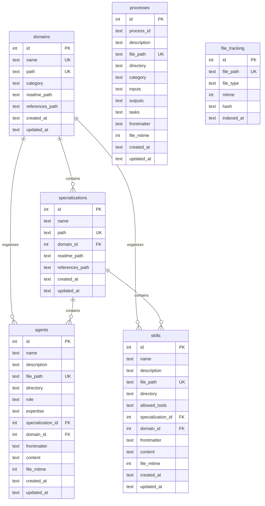
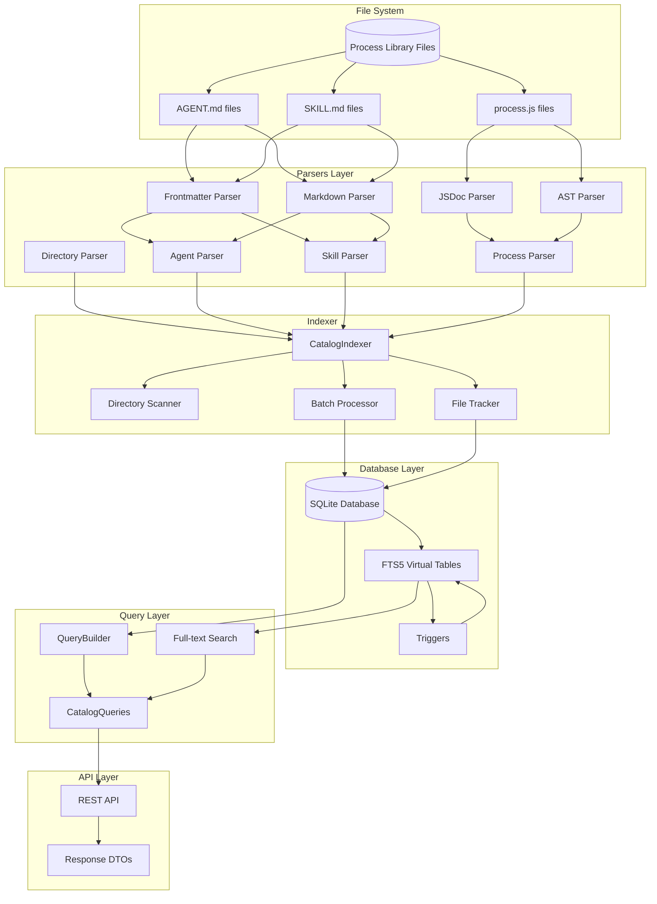

# Data Models and Database Schema

## 1. Overview

The Process Library Catalog uses SQLite as its primary database with `better-sqlite3` for Node.js integration. The system features:

- **Full-text search** using FTS5 virtual tables
- **Relational data model** with foreign key constraints
- **Incremental indexing** based on file modification times
- **Schema versioning** for migrations
- **WAL mode** for concurrent access

### Schema Version

Current schema version: **1**

---

## 2. Database Tables

### 2.1 schema_version

Tracks database schema version for migration management.

| Column | Type | Constraints | Description |
|--------|------|-------------|-------------|
| id | INTEGER | PRIMARY KEY, CHECK (id = 1) | Singleton row identifier |
| version | INTEGER | NOT NULL | Current schema version number |
| updated_at | TEXT | NOT NULL, DEFAULT datetime('now') | Last update timestamp |

### 2.2 domains

Top-level domain categories (e.g., science, business) that organize specializations.

| Column | Type | Constraints | Description |
|--------|------|-------------|-------------|
| id | INTEGER | PRIMARY KEY AUTOINCREMENT | Unique identifier |
| name | TEXT | NOT NULL, UNIQUE | Domain name |
| path | TEXT | NOT NULL, UNIQUE | Filesystem path to domain |
| category | TEXT | | Optional category grouping |
| readme_path | TEXT | | Path to README.md file |
| references_path | TEXT | | Path to references file |
| created_at | TEXT | NOT NULL, DEFAULT datetime('now') | Creation timestamp |
| updated_at | TEXT | NOT NULL, DEFAULT datetime('now') | Last update timestamp |

**Indexes:**
- `idx_domains_name` on `name`
- `idx_domains_category` on `category`

### 2.3 specializations

Specialized areas within or outside domains.

| Column | Type | Constraints | Description |
|--------|------|-------------|-------------|
| id | INTEGER | PRIMARY KEY AUTOINCREMENT | Unique identifier |
| name | TEXT | NOT NULL | Specialization name |
| path | TEXT | NOT NULL, UNIQUE | Filesystem path |
| domain_id | INTEGER | FK -> domains(id) ON DELETE SET NULL | Parent domain reference |
| readme_path | TEXT | | Path to README.md file |
| references_path | TEXT | | Path to references file |
| created_at | TEXT | NOT NULL, DEFAULT datetime('now') | Creation timestamp |
| updated_at | TEXT | NOT NULL, DEFAULT datetime('now') | Last update timestamp |

**Indexes:**
- `idx_specializations_name` on `name`
- `idx_specializations_domain_id` on `domain_id`

### 2.4 agents

AI agent definitions with roles and capabilities.

| Column | Type | Constraints | Description |
|--------|------|-------------|-------------|
| id | INTEGER | PRIMARY KEY AUTOINCREMENT | Unique identifier |
| name | TEXT | NOT NULL | Agent name |
| description | TEXT | NOT NULL, DEFAULT '' | Agent description |
| file_path | TEXT | NOT NULL, UNIQUE | Source file path |
| directory | TEXT | NOT NULL | Parent directory path |
| role | TEXT | | Agent's role definition |
| expertise | TEXT | NOT NULL, DEFAULT '[]' | JSON array of expertise areas |
| specialization_id | INTEGER | FK -> specializations(id) ON DELETE SET NULL | Parent specialization |
| domain_id | INTEGER | FK -> domains(id) ON DELETE SET NULL | Parent domain |
| frontmatter | TEXT | NOT NULL, DEFAULT '{}' | JSON object of YAML frontmatter |
| content | TEXT | NOT NULL, DEFAULT '' | Markdown content body |
| file_mtime | INTEGER | NOT NULL, DEFAULT 0 | File modification time (ms) |
| created_at | TEXT | NOT NULL, DEFAULT datetime('now') | Creation timestamp |
| updated_at | TEXT | NOT NULL, DEFAULT datetime('now') | Last update timestamp |

**Indexes:**
- `idx_agents_name` on `name`
- `idx_agents_specialization_id` on `specialization_id`
- `idx_agents_domain_id` on `domain_id`
- `idx_agents_file_mtime` on `file_mtime`

### 2.5 skills

Skill definitions with allowed tools and instructions.

| Column | Type | Constraints | Description |
|--------|------|-------------|-------------|
| id | INTEGER | PRIMARY KEY AUTOINCREMENT | Unique identifier |
| name | TEXT | NOT NULL | Skill name |
| description | TEXT | NOT NULL, DEFAULT '' | Skill description |
| file_path | TEXT | NOT NULL, UNIQUE | Source file path |
| directory | TEXT | NOT NULL | Parent directory path |
| allowed_tools | TEXT | NOT NULL, DEFAULT '[]' | JSON array of allowed tools |
| specialization_id | INTEGER | FK -> specializations(id) ON DELETE SET NULL | Parent specialization |
| domain_id | INTEGER | FK -> domains(id) ON DELETE SET NULL | Parent domain |
| frontmatter | TEXT | NOT NULL, DEFAULT '{}' | JSON object of YAML frontmatter |
| content | TEXT | NOT NULL, DEFAULT '' | Markdown content body |
| file_mtime | INTEGER | NOT NULL, DEFAULT 0 | File modification time (ms) |
| created_at | TEXT | NOT NULL, DEFAULT datetime('now') | Creation timestamp |
| updated_at | TEXT | NOT NULL, DEFAULT datetime('now') | Last update timestamp |

**Indexes:**
- `idx_skills_name` on `name`
- `idx_skills_specialization_id` on `specialization_id`
- `idx_skills_domain_id` on `domain_id`
- `idx_skills_file_mtime` on `file_mtime`

### 2.6 processes

Process definitions with inputs, outputs, and task definitions.

| Column | Type | Constraints | Description |
|--------|------|-------------|-------------|
| id | INTEGER | PRIMARY KEY AUTOINCREMENT | Unique identifier |
| process_id | TEXT | NOT NULL | Process identifier (from JSDoc @process) |
| description | TEXT | NOT NULL, DEFAULT '' | Process description |
| file_path | TEXT | NOT NULL, UNIQUE | Source file path |
| directory | TEXT | NOT NULL | Parent directory path |
| category | TEXT | | Process category |
| inputs | TEXT | NOT NULL, DEFAULT '[]' | JSON array of input definitions |
| outputs | TEXT | NOT NULL, DEFAULT '[]' | JSON array of output definitions |
| tasks | TEXT | NOT NULL, DEFAULT '[]' | JSON array of defineTask calls |
| frontmatter | TEXT | NOT NULL, DEFAULT '{}' | JSON object (reserved) |
| file_mtime | INTEGER | NOT NULL, DEFAULT 0 | File modification time (ms) |
| created_at | TEXT | NOT NULL, DEFAULT datetime('now') | Creation timestamp |
| updated_at | TEXT | NOT NULL, DEFAULT datetime('now') | Last update timestamp |

**Indexes:**
- `idx_processes_process_id` on `process_id`
- `idx_processes_category` on `category`
- `idx_processes_file_mtime` on `file_mtime`

### 2.7 file_tracking

File modification tracking for incremental updates.

| Column | Type | Constraints | Description |
|--------|------|-------------|-------------|
| id | INTEGER | PRIMARY KEY AUTOINCREMENT | Unique identifier |
| file_path | TEXT | NOT NULL, UNIQUE | Tracked file path |
| file_type | TEXT | NOT NULL, CHECK IN ('agent', 'skill', 'process', 'domain', 'specialization') | Type of tracked file |
| mtime | INTEGER | NOT NULL | File modification time (ms) |
| hash | TEXT | | Optional content hash |
| indexed_at | TEXT | NOT NULL, DEFAULT datetime('now') | When file was indexed |

**Indexes:**
- `idx_file_tracking_path` on `file_path`
- `idx_file_tracking_type` on `file_type`
- `idx_file_tracking_mtime` on `mtime`

### 2.8 index_metadata

Metadata about indexing operations (singleton table).

| Column | Type | Constraints | Description |
|--------|------|-------------|-------------|
| id | INTEGER | PRIMARY KEY, CHECK (id = 1) | Singleton row identifier |
| last_full_index | TEXT | | Timestamp of last full index |
| last_incremental_index | TEXT | | Timestamp of last incremental index |
| total_files_indexed | INTEGER | DEFAULT 0 | Total files in last index operation |
| index_duration_ms | INTEGER | DEFAULT 0 | Duration of last index operation |

---

## 3. FTS5 Virtual Tables

### 3.1 agents_fts

Full-text search index for agents.

| Column | Description |
|--------|-------------|
| name | Agent name (searchable) |
| description | Agent description (searchable) |
| role | Agent role (searchable) |
| expertise | JSON array of expertise (searchable) |
| content | Markdown content body (searchable) |

**Configuration:**
- `content='agents'` - Content table reference
- `content_rowid='id'` - Row ID mapping
- `tokenize='porter unicode61'` - Porter stemming with Unicode support

### 3.2 skills_fts

Full-text search index for skills.

| Column | Description |
|--------|-------------|
| name | Skill name (searchable) |
| description | Skill description (searchable) |
| allowed_tools | JSON array of tools (searchable) |
| content | Markdown content body (searchable) |

**Configuration:**
- `content='skills'` - Content table reference
- `content_rowid='id'` - Row ID mapping
- `tokenize='porter unicode61'` - Porter stemming with Unicode support

### 3.3 processes_fts

Full-text search index for processes.

| Column | Description |
|--------|-------------|
| process_id | Process identifier (searchable) |
| description | Process description (searchable) |
| category | Process category (searchable) |
| inputs | JSON array of inputs (searchable) |
| outputs | JSON array of outputs (searchable) |

**Configuration:**
- `content='processes'` - Content table reference
- `content_rowid='id'` - Row ID mapping
- `tokenize='porter unicode61'` - Porter stemming with Unicode support

### 3.4 catalog_search

Unified full-text search across all catalog items.

| Column | Description |
|--------|-------------|
| item_type | Type of item (agent, skill, process, domain, specialization) |
| item_id | Reference ID in source table (UNINDEXED) |
| name | Item name (searchable) |
| description | Item description (searchable) |
| content | Full content (searchable) |

**Configuration:**
- `tokenize='porter unicode61'` - Porter stemming with Unicode support
- `item_id UNINDEXED` - Not searchable, just stored

---

## 4. Database Triggers

### 4.1 Agent FTS Sync Triggers

```sql
-- After INSERT
CREATE TRIGGER agents_ai AFTER INSERT ON agents BEGIN
  INSERT INTO agents_fts(rowid, name, description, role, expertise, content)
  VALUES (new.id, new.name, new.description, new.role, new.expertise, new.content);
END;

-- After DELETE
CREATE TRIGGER agents_ad AFTER DELETE ON agents BEGIN
  INSERT INTO agents_fts(agents_fts, rowid, name, description, role, expertise, content)
  VALUES ('delete', old.id, old.name, old.description, old.role, old.expertise, old.content);
END;

-- After UPDATE
CREATE TRIGGER agents_au AFTER UPDATE ON agents BEGIN
  INSERT INTO agents_fts(agents_fts, rowid, name, description, role, expertise, content)
  VALUES ('delete', old.id, old.name, old.description, old.role, old.expertise, old.content);
  INSERT INTO agents_fts(rowid, name, description, role, expertise, content)
  VALUES (new.id, new.name, new.description, new.role, new.expertise, new.content);
END;
```

### 4.2 Skill FTS Sync Triggers

```sql
-- After INSERT
CREATE TRIGGER skills_ai AFTER INSERT ON skills BEGIN
  INSERT INTO skills_fts(rowid, name, description, allowed_tools, content)
  VALUES (new.id, new.name, new.description, new.allowed_tools, new.content);
END;

-- After DELETE
CREATE TRIGGER skills_ad AFTER DELETE ON skills BEGIN
  INSERT INTO skills_fts(skills_fts, rowid, name, description, allowed_tools, content)
  VALUES ('delete', old.id, old.name, old.description, old.allowed_tools, old.content);
END;

-- After UPDATE
CREATE TRIGGER skills_au AFTER UPDATE ON skills BEGIN
  INSERT INTO skills_fts(skills_fts, rowid, name, description, allowed_tools, content)
  VALUES ('delete', old.id, old.name, old.description, old.allowed_tools, old.content);
  INSERT INTO skills_fts(rowid, name, description, allowed_tools, content)
  VALUES (new.id, new.name, new.description, new.allowed_tools, new.content);
END;
```

### 4.3 Process FTS Sync Triggers

```sql
-- After INSERT
CREATE TRIGGER processes_ai AFTER INSERT ON processes BEGIN
  INSERT INTO processes_fts(rowid, process_id, description, category, inputs, outputs)
  VALUES (new.id, new.process_id, new.description, new.category, new.inputs, new.outputs);
END;

-- After DELETE
CREATE TRIGGER processes_ad AFTER DELETE ON processes BEGIN
  INSERT INTO processes_fts(processes_fts, rowid, process_id, description, category, inputs, outputs)
  VALUES ('delete', old.id, old.process_id, old.description, old.category, old.inputs, old.outputs);
END;

-- After UPDATE
CREATE TRIGGER processes_au AFTER UPDATE ON processes BEGIN
  INSERT INTO processes_fts(processes_fts, rowid, process_id, description, category, inputs, outputs)
  VALUES ('delete', old.id, old.process_id, old.description, old.category, old.inputs, old.outputs);
  INSERT INTO processes_fts(rowid, process_id, description, category, inputs, outputs)
  VALUES (new.id, new.process_id, new.description, new.category, new.inputs, new.outputs);
END;
```

---

## 5. Entity Relationships

### 5.1 Entity-Relationship Diagram



### 5.2 Relationship Summary

| From | To | Relationship | Foreign Key | On Delete |
|------|-----|--------------|-------------|-----------|
| specializations | domains | many-to-one | domain_id | SET NULL |
| agents | specializations | many-to-one | specialization_id | SET NULL |
| agents | domains | many-to-one | domain_id | SET NULL |
| skills | specializations | many-to-one | specialization_id | SET NULL |
| skills | domains | many-to-one | domain_id | SET NULL |

---

## 6. TypeScript Types

### 6.1 Database Row Types (src/lib/db/types.ts)

#### DomainRow

```typescript
interface DomainRow {
  id: number;
  name: string;
  path: string;
  category: string | null;
  readme_path: string | null;
  references_path: string | null;
  created_at: string;
  updated_at: string;
}
```

#### SpecializationRow

```typescript
interface SpecializationRow {
  id: number;
  name: string;
  path: string;
  domain_id: number | null;
  readme_path: string | null;
  references_path: string | null;
  created_at: string;
  updated_at: string;
}
```

#### AgentRow

```typescript
interface AgentRow {
  id: number;
  name: string;
  description: string;
  file_path: string;
  directory: string;
  role: string | null;
  expertise: string; // JSON array
  specialization_id: number | null;
  domain_id: number | null;
  frontmatter: string; // JSON object
  content: string;
  file_mtime: number;
  created_at: string;
  updated_at: string;
}
```

#### SkillRow

```typescript
interface SkillRow {
  id: number;
  name: string;
  description: string;
  file_path: string;
  directory: string;
  allowed_tools: string; // JSON array
  specialization_id: number | null;
  domain_id: number | null;
  frontmatter: string; // JSON object
  content: string;
  file_mtime: number;
  created_at: string;
  updated_at: string;
}
```

#### ProcessRow

```typescript
interface ProcessRow {
  id: number;
  process_id: string;
  description: string;
  file_path: string;
  directory: string;
  category: string | null;
  inputs: string; // JSON array
  outputs: string; // JSON array
  tasks: string; // JSON array
  frontmatter: string; // JSON object
  file_mtime: number;
  created_at: string;
  updated_at: string;
}
```

#### FileTrackingRow

```typescript
interface FileTrackingRow {
  id: number;
  file_path: string;
  file_type: 'agent' | 'skill' | 'process' | 'domain' | 'specialization';
  mtime: number;
  hash: string | null;
  indexed_at: string;
}
```

### 6.2 Search Types

#### FTSSearchRow

```typescript
interface FTSSearchRow {
  id: number;
  item_type: string;
  item_id: number;
  name: string;
  description: string;
  content: string;
  rank: number;
}
```

#### SearchResult

```typescript
interface SearchResult {
  type: 'agent' | 'skill' | 'process' | 'domain' | 'specialization';
  id: number;
  name: string;
  description: string;
  path: string;
  score: number;
  highlights?: {
    name?: string;
    description?: string;
    content?: string;
  };
  metadata?: Record<string, unknown>;
}
```

### 6.3 Query Types

#### FilterOperator

```typescript
type FilterOperator =
  | 'eq'      // Equal
  | 'ne'      // Not equal
  | 'gt'      // Greater than
  | 'gte'     // Greater than or equal
  | 'lt'      // Less than
  | 'lte'     // Less than or equal
  | 'like'    // LIKE pattern match
  | 'in'      // IN array
  | 'not_in'  // NOT IN array
  | 'is_null' // IS NULL
  | 'is_not_null'; // IS NOT NULL
```

#### FilterCondition

```typescript
interface FilterCondition {
  field: string;
  operator: FilterOperator;
  value: unknown;
}
```

#### SortDirection

```typescript
type SortDirection = 'asc' | 'desc';
```

#### SortSpec

```typescript
interface SortSpec {
  field: string;
  direction: SortDirection;
}
```

#### PaginationOptions

```typescript
interface PaginationOptions {
  page: number;
  pageSize: number;
}
```

#### QueryOptions

```typescript
interface QueryOptions {
  filters?: FilterCondition[];
  sort?: SortSpec[];
  pagination?: PaginationOptions;
  search?: string;
  includeContent?: boolean;
}
```

#### PaginatedResult

```typescript
interface PaginatedResult<T> {
  data: T[];
  pagination: {
    page: number;
    pageSize: number;
    totalItems: number;
    totalPages: number;
    hasNextPage: boolean;
    hasPrevPage: boolean;
  };
}
```

### 6.4 Indexer Types

#### IndexProgress

```typescript
interface IndexProgress {
  phase: 'scanning' | 'parsing' | 'indexing' | 'complete';
  current: number;
  total: number;
  currentFile?: string;
  message?: string;
}
```

#### IndexResult

```typescript
interface IndexResult {
  success: boolean;
  statistics: {
    domainsIndexed: number;
    specializationsIndexed: number;
    agentsIndexed: number;
    skillsIndexed: number;
    processesIndexed: number;
    filesProcessed: number;
    errors: number;
    duration: number;
  };
  errors: Array<{ file: string; error: string }>;
}
```

#### IndexerOptions

```typescript
interface IndexerOptions {
  forceReindex?: boolean;
  onProgress?: IndexProgressCallback;
  batchSize?: number;
  libraryPaths?: string[];
}
```

### 6.5 Database Client Types

#### DatabaseClientOptions

```typescript
interface DatabaseClientOptions {
  dbPath: string;
  walMode?: boolean;
  verbose?: boolean;
}
```

#### DatabaseStats

```typescript
interface DatabaseStats {
  domainsCount: number;
  specializationsCount: number;
  agentsCount: number;
  skillsCount: number;
  processesCount: number;
  lastIndexedAt: string | null;
  databaseSize: number;
}
```

### 6.6 Catalog Entry Types

#### CatalogEntryType

```typescript
type CatalogEntryType = 'agent' | 'skill' | 'process' | 'domain' | 'specialization';
```

#### CatalogEntryView

```typescript
interface CatalogEntryView {
  id: number;
  type: CatalogEntryType;
  name: string;
  description: string;
  path: string;
  domainName: string | null;
  specializationName: string | null;
  tags: string[];
  metadata: Record<string, unknown>;
  createdAt: string;
  updatedAt: string;
}
```

---

## 7. Parser Types (src/lib/parsers/types.ts)

### 7.1 Common Parser Types

#### ParseResult

```typescript
interface ParseResult<T> {
  success: boolean;
  data?: T;
  error?: ParseError;
  warnings?: ParseWarning[];
}
```

#### ParseError

```typescript
interface ParseError {
  code: string;
  message: string;
  file?: string;
  line?: number;
  column?: number;
}
```

#### ParseWarning

```typescript
interface ParseWarning {
  code: string;
  message: string;
  file?: string;
  line?: number;
}
```

#### SourceLocation

```typescript
interface SourceLocation {
  file: string;
  line?: number;
  column?: number;
}
```

### 7.2 Frontmatter Types

#### FrontmatterData

```typescript
interface FrontmatterData {
  [key: string]: unknown;
}
```

#### ParsedFrontmatter

```typescript
interface ParsedFrontmatter<T = FrontmatterData> {
  data: T;
  content: string;
  isEmpty: boolean;
  excerpt?: string;
}
```

#### AgentMetadata

```typescript
interface AgentMetadata {
  specialization?: string;
  domain?: string;
  category?: string;
  phase?: number;
  id?: string;
}
```

#### AgentFrontmatter

```typescript
interface AgentFrontmatter {
  name: string;
  description: string;
  role?: string;
  expertise?: string[];
  metadata?: AgentMetadata;
}
```

#### SkillMetadata

```typescript
interface SkillMetadata {
  specialization?: string;
  domain?: string;
  category?: string;
  phase?: number;
  id?: string;
}
```

#### SkillFrontmatter

```typescript
interface SkillFrontmatter {
  name: string;
  description: string;
  'allowed-tools'?: string[];
  metadata?: SkillMetadata;
}
```

### 7.3 Parsed Entity Types

#### MarkdownSection

```typescript
interface MarkdownSection {
  title: string;
  level: number;
  content: string;
  subsections?: MarkdownSection[];
}
```

#### ParsedAgent

```typescript
interface ParsedAgent {
  name: string;
  description: string;
  role?: string;
  expertise: string[];
  metadata: AgentMetadata;
  sections: MarkdownSection[];
  responsibilities?: string[];
  requiredSkills?: string[];
  collaboration?: string[];
  source: {
    file: string;
    directory: string;
  };
}
```

#### ParsedSkill

```typescript
interface ParsedSkill {
  name: string;
  description: string;
  allowedTools: string[];
  metadata: SkillMetadata;
  sections: MarkdownSection[];
  purpose?: string;
  capabilities?: string[];
  usageGuidelines?: string[];
  tools?: string[];
  source: {
    file: string;
    directory: string;
  };
}
```

#### ParsedProcess

```typescript
interface ParsedProcess {
  id: string;
  description: string;
  inputs: JSDocInput[];
  outputs: JSDocOutput[];
  tasks: DefineTaskCall[];
  exports: ExportInfo[];
  hasProcessFunction: boolean;
  category: string;
  path: string;
  source: {
    file: string;
    directory: string;
  };
}
```

### 7.4 JSDoc Types

#### JSDocInput

```typescript
interface JSDocInput {
  name: string;
  type: string;
  description?: string;
  required?: boolean;
  defaultValue?: string;
}
```

#### JSDocOutput

```typescript
interface JSDocOutput {
  name: string;
  type: string;
  description?: string;
}
```

#### ParsedJSDoc

```typescript
interface ParsedJSDoc {
  process?: string;
  description?: string;
  inputs?: JSDocInput[];
  outputs?: JSDocOutput[];
  rawInputs?: string;
  rawOutputs?: string;
  author?: string;
  version?: string;
  since?: string;
  deprecated?: string;
  see?: string[];
  example?: string[];
  tags?: Record<string, string>;
}
```

### 7.5 AST Types

#### DefineTaskCall

```typescript
interface DefineTaskCall {
  name: string;
  variableName?: string;
  kind?: 'agent' | 'node' | 'parallel' | 'sequence';
  title?: string;
  description?: string;
  labels?: string[];
  agent?: {
    name?: string;
    prompt?: {
      role?: string;
      task?: string;
      instructions?: string[];
      outputFormat?: string;
    };
    outputSchema?: Record<string, unknown>;
  };
  io?: {
    inputJsonPath?: string;
    outputJsonPath?: string;
    outputArtifacts?: Array<{
      path?: string;
      format?: string;
    }>;
  };
  location: SourceLocation;
}
```

#### ExportInfo

```typescript
interface ExportInfo {
  name: string;
  type: 'function' | 'const' | 'default';
  isAsync?: boolean;
  location: SourceLocation;
}
```

### 7.6 Directory Structure Types

#### DomainInfo

```typescript
interface DomainInfo {
  name: string;
  path: string;
  category?: string;
  specializations: SpecializationInfo[];
  agents: string[];
  skills: string[];
  readme?: string;
  references?: string;
}
```

#### SpecializationInfo

```typescript
interface SpecializationInfo {
  name: string;
  path: string;
  domain?: string;
  agents: string[];
  skills: string[];
  processes?: string[];
  readme?: string;
  references?: string;
}
```

#### DirectoryScanResult

```typescript
interface DirectoryScanResult {
  domains: DomainInfo[];
  specializations: SpecializationInfo[];
  methodologies: string[];
  totalAgents: number;
  totalSkills: number;
  totalProcesses: number;
}
```

### 7.7 Catalog Types

#### CatalogItemType

```typescript
type CatalogItemType = 'agent' | 'skill' | 'process' | 'domain' | 'specialization';
```

#### CatalogEntry

```typescript
interface CatalogEntry {
  id: string;
  type: CatalogItemType;
  name: string;
  description: string;
  path: string;
  domain?: string;
  specialization?: string;
  category?: string;
  phase?: number;
  tags?: string[];
  metadata?: Record<string, unknown>;
}
```

#### ProcessCatalog

```typescript
interface ProcessCatalog {
  version: string;
  generatedAt: string;
  entries: CatalogEntry[];
  domains: DomainInfo[];
  specializations: SpecializationInfo[];
  statistics: {
    totalAgents: number;
    totalSkills: number;
    totalProcesses: number;
    totalDomains: number;
    totalSpecializations: number;
  };
}
```

---

## 8. API Types (src/types/index.ts)

### ProcessDefinition

```typescript
interface ProcessDefinition {
  id: string;
  name: string;
  description: string;
  category: string;
  tags: string[];
  version: string;
  author?: string;
  createdAt: string;
  updatedAt: string;
  status: "active" | "deprecated" | "draft";
}
```

### Agent (API)

```typescript
interface Agent {
  id: string;
  name: string;
  description: string;
  capabilities: string[];
  processId: string;
}
```

### Skill (API)

```typescript
interface Skill {
  id: string;
  name: string;
  description: string;
  inputs: SkillInput[];
  outputs: SkillOutput[];
  processId: string;
}
```

### SkillInput

```typescript
interface SkillInput {
  name: string;
  type: string;
  description?: string;
  required: boolean;
}
```

### SkillOutput

```typescript
interface SkillOutput {
  name: string;
  type: string;
  description?: string;
}
```

### CatalogItem

```typescript
interface CatalogItem {
  type: "process" | "agent" | "skill";
  data: ProcessDefinition | Agent | Skill;
  path: string;
}
```

### SearchResult (API)

```typescript
interface SearchResult {
  items: CatalogItem[];
  total: number;
  page: number;
  pageSize: number;
}
```

### FilterOptions

```typescript
interface FilterOptions {
  category?: string;
  tags?: string[];
  status?: ProcessDefinition["status"];
  search?: string;
}
```

---

## 9. Data Flow

### 9.1 Data Flow Diagram



### 9.2 Data Transformation Pipeline

1. **File Discovery**
   - Directory scanner finds all AGENT.md, SKILL.md, and *.js files
   - File tracker checks modification times against database

2. **Parsing Phase**
   - YAML frontmatter extracted from markdown files
   - Markdown sections parsed into structured objects
   - JSDoc comments extracted from JS files
   - AST analysis identifies defineTask calls

3. **Transformation Phase**
   - ParsedAgent/ParsedSkill/ParsedProcess created
   - JSON arrays serialized for storage (expertise, allowedTools, inputs, outputs)
   - Foreign keys resolved (domain_id, specialization_id)

4. **Storage Phase**
   - Batch inserts with transactions
   - Triggers update FTS indexes automatically
   - File tracking updated for incremental indexing

5. **Query Phase**
   - QueryBuilder constructs SQL with filters/sort/pagination
   - FTS5 MATCH for full-text search
   - Results mapped to TypeScript types
   - JSON fields deserialized

---

## 10. Validation Rules

### 10.1 Database Constraints

| Table | Constraint | Description |
|-------|------------|-------------|
| schema_version | CHECK (id = 1) | Singleton table |
| domains | UNIQUE(name) | Domain names must be unique |
| domains | UNIQUE(path) | Domain paths must be unique |
| specializations | UNIQUE(path) | Specialization paths must be unique |
| agents | UNIQUE(file_path) | Agent file paths must be unique |
| skills | UNIQUE(file_path) | Skill file paths must be unique |
| processes | UNIQUE(file_path) | Process file paths must be unique |
| file_tracking | UNIQUE(file_path) | One tracking record per file |
| file_tracking | CHECK file_type | Must be valid file type enum |
| index_metadata | CHECK (id = 1) | Singleton table |

### 10.2 Parser Validation

**Agent Files:**
- Must have valid YAML frontmatter
- `name` field required in frontmatter
- `description` field required in frontmatter

**Skill Files:**
- Must have valid YAML frontmatter
- `name` field required in frontmatter
- `description` field required in frontmatter

**Process Files:**
- Must have `@process` JSDoc tag
- Must export a function (process entry point)
- Inputs/outputs validated against expected structure

### 10.3 JSON Field Schemas

**expertise (agents):**
```json
["string", "array", "of", "expertise", "areas"]
```

**allowed_tools (skills):**
```json
["Bash", "Read", "Write", "Edit", "Glob", "Grep"]
```

**inputs (processes):**
```json
[
  {
    "name": "inputName",
    "type": "string",
    "description": "Input description",
    "required": true,
    "defaultValue": "optional default"
  }
]
```

**outputs (processes):**
```json
[
  {
    "name": "outputName",
    "type": "string",
    "description": "Output description"
  }
]
```

**tasks (processes):**
```json
[
  {
    "name": "taskName",
    "kind": "agent",
    "title": "Task Title",
    "description": "Task description"
  }
]
```

---

## 11. Performance Optimizations

### 11.1 Database Configuration

```typescript
// WAL mode for concurrent access
db.pragma('journal_mode = WAL');

// Performance pragmas
db.pragma('synchronous = NORMAL');
db.pragma('cache_size = -64000'); // 64MB cache
db.pragma('temp_store = MEMORY');
db.pragma('mmap_size = 268435456'); // 256MB mmap
```

### 11.2 Index Strategy

| Index | Purpose | Query Pattern |
|-------|---------|---------------|
| idx_*_name | Fast lookup by name | WHERE name = ? |
| idx_*_domain_id | Domain filtering | WHERE domain_id = ? |
| idx_*_specialization_id | Specialization filtering | WHERE specialization_id = ? |
| idx_*_file_mtime | Incremental indexing | WHERE file_mtime > ? |
| idx_*_category | Category filtering | WHERE category = ? |

### 11.3 FTS5 Optimization

- **Porter stemmer**: Matches word variations (run, running, ran)
- **Unicode61 tokenizer**: Full Unicode support
- **Content tables**: FTS linked to source tables, no data duplication
- **Ranked results**: BM25 ranking via `rank` column

### 11.4 Batch Processing

```typescript
const DEFAULT_BATCH_SIZE = 100;

// Batch inserts within transactions
for (let i = 0; i < items.length; i += batchSize) {
  const batch = items.slice(i, i + batchSize);
  db.transaction(() => {
    for (const item of batch) {
      insertStmt.run(item);
    }
  });
}
```

---

## 12. Schema Migration

### 12.1 Version Checking

```typescript
function needsMigration(db: Database.Database): boolean {
  const currentVersion = getSchemaVersion(db);
  return currentVersion < SCHEMA_VERSION;
}
```

### 12.2 Migration Pattern

```typescript
function runMigrations(db: Database.Database): void {
  const currentVersion = getSchemaVersion(db);

  if (currentVersion < 1) {
    initializeSchema(db);
    return;
  }

  // Future migrations
  // if (currentVersion < 2) { runMigration2(db); }
  // if (currentVersion < 3) { runMigration3(db); }
}
```

### 12.3 Reset Database

```typescript
function resetDatabase(db: Database.Database): void {
  // Drop in reverse dependency order
  db.exec('DROP TABLE IF EXISTS catalog_search');
  db.exec('DROP TABLE IF EXISTS processes_fts');
  // ... more drops ...

  // Recreate schema
  initializeSchema(db);
}
```

---

## 13. Summary Statistics

| Category | Count |
|----------|-------|
| Core Tables | 8 |
| FTS Virtual Tables | 4 |
| Indexes | 18 |
| Triggers | 9 |
| Database Row Types | 6 |
| Search Types | 2 |
| Query Types | 7 |
| Indexer Types | 4 |
| Client Types | 2 |
| Catalog Types | 2 |
| Parser Types | 25+ |
| API Types | 7 |
| **Total Types** | **55+** |
