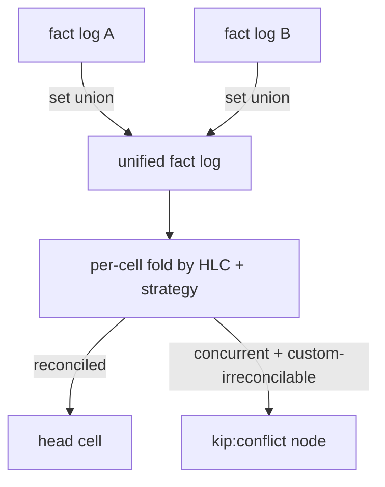
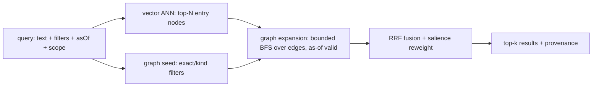

# `@a5c-ai/kip-sdk` — SPEC (v1)

> Status: **Draft v1**, spec-only. Illustrative TypeScript interfaces are normative for *shape*,
> not implementation. `MUST`/`SHOULD`/`MAY` are RFC-2119 keywords. Companion: `PRIOR-ART.md`
> (research brief). This SPEC **resolves** the hard problems and tensions enumerated there; it does
> not re-derive them. Cross-references like *(HP-4)* point at PRIOR-ART §3 hard problems and *(T-2)*
> at §4 tensions.

---

## 1. Executive summary

**Thesis.** *kip is a git-substrate, bitemporal, signed-fact property-graph memory whose unit of
synchronization is an append-only signed temporal fact, so that coordinator-free agent replicas
converge mechanically at the substrate and supersede semantically above it, and a context-management
layer can be built entirely on derived, rebuildable projections.*

kip-sdk (Knowledge / Inference / Provenance) is the **ideal core** beneath a future
context-management product. It is a library, not a runtime (cf. Letta pitfall — memory is a
substrate, agents are clients). It provides:

1. A **typed property graph** (nodes, edges, properties, schema/ontology, dual identity) as the
   conceptual surface.
2. A **git object/ref layout** as the *only* durable store: every memory write is a commit; history,
   branching, merge, and sync are git operations specialized with typed semantics.
3. **Bitemporal signed temporal facts** as the *unit of change and the unit of synchronization* —
   the graph is a *projection* of the fact log, never an authoritative store of its own.
4. **Coordinator-free convergence**: HLC-stamped, Ed25519-signed facts; mechanical CRDT-like merge
   at the substrate; semantic supersession above it; provable associative/commutative/idempotent
   reconciliation.
5. **Hybrid retrieval**: vector candidates → graph expansion → RRF fusion, over
   content-addressed, incrementally rebuildable projections.
6. **Memory semantics**: episodic vs semantic, salience/decay, consolidation, forgetting via
   tombstone+excision that preserves verifiability.

### Goals

- G1. Git is the **sole source of truth**. Any projection (graph adjacency, vector index, salience)
  is droppable and rebuildable from git objects alone, deterministically.
- G2. Every change is an **append-only, signed, bitemporal fact** carrying its own version tag.
- G3. **Coordinator-free convergence**: two replicas that have seen the same set of facts compute
  byte-identical projections, independent of ingestion order (HP-6, T-4, T-5).
- G4. **Stable entity identity** decoupled from content addressing (HP-4, T-1).
- G5. **Incremental projections** keyed off git object hashes — never a monolithic full rebuild
  (HP-2, T-3).
- G6. **Forgetting coexists with immutable history** via tombstone + excision (HP-7).
- G7. **Schema/fact evolution** via versioned upcasters from day one (HP-8).
- G8. A **small, composable, well-typed** core API (the "seams" the context layer plugs into).

### Non-goals

- N1. The context-management layer itself (assembly heuristics, prompt packing, token budgeting).
  kip specs the *seams* (§4c), not the layer.
- N2. The embedding model, LLM, or extraction pipeline. kip consumes embeddings/extracted facts;
  it does not produce them. (cognee ECL lives *above* kip.)
- N3. A query language / SQL surface. kip exposes a typed traversal + retrieval API, not a DSL.
- N4. A network server / replication daemon. kip provides the fact log, sync primitives, and
  transports; deployment topology is a client concern.
- N5. **No fallbacks.** Ambiguous merges surface as typed conflicts; unverifiable facts are
  rejected. kip never silently "picks something."

### Terminology

| Term | Meaning |
|---|---|
| **Fact** | The atomic, immutable, signed, bitemporal unit of change. Asserts or retracts one statement about one node or edge. The *only* writable thing. |
| **Node / Edge** | *Projected* graph entities, reconstructed by folding the relevant facts. Not stored directly. |
| **Entity id (EID)** | Stable, author-assigned identity of a node/edge across all mutations. |
| **Content id (CID)** | git object id (SHA-1/SHA-256 per repo) of an immutable value. |
| **Projection** | A derived, rebuildable read model (graph index, vector index, salience). Keyed by source git hashes. |
| **HLC** | Hybrid Logical Clock stamp on every fact: `(wall, counter, replicaId)`. |
| **Replica** | An independent kip instance (one agent / one process) with its own branch. |
| **Valid time** | When a fact is true *in the modeled world* (`validFrom`/`validTo`). |
| **Transaction time** | When kip *recorded* the fact (`txFrom`/`txTo`), derived from HLC + commit. |

---

## 2. Conceptual model — memory as a typed property graph

### 2.1 Nodes, edges, properties

A node is a typed bag of properties with provenance; an edge is a typed, directed, attributed,
**bitemporal** relationship. This mirrors `packages/atlas` (`AtlasRecord` / `Edge`) but every field
is the *fold* of facts, not an authored file.

```ts
type EID = string;          // stable entity id, e.g. "node:person/ada", "edge:01J…"
type CID = string;          // git object id (hex)
type NodeKind = string;     // schema-defined, e.g. "person", "episode"
type EdgeKind = string;     // schema-defined, e.g. "works_at", "derived_from"
type PropKey = string;
type PropValue = string | number | boolean | null | CID; // large values → blob, referenced by CID

interface NodeView {
  eid: EID;
  kind: NodeKind;
  props: Record<PropKey, PropCell>;   // each cell carries its own provenance + temporality
  provenance: Provenance;             // latest asserting fact's provenance
}

interface EdgeView {
  eid: EID;
  kind: EdgeKind;
  from: EID;
  to: EID;
  props: Record<PropKey, PropCell>;
  validFrom: HlcOrTime; validTo: HlcOrTime | null;   // valid-time interval (Graphiti-style)
  provenance: Provenance;
}

interface PropCell {                  // the merge/conflict unit (T-4: mechanical merge granularity)
  value: PropValue;
  validFrom: HlcOrTime; validTo: HlcOrTime | null;
  assertedBy: FactId;                 // the fact that set this cell
  supersededBy?: FactId;              // set when a later fact retracts/overwrites
}
```

The **cell** (one property of one entity at one valid-time interval) is the atomic unit of merge and
conflict (resolving HP-1, T-4: mechanical convergence bottoms out at the cell, exactly as Dolt's
prolly-tree merge does).

### 2.2 Typing / schema / ontology

Schema is a **per-tenant, mutable ontology** (cf. kradle `AgentMemoryOntology`), itself versioned and
stored as facts so schema history is auditable and as-of-queryable.

```ts
interface NodeKindDef {
  kind: NodeKind;
  version: number;                    // schema version → upcaster keying (HP-8)
  props: PropSchema[];
  mergeStrategy: MergeStrategyRef;    // per-kind merge policy (Irmin)
  identity: IdentityPolicy;           // how EIDs are formed/validated
}
interface EdgeKindDef {
  kind: EdgeKind; version: number;
  source: NodeKind | NodeKind[]; target: NodeKind | NodeKind[];
  cardinality: "1:1" | "1:N" | "N:1" | "N:M";
  inverse?: EdgeKind;
  temporal: boolean;                  // bitemporal validity tracked (default true)
  mergeStrategy: MergeStrategyRef;
}
```

**Decision: schema is *descriptive + gated at write*, not enforced at read.** Atlas treats schema as
descriptive (counted, not gated). kip tightens this: a fact whose kind/props violate the *current*
ontology is **rejected at `assertFact`** (no silent acceptance — see N5), but a fact valid under the
ontology *as-of its txFrom* is always replayable, even after the schema later changes. *Rejected
alternative:* read-time enforcement (atlas-style) — discarded because it makes projections
non-deterministic w.r.t. schema drift.

### 2.3 Episodic vs semantic

Two co-resident layers in one graph, distinguished by node kind and a `memoryClass` facet, **not** by
separate stores (Mem0 pitfall: a bolted-on second store that doesn't earn its keep).

| Layer | Node kinds (examples) | Origin | Lifecycle |
|---|---|---|---|
| **Episodic** | `episode`, `observation`, `run`, `event` | Direct ingestion (e.g. babysitter journal, à la kradle `parseJournalForImport` — summary-only, never raw). | High volume, time-stamped, **decays**, candidate for consolidation. |
| **Semantic** | `entity`, `concept`, `claim`, `relation` | **Consolidated** from episodic via promotion facts; or asserted directly. | Lower volume, durable, **provenance-linked back** to source episodes. |

`derived_from` edges link semantic nodes to the episodes that produced them — so every semantic claim
is auditable to its episodic source, and forgetting an episode can cascade (§4 decay).

### 2.4 Provenance (first-class on every fact)

```ts
interface Provenance {
  author: ActorId;                    // who/what asserted it (agent, human, importer)
  signature: Ed25519Sig;              // signed canonical payload (adapters/tasks pattern)
  publicKeyFingerprint: string;       // SHA-256 of pubkey DER
  signedFields: string[];             // explicit ordered field set → verifier rebuilds payload
  hlc: HlcStamp;                      // causal clock
  commit: CID;                        // commit that durably recorded the fact
  source?: { uri: string; cid?: CID }; // upstream artifact (journal, doc, message)
  confidence?: number;                // [0,1] — feeds salience + supersession
}
```

Provenance is **signed and verifiable before merge** (resolving the trust half of HP-6). A replica
**MUST reject** an unverifiable fact rather than degrade to trusting it (N5).

---

## 3. Git substrate

### 3.1 Object & ref layout

Git is the *only* durable store. The mapping:

```
refs/
  heads/main                         # the trunk: canonical, merged history
  kip/replicas/<replicaId>           # one branch per replica/agent (T-2 hybrid)
  kip/sessions/<runId>               # short-lived per-session branch, pinned read-set (kradle snapshot)
  kip/projections/<name>@<srcHash>   # CACHE ref: a built projection keyed to its source tree hash
  kip/keys/trusted                   # trusted Ed25519 pubkeys + validity windows
objects/                             # content-addressed: blobs, trees, commits (+ packs)

# tree layout inside a commit (working tree of the memory):
/facts/<shardHi>/<shardLo>/<factId>.json     # the append-only fact log (one file per fact)
/heads/nodes/<eidShard>/<eid>.json           # MATERIALIZED node head (latest fold) — derived, committed for self-containment
/heads/edges/<eidShard>/<eid>.json           # MATERIALIZED edge head — derived
/ontology/nodes/<kind>@<ver>.json            # schema as data, versioned
/ontology/edges/<kind>@<ver>.json
/upcasters/<factType>@<from>-<to>.json       # declarative upcaster descriptors (HP-8)
/manifest.json                               # repo format version, hash algo, clock epoch
```

**Sharding** (`<shardHi>/<shardLo>` = first 2 + next 2 hex of the fact/eid hash) keeps any single
tree small, so prolly-tree-style subtree-hash-skip diffs are cheap and loose-object fan-out is
bounded (HP-3). Empirically git tolerates ~tens of thousands of entries per tree poorly; sharding caps
fan-out per directory.

**Dual storage of facts and heads** resolves T-3 pragmatically:
- `/facts/**` is the **authoritative append-only log** (event-sourcing source of truth).
- `/heads/**` is a **materialized projection committed into git** so a fresh clone can answer
  point reads at *any commit* without a rebuild — but it is *derivable* and verified by replay
  (`kip fsck`). Vector/salience projections are **NOT** committed (too large, too volatile) — they
  live under `refs/kip/projections/*` cache refs and are pure derivatives (T-3 resolution: cheap
  self-contained heads in git, expensive volatile indexes outside).

### 3.2 A memory write → a commit

```
assertFact(f) ⇒
  1. validate f against current ontology (reject on violation)
  2. verify f.signature (reject if unsigned/untrusted) ; stamp HLC
  3. write /facts/<shard>/<f.id>.json                         (new blob)
  4. fold f into affected /heads/<eid>.json                    (new blob; cell-level update)
  5. write tree + commit on the replica branch
       commit.message = canonical fact summary
       commit.author  = f.provenance.author
       commit trailers: Kip-Fact-Id, Kip-HLC, Kip-Sig-Fpr
  6. update projections incrementally (§5), keyed off new tree hash
```

**Commit granularity (decision).** Default is **batched**: a `txn([...facts])` produces **one
commit** containing all facts (resolving HP-3 — per-fact commits explode object count). `assertFact`
outside a txn auto-batches via a debounced write buffer flushed on `commit()` or timeout. *Rejected
alternative:* one-commit-per-fact (Datomic-tx-like) — clean but pathological for git object count at
agent write rates.

### 3.3 Branch & commit semantics

```
trunk (refs/heads/main):  o──o──o───────────o (merge)
                               \             /
replica A:                      a1──a2──a3──/
                                     \
session S (pinned read-set):          (no writes; read snapshot @a2)
```

- **commit** = a durable, ordered set of facts on a branch. Commit DAG gives causal order at the
  *batch* level; HLC gives causal order at the *fact* level (§4b).
- **branch** = an independent timeline. `refs/kip/replicas/*` are long-lived (one per agent);
  `refs/kip/sessions/*` are short-lived read pins (kradle snapshot model) and normally carry **no
  writes** (read isolation), or carry session-scratch writes that merge back.
- **as-of a commit** = check out `/heads` at that commit → a complete, self-contained graph snapshot
  with zero rebuild.

### 3.4 Merge & conflict resolution

Two-level resolution (the central T-4 / HP-1 decision):

**Level 1 — mechanical, at the substrate (always converges).** A typed 3-way merge over the fact log
and head trees, prolly-tree-style: subtrees whose content hash matches the merge base are skipped
untouched; only divergent cells are examined.

- **Fact log merge is a set union.** Facts are immutable and content-addressed; `merge(base, A, B)`
  of `/facts/**` = union of fact blobs. Two replicas that ingested the same facts in different orders
  produce the *same* fact-set ⇒ **append-only fact log is trivially a CRDT (a grow-only set, OR-Set
  with no removes)** (HP-6, T-4 substrate half). This is the convergence guarantee's foundation.
- **Head merge is per-cell, by registered strategy.** After unioning facts, each affected
  `/heads/<eid>` cell is **recomputed by folding its facts** (not text-merged). The fold is the merge:
  conflict only arises when two *concurrent* (HLC-incomparable) facts assert the *same cell* with
  different values.

```ts
type MergeStrategyRef = "lww-hlc" | "max" | "min" | "set-union" | "gset" | "counter" | "custom:<id>";

interface MergeStrategy<V = PropValue> {
  id: string;
  // MUST be associative, commutative, idempotent (Irmin contract) — verified by conformance suite (§9)
  merge(base: V | undefined, a: Cell<V>, b: Cell<V>): MergeResult<V>;
}
type MergeResult<V> = { resolved: Cell<V> } | { conflict: Conflict<V> };
```

**Default strategy `lww-hlc`**: last-writer-wins keyed by HLC (wall, then counter, then replicaId as
deterministic tiebreak). This is associative/commutative/idempotent because HLC induces a total order
on facts (the replicaId tiebreak guarantees totality), so the "max fact wins" is order-independent.
Per-kind overrides (e.g. a `tags` property uses `set-union`; a `view_count` uses `counter`).

**Conflict surfacing (no fallback).** When a strategy returns `{conflict}` (e.g. a `custom`
strategy that declares two values genuinely irreconcilable), kip writes a `kip:conflict` node linking
both facts and **does not pick a value**. The cell reads as `CONFLICTED` until a human/agent asserts a
resolving fact. Conflicts are first-class graph citizens, queryable. *This is the explicit policy that
Dolt's pitfall demands (cell-level conflict requires a policy).*



### 3.5 GC / packing / history bloat

(HP-3, content-addressed pitfall.)

- **Packing.** kip schedules `git repack`/`gc` after N commits or M loose objects. Sharded trees +
  batched commits keep loose-object fan-out bounded; delta compression across fact blobs of the same
  shard is effective because facts share envelope structure.
- **Delta-layer rollup (TerminusDB-style).** A **rollup** operation rewrites a long fact run into a
  compacted *snapshot commit*: it materializes `/heads` at a chosen commit, writes a `kip:rollup`
  marker fact recording the covered HLC range + the pre-rollup tip CID, and the old fact blobs become
  GC-eligible **only after** excision policy permits (§4 forgetting). Reads after a rollup traverse
  fewer facts; the rollup marker preserves auditability ("history before T is summarized at CID X").
- **Excision vs gc.** Ordinary gc removes only unreachable objects and never drops reachable facts.
  *Forgetting* (deliberate fact removal) is a distinct, audited operation (§4.5), not gc.

### 3.6 Content-addressing vs stable identity (the dual-id scheme)

(HP-4, T-1 — resolved.) kip maintains **both** layers and declares which is authoritative for equality:

- **CID (content id)** = git object id. Authoritative for **integrity, dedup, and sync** (Noms: send
  only missing chunks). Identical fact/value content stored once, repo-wide.
- **EID (entity id)** = author-assigned stable string (atlas-style: `node:person/ada`). Authoritative
  for **identity/equality over time** ("the same entity"). EIDs MUST be stable and are validated by
  the kind's `IdentityPolicy` (e.g. natural-key, UUID, or content-hash-seeded-then-frozen).

The mapping `EID → ordered list of (HLC, CID)` (the entity's history of head states) is itself a
derived projection rebuildable from the fact log. **Equality decision:** two graph references are the
same entity **iff equal EID**; CID equality means "same value," never "same entity." Facts reference
entities by **EID**, never by CID (so a fact survives content changes). *This directly resolves the
Noms pitfall (content == identity) by layering a stable id overlay, and resolves T-1 by declaring EID
authoritative for entity equality and CID authoritative for value/dedup.*

---

## 4. Temporality & temporal facts

### 4.1 The fact envelope (the unit of change *and* sync)

```ts
type FactId = string;          // = CID of the canonical fact payload (content-addressed)
type FactType = "assert" | "retract";
type Target =
  | { kind: "node-prop"; eid: EID; nodeKind: NodeKind; prop: PropKey }
  | { kind: "edge"; eid: EID; edgeKind: EdgeKind; from: EID; to: EID }
  | { kind: "edge-prop"; eid: EID; prop: PropKey }
  | { kind: "node-existence"; eid: EID; nodeKind: NodeKind }
  | { kind: "schema"; ontologyRef: string }
  | { kind: "control"; op: "rollup" | "tombstone" | "consolidate" };

interface Fact {
  id: FactId;
  v: number;                   // fact schema version → upcaster key (HP-8, event-sourcing)
  type: FactType;
  target: Target;
  value?: PropValue;           // present for assert
  // BITEMPORAL axes (Fowler / Datomic / Graphiti):
  validFrom: HlcOrTime;        // valid-time start (when true in the world) — MAY be in the past
  validTo: HlcOrTime | null;   // valid-time end (null = still valid)
  // transaction time is derived, not authored: txFrom = hlc, txTo set by a superseding fact
  hlc: HlcStamp;               // causal + tx-time anchor
  causedBy?: FactId[];         // optional explicit causal parents (sharpens HLC order)
  provenance: Provenance;      // signed (§2.4)
}
```

**Accretion-only (Datomic).** Facts are never updated or deleted. "Update" = a new assert that
supersedes; "delete" = a `retract` fact. The graph at any `(validTime, txTime)` is the fold of all
facts with `txFrom ≤ txTime`, taking each cell's value from the assert whose valid interval contains
`validTime` and that is not retracted-as-of `txTime`.

### 4.2 Bitemporal soundness

(HP-5 — resolved.) Two independent axes:

- **Valid time** (`validFrom`/`validTo`): when the statement is true in the modeled world. Supports
  **late-arriving** ("yesterday X was true") and **corrected** ("we were wrong, X held [t0,t1)") facts.
- **Transaction time** (`txFrom`/`txTo`): when kip knew it. `txFrom` = the fact's HLC; `txTo` is set
  (logically) when a superseding fact arrives. Transaction time is **append-only and monotone per
  replica** (HLC guarantees it), so "what did we believe at T?" is always answerable.

**Interval invariant (no gaps/overlaps within a cell's *active* facts).** For a given (eid, prop) and
a given txTime slice, the set of *non-superseded* asserts MUST partition valid-time into
non-overlapping intervals. kip enforces this **mechanically on fold**: overlapping concurrent asserts
are reconciled by the cell's merge strategy (default `lww-hlc` keeps the HLC-max, clipping the loser's
interval); a `retract` clips/closes an interval. Because reconciliation is deterministic and
order-independent (§3.4), the partition is the same on every replica (resolving the
Graphiti out-of-order pitfall *mechanically*, not via an LLM prompt — semantic/LLM supersession is an
*above-core* concern, §4c).

```
valid-time →   [ades works_at A ........]
correction:    [.....](invalidated)[works_at B .......]        (validTo set on A, B asserted)
tx-time ↑      believed-then vs true-then are both reconstructable
```

### 4.3 History & as-of queries

```ts
interface AsOf {
  txTime?: HlcOrTime | "now";    // "what did we believe at txTime?"  (default now)
  validTime?: HlcOrTime | "now"; // "what was true at validTime?"     (default now)
}
```

`asOf({txTime, validTime})` returns a **read-only graph view** = fold of facts under both bounds.
Implemented as: pick the commit whose HLC tip ≤ txTime (commit DAG binary search), then fold valid-time
within that snapshot. Pure git checkout + valid-time filter ⇒ no recompute for the txTime axis (the
committed `/heads` give it for free at commit granularity; finer txTime resolves via fact replay).

### 4.4 Decay, salience, consolidation as operations over time

Memory dynamics are **facts about facts**, so they are themselves auditable, signed, and as-of-queryable:

- **Salience** is a derived projection (§5.4), not stored on the node. It is a function of recency
  (HLC age), access frequency (read-event facts), confidence (provenance), and graph centrality.
- **Decay** = scheduled recomputation of salience with a time-discount; a node below a floor becomes a
  **consolidation/forgetting candidate**. Decay writes no facts; it only changes a projection.
- **Consolidation** (episodic→semantic, Letta sleep-time / Mem0 fact-extraction analog but
  *mechanical at the core*): a background pass MAY emit `consolidate` control facts that (a) assert
  semantic nodes/edges and (b) link them `derived_from` the source episodes. The *decision* of what to
  consolidate is an above-core (context-layer/LLM) concern; the core only provides the
  `consolidate` fact type, the `derived_from` provenance edge, and idempotent re-runnability (cognee
  pitfall: ingestion MUST be replayable from the log — same inputs ⇒ same consolidation facts, keyed
  by source CIDs).

### 4.5 Forgetting vs immutable history

(HP-7 — resolved.) Three distinct mechanisms, ordered by strength:

1. **Soft-forget (decay/eviction)**: drop from hot projections; facts remain in git. Reversible.
2. **Tombstone**: a signed `retract`/`tombstone` control fact closes valid-time and removes the
   entity from default reads. History before the tombstone is still as-of-queryable. Auditable,
   reversible, **does not break content-addressing or signatures**.
3. **Excision (true erasure, GDPR)**: physically removes fact blobs from git history (filter-repo /
   replace-object rewrite) and records a signed `kip:excision` marker fact carrying the **CID of the
   removed fact (not its content)** plus reason + actor. Excision is the *only* operation that
   rewrites history; it is rare, audited, and propagated to replicas as an excision marker so they
   excise the same CID. Secret redaction on export (adapters/tasks key-name regex) is the lightweight
   per-read form. **Invariant:** after excision, the remaining history's signatures still verify
   (each fact is self-signed; removing a fact does not invalidate others), and the excision marker
   proves *that* something was removed without revealing *what* — preserving verifiability of what
   remains.

---

## 4b. Synchronization & distribution (FIRST-CLASS)

(HP-6, T-2, T-4, T-5 — the core's headline capability.)

### 4b.1 Clock — HLC (decision)

Every fact carries an **HLC stamp** `(wall: int64ms, counter: uint32, replicaId)`. (T-5 resolved.)

- **Rejected:** wall-clock alone (no causal order across replicas); Lamport (can't be human-anchored,
  can't bound drift); vector/dotted-version clocks (metadata grows O(replicas) — too heavy for
  high-fan-out agent fleets).
- **Chosen:** HLC — human-anchored *and* causally sound, O(1) metadata. Ordering: compare `wall`, then
  `counter`, then `replicaId` (deterministic total order; the replicaId tiebreak is what makes
  `lww-hlc` commutative and thus convergent). Optional `causedBy` parents add explicit causal edges
  where HLC alone would call two facts concurrent. **Concurrency detection** (needed to know *when* to
  invoke a merge strategy vs. accept a linear supersession) uses `causedBy` + HLC: two facts are
  concurrent iff neither is in the other's `causedBy` closure and their HLCs are mutually
  non-dominating. (kip acknowledges HLC cannot *detect* concurrency alone — the PRIOR-ART pitfall — so
  it augments HLC with the optional causal-parent set, giving dotted-version-vector-grade detection
  only where a writer opts in, without per-fact O(replicas) cost.)

### 4b.2 Append-only fact log over git as the convergence substrate

The fact log `/facts/**` is a **grow-only set (G-Set / OR-Set without removal)** of immutable,
content-addressed facts. This is the load-bearing CRDT:

- **Merge = set union of fact blobs** (§3.4). Trivially associative, commutative, idempotent.
- **Transport = git's content-addressed delta** (Noms lesson): `sync` = `git fetch`/`push` of missing
  objects only. Sending a replica's new facts is sending its missing fact blobs — nothing more.
- **Idempotent ingestion**: a fact's id *is* its content CID, so re-ingesting a fact is a no-op
  (same blob, same tree entry). Replays and re-deliveries cannot corrupt state.

### 4b.3 Reconciliation — two layers (the core's central distinction)

Per T-4, kip splits resolution by where each conflict *belongs*:

| Layer | Where | Mechanism | Property |
|---|---|---|---|
| **Substrate (mechanical)** | core | grow-only fact-set union + per-cell fold by HLC + registered merge strategy | **Provably convergent** (assoc/comm/idem). Always runs. No LLM, no order sensitivity. |
| **Semantic (supersession)** | above core (context layer) | Graphiti-style "this new fact invalidates that old one" decisions (possibly LLM, possibly order-sensitive) | Emitted *as new facts* (a `retract` + a fresh `assert`). Once emitted, they re-enter the substrate and converge mechanically. |

**Key invariant:** semantic supersession **never mutates** an existing fact — it appends a `retract`
and a corrective `assert`. So even probabilistic, order-sensitive, LLM-driven supersession decisions
produce *new immutable facts* that the mechanical substrate then converges deterministically. The
substrate's convergence is therefore **never at the mercy of** the semantic layer's heuristics. This
is the precise resolution of T-4: mechanical merge at the substrate, semantic supersession above it,
glued by "supersession = append, never mutate."

### 4b.4 Convergence guarantee

> **Theorem (Strong Eventual Consistency).** Any two replicas that have delivered the same set of
> facts `S` compute byte-identical `/heads` trees and byte-identical projections, regardless of
> delivery order or batching.

*Sketch.* (1) The fact log is a G-Set; union is ACI, so both replicas hold the same fact-set `S`.
(2) Per-cell fold is a deterministic function of the fact-set restricted to that cell, using a total
order (HLC+replicaId) and an ACI merge strategy; equal fact-sets ⇒ equal cells ⇒ equal `/heads`.
(3) Projections are pure deterministic functions of `/heads` + fact-set (§5), keyed by source hashes;
equal sources ⇒ equal projections. ∎ The conformance suite (§9) tests this by random-order replay
equality.

**Partition tolerance.** Replicas operate fully offline (local branch writes). On reconnect, `sync`
exchanges missing objects; convergence holds the moment fact-sets equalize. No coordinator, no quorum,
no global lock (T-2 resolved toward *coordinator-free*).

### 4b.5 Branch-per-agent vs trunk (decision)

**Decision: hybrid — long-lived `refs/kip/replicas/<id>` per agent, a shared `main` trunk, and
short-lived `refs/kip/sessions/<runId>` read-pins.** (T-2 resolved.)

- Each agent writes only to *its own* replica branch (no write serialization across agents → no
  coordinator).
- `sync` performs the typed merge (§3.4) replica↔replica or replica→main. Because merge is
  mechanically convergent, *any* merge topology (star via main, or peer-to-peer mesh) converges to
  the same state — the trunk is a *convenience anchor*, not a correctness requirement.
- Branch proliferation (the T-2 cost) is bounded: session branches are ephemeral (deleted after
  rollup), and replica branches are O(agents), not O(writes). gc reclaims merged session branches.
- *Rejected:* pure single-trunk (Datomic) — serializes writes, can't branch-from-past. *Rejected:*
  unbounded branch-per-memory — gc/merge nightmare. The hybrid keeps as-of *and* divergent timelines.

---

## 4c. Context-management enablement (seams only)

kip exposes exactly the seams the on-top context layer needs; it does **not** implement context
assembly (N1).

| Seam | kip primitive | Context layer uses it to… |
|---|---|---|
| **Scoped snapshot** | `pin(scope, asOf) → SnapshotRef` (a `refs/kip/sessions/*` ref) | Freeze a deterministic, immutable read-set per run (kradle snapshot-pinning). |
| **As-of read** | `asOf({txTime, validTime})` | Reconstruct "what the agent believed/knew at point T." |
| **Salience-ranked recall** | `recall(query, { scope, asOf, k, rank })` | Pull the top-k most relevant memories for a working context. |
| **Incremental update stream** | `subscribe(scope) → AsyncIterable<FactDelta>` | Receive only the *new facts* since last sync → incrementally patch the working context (no full reassembly). |
| **Compaction hint** | `salience(eid)` + `summarizeRange(hlcRange)` | Decide what to keep vs. drop vs. consolidate. |
| **Provenance trace** | `provenanceOf(eid|factId)` | Cite/justify every item placed in context. |

```ts
interface FactDelta {                 // the incremental, synchronized context-update unit
  facts: Fact[];                      // new facts since cursor
  affected: EID[];                    // entities whose head changed
  cursor: HlcStamp;                   // resume point (monotone)
}
```

**Temporal facts drive incremental synchronized context updates**: because every change is a fact
with an HLC cursor, the context layer maintains a cursor and pulls `FactDelta`s; sync across replicas
delivers the same deltas, so distributed agents converge their *contexts*, not just their stores.
This is the entire reason facts are first-class — the context layer is a pure consumer of the fact
stream.

---

## 5. Retrieval

### 5.1 Hybrid pipeline (vector candidates → graph expansion → RRF)



```ts
interface RecallQuery {
  text?: string;                      // → embedding → ANN candidates
  filters?: { kind?: NodeKind[]; props?: Record<PropKey, PropValue>; edgeKinds?: EdgeKind[] };
  scope?: ScopeRef;                   // tenant / namespace / pinned snapshot
  asOf?: AsOf;
  expand?: { hops: number; edgeKinds?: EdgeKind[]; maxFanout?: number }; // bounded — Mem0 precision pitfall
  k: number;
  rank?: { rrfK?: number; salienceWeight?: number; recencyWeight?: number };
}
```

- **Vector half** (the atlas gap kip fills): ANN over an embedding projection (HNSW or IVF; pluggable
  index, embeddings supplied by caller — N2). Returns candidate entry nodes.
- **Graph half** (atlas `getNeighbors` lineage): bounded BFS expansion from candidates over `as-of`-
  valid edges, with `maxFanout`/`hops` caps to fight context dilution (Mem0/hybrid pitfall: graph
  expansion injects tangential noise — so expansion is **bounded and opt-in**, never unbounded).
- **Fusion**: **Reciprocal Rank Fusion** `score(d) = Σ_r 1/(rrfK + rank_r(d))` over the vector rank,
  graph-proximity rank, and salience rank. RRF avoids score-scale mismatch between cosine sim and
  graph distance. Final reweight by salience/recency knobs.

### 5.2 Graph traversal

Typed, directional, as-of BFS/DFS with seen-set (atlas adjacency model, made bitemporal): traversal
only crosses edges valid at the query's `validTime` and known as-of its `txTime`.

### 5.3 Indexing strategy — derived, content-addressed, incremental

(HP-2, T-3 — resolved.) **All indexes are projections; none is the source of truth.**

- **Keying.** Each projection chunk is keyed by the **git hash of its source subtree** (a shard) or
  the source fact CIDs. Cached under `refs/kip/projections/<name>@<srcHash>`.
- **Incremental rebuild.** On a new commit, diff the tree (prolly-style subtree-hash skip): only
  shards whose hash changed are reprojected. Vector embeddings are recomputed **only for entities
  whose embedded content changed** (the expensive path — never a global re-embed; resolves atlas's
  monolithic-rebuild and the embedding-cost half of T-3).
- **Cache invalidation = hash mismatch.** A projection chunk is valid iff its key matches the current
  source hash. No manual invalidation; staleness is structurally impossible (a changed source ⇒ a new
  hash ⇒ a cache miss ⇒ reprojection of *only that chunk*).
- **Rebuildability invariant.** Deleting all of `refs/kip/projections/*` and recomputing yields
  byte-identical projections (determinism → testable, §9). This is the event-sourcing
  "projections are droppable" property.

### 5.4 Salience projection

```ts
interface SalienceModel {
  // salience(eid) = w_r·recency(hlcAge) + w_a·accessFreq + w_c·confidence + w_g·centrality
  // recompute incrementally as access-event facts and edges arrive; decay applies time-discount
  weights: { recency: number; access: number; confidence: number; centrality: number };
  halfLifeMs: number;                 // decay constant
}
```

Salience is a derived projection (never an authored property), so it is rebuildable and cannot drift
from the facts. Access events are themselves facts (`read` events), keeping the salience input
auditable and as-of-queryable.

---

## 6. SDK surface (minimal, composable, illustrative)

The core is deliberately small. Everything else (context assembly, LLM extraction, embedding) is a
client of these seams.

```ts
interface Kip {
  // --- lifecycle / substrate ---
  open(opts: OpenOptions): Promise<Repo>;          // open/clone a memory repo (git dir + manifest)
}

interface Repo {
  branch(): string;                                 // current replica/session branch
  withScope(scope: ScopeRef): Repo;                 // tenant/namespace lens (§8)

  // --- transactional writes (facts are the ONLY writable thing) ---
  txn<T>(fn: (tx: Tx) => Promise<T>): Promise<{ result: T; commit: CID }>; // one commit per txn
  commit(message?: string): Promise<CID>;           // flush auto-batched facts

  // --- facts ---
  assertFact(input: AssertInput): Promise<FactId>;  // validates+signs+HLC-stamps; rejects on violation
  retractFact(input: RetractInput): Promise<FactId>;

  // --- convenience folds over facts (sugar; emit facts under the hood) ---
  putNode(node: NodePut): Promise<EID>;             // → assert node-existence + prop facts
  putEdge(edge: EdgePut): Promise<EID>;             // → assert edge + edge-prop facts

  // --- reads ---
  getNode(eid: EID, asOf?: AsOf): Promise<NodeView | null>;
  getEdge(eid: EID, asOf?: AsOf): Promise<EdgeView | null>;
  query(spec: TraversalSpec): AsyncIterable<NodeView | EdgeView>;   // typed graph traversal
  recall(q: RecallQuery): Promise<RecallResult[]>;                  // hybrid vector+graph+RRF
  asOf(asOf: AsOf): Promise<ReadView>;                             // bitemporal snapshot lens

  // --- distribution ---
  pin(scope: ScopeRef, asOf?: AsOf): Promise<SnapshotRef>;          // read-isolation snapshot
  sync(remote: RemoteRef, opts?: SyncOptions): Promise<SyncReport>; // fetch/push facts + typed merge
  merge(from: BranchRef, opts?: MergeOptions): Promise<MergeReport>;// explicit merge (convergent)
  subscribe(scope: ScopeRef, since?: HlcStamp): AsyncIterable<FactDelta>;

  // --- provenance / ops ---
  provenanceOf(ref: EID | FactId): Promise<Provenance[]>;
  rollup(opts: RollupOptions): Promise<CID>;        // compaction/snapshot commit (§3.5)
  tombstone(eid: EID, reason: string): Promise<FactId>;
  excise(factId: FactId, reason: string): Promise<ExcisionMarker>;  // audited true erasure (§4.5)
  fsck(): Promise<FsckReport>;                       // verify heads == replay(facts); verify signatures
}

interface SyncReport { received: number; sent: number; merged: number; conflicts: Conflict[]; tip: CID; }
```

Design notes:
- **`assertFact`/`retractFact` are the substrate**; `putNode`/`putEdge` are thin sugar that compile to
  facts. There is exactly one way to change state: append a signed fact.
- **No `delete`/`update`** in the surface (accretion-only, §4.1). Forgetting is `tombstone`/`excise`.
- **`sync` and `merge` are first-class**, returning typed `conflicts` (never auto-picked).
- **Determinism**: every read takes an optional `asOf`; default is `now` (= current tip HLC).

---

## 7. Consistency & concurrency

- **Multi-writer model**: branch-per-replica (§4b.5). Within a replica, writes are serialized by the
  commit buffer; across replicas, no serialization — convergence handles divergence.
- **Conflict policy**: per-kind `MergeStrategy` (default `lww-hlc`), conflicts surfaced as
  `kip:conflict` nodes, never silently resolved (N5). Custom strategies MUST satisfy ACI; the
  conformance suite (§9) rejects non-ACI strategies.
- **Signing/provenance**: every fact is Ed25519-signed over a canonical, explicit `signedFields`
  payload (adapters/tasks pattern). `sync`/`merge` **verify signatures against `refs/kip/keys/trusted`
  (with temporal key validity) before accepting facts** — an unverifiable fact is rejected, not
  merged. This makes convergence *and* trust composable: replicas only converge over facts they can
  verify.
- **Isolation**: sessions read from pinned snapshots (kradle), so a long-running agent run sees a
  stable graph even as other replicas write.
- **Atomicity**: a `txn` is one commit (all-or-nothing at the git level). A partially-written buffer
  is never visible (the commit is the publish point).

---

## 8. Security, privacy, tenancy & testability

### 8.1 Tenancy & scoping

- **Tenant = a path-scoped subtree + ontology + key-set** (kradle `AgentMemorySource` path-scoping).
  `ScopeRef` selects a namespace; `withScope` returns a lens that filters reads and prefixes EIDs.
  Cross-tenant reads require explicit grant facts.
- **Access policy** is data: `allow`/`deny` facts over (scope, actor, capability), as-of-queryable and
  auditable. Reads outside policy return nothing (no partial leak).

### 8.2 Privacy / secrets / redaction / erasure

- **Secret redaction** on export by key-name regex (adapters/tasks) — `token|secret|password|...`
  cells are redacted at read for unprivileged scopes.
- **Erasure**: tombstone (logical) + excise (physical, GDPR) per §4.5. Excision preserves remaining
  signatures and records an audit marker.

### 8.3 Auditability

Every state change is a signed fact with provenance, HLC, and commit — so the entire history is a
verifiable audit log. `provenanceOf` traces any value to its asserting fact, actor, and source. `fsck`
proves `heads == replay(facts)` and that all signatures verify.

### 8.4 Testability — conformance invariants (the suite kip ships)

Determinism is the testing strategy. The conformance suite asserts:

- **INV-1 (replay determinism).** `replay(facts)` ⇒ same `/heads` regardless of order/batching.
- **INV-2 (convergence / SEC).** For random fact-set partitions delivered in random orders to N
  replicas, all replicas reach byte-identical `/heads` and projections once fact-sets equalize (§4b.4).
- **INV-3 (merge ACI).** Every registered `MergeStrategy` is associative, commutative, idempotent
  (property-tested over generated cell triples). Non-ACI ⇒ test failure.
- **INV-4 (bitemporal soundness).** Active asserts of any cell partition valid-time with no
  gaps/overlaps at every txTime slice; as-of("believed-then") and as-of("true-then") agree with a
  reference oracle.
- **INV-5 (projection rebuildability).** Dropping and rebuilding all projections yields byte-identical
  results (§5.3).
- **INV-6 (signature/verification).** Tampered facts and untrusted-key facts are rejected at
  ingest/merge; excision preserves verifiability of remaining facts.
- **INV-7 (idempotent ingestion).** Re-ingesting any fact set is a no-op (CID dedup).
- **INV-8 (upcaster soundness).** `upcast(v_old → v_n)` is total over all historical facts; reading
  old facts under a new schema never throws (HP-8).
- **INV-9 (GC safety).** gc/repack/rollup never change query results for any `asOf` not excised.

Determinism (fixed HLC seeds, fixed replicaIds, content-addressed everything) makes all of these
reproducible.

---

## 9. Open questions (non-core — explicitly deferred)

These are out of the *core* and belong to the context layer or to ops tuning; the core is complete
without resolving them:

- **OQ-1.** Default embedding model & dimensionality (caller-supplied — N2). Core fixes the *index
  contract*, not the model.
- **OQ-2.** The *policy* for when semantic supersession fires (LLM invalidation prompt design) —
  above-core (§4b.3). Core only guarantees that whatever it emits converges.
- **OQ-3.** Consolidation *heuristics* (which episodes promote to semantic, when) — above-core (§4.4).
- **OQ-4.** Rollup/gc *scheduling* policy (after-N-commits vs size vs time) — ops tuning; core fixes
  the mechanism (§3.5), not the trigger.
- **OQ-5.** Cross-tenant federation transport (beyond git remotes) — deployment concern (N4).
- **OQ-6.** Concrete ANN index choice (HNSW vs IVF vs DiskANN) per scale tier — core fixes the
  pluggable index interface, not the implementation.
- **OQ-7.** HLC wall-clock drift bound / NTP assumptions for human-meaningful timestamps — operational
  (correctness of *ordering* does not depend on it; only human-readability does).

---

## Appendix A — end-to-end write→sync→recall (illustrative)

```ts
const repo = await kip.open({ dir: ".kip", replicaId: "agent-7", keyring });

await repo.txn(async (tx) => {
  const ada = await tx.putNode({ kind: "person", eid: "node:person/ada", props: { name: "Ada" } });
  await tx.putEdge({ kind: "works_at", from: ada, to: "node:org/acme",
                     props: {}, validFrom: "2025-01-01" });
});                                              // → one signed commit on refs/kip/replicas/agent-7

await repo.sync({ remote: "origin/main" });      // fetch+push fact blobs, typed convergent merge

const ctx = await repo.recall({                  // hybrid vector+graph+RRF, as-of now
  text: "where does Ada work?",
  expand: { hops: 1, edgeKinds: ["works_at"], maxFanout: 8 },
  k: 5,
});
// later correction (bitemporal): Ada changed jobs as of 2026-03; append, never mutate:
await repo.assertFact({ type: "assert", target: { kind: "edge", eid: "edge:…", edgeKind: "works_at",
  from: "node:person/ada", to: "node:org/beta" }, validFrom: "2026-03-01" });
// the old works_at edge's validTo is mechanically clipped on fold; both remain as-of-queryable.
```
