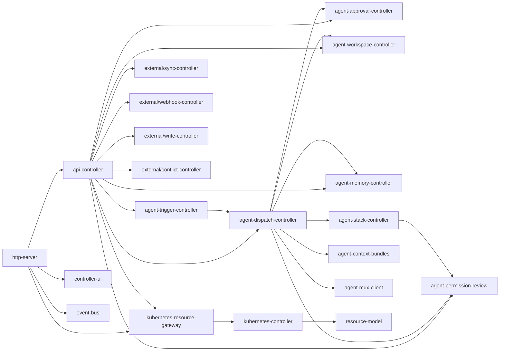
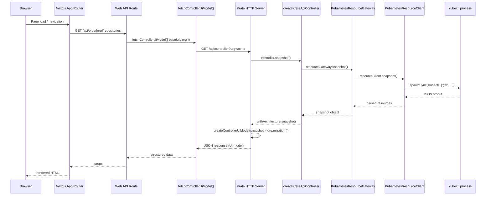
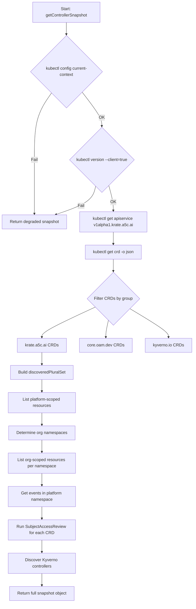
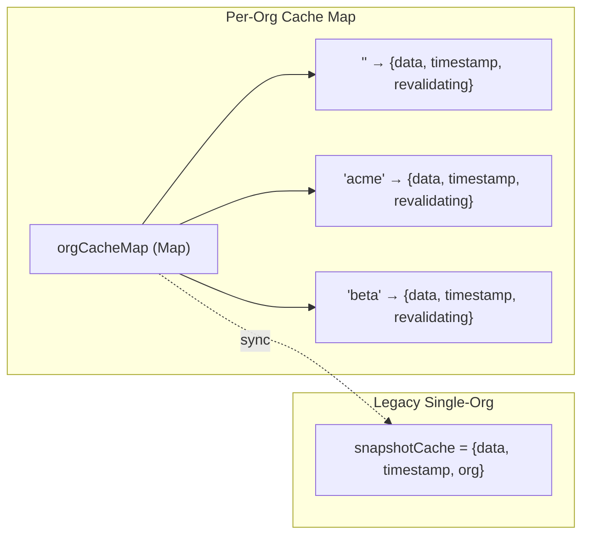
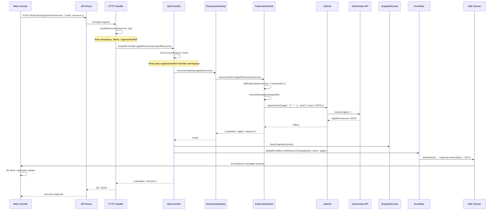
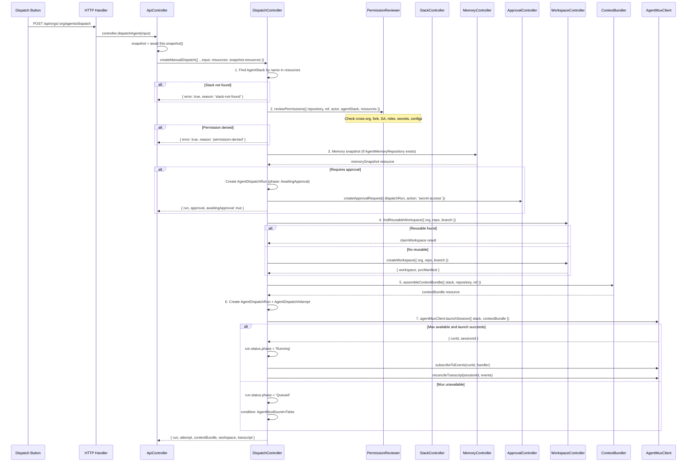
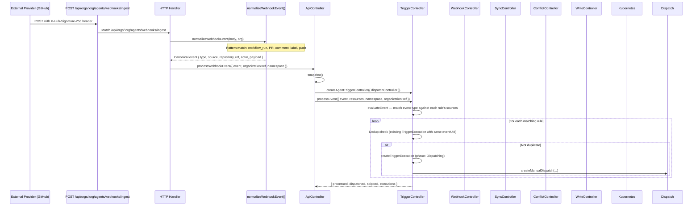
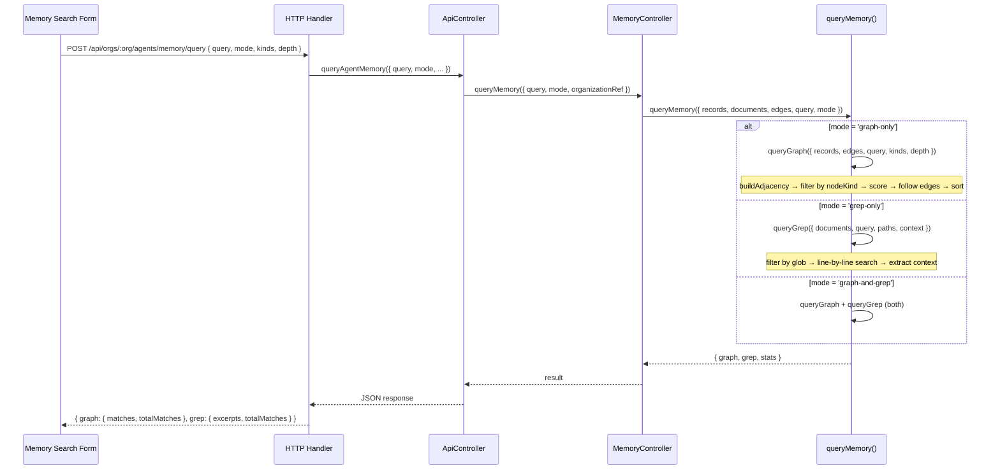
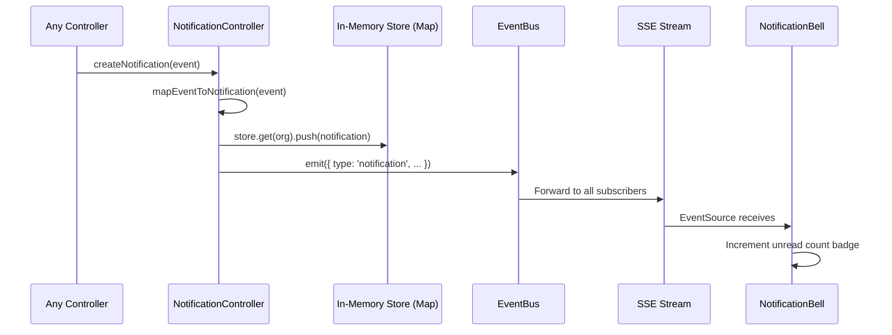

# Krate Architecture Specification v2

> Exhaustive architecture reference derived from implementation source code.
> Source: `packages/krate/core/src/`, `packages/krate/sdk/src/`, `packages/krate/web/`, `packages/krate/cli/`

---

## 1. System Overview

Krate is a Kubernetes-native Git forge runtime built as a monorepo with four packages:

| Package | NPM Name | Role | Path | Dependencies |
|---------|-----------|------|------|--------------|
| **core** | `@a5c-ai/krate` | Resource model, controllers, HTTP API server | `packages/krate/core/` | Zero external (Node.js built-ins only) |
| **sdk** | `@a5c-ai/krate-sdk` | Client SDK re-exporting core helpers for web/CLI consumers | `packages/krate/sdk/` | Re-exports from core |
| **cli** | `@a5c-ai/krate-cli` | CLI entrypoint and MCP server mode | `packages/krate/cli/` | Imports from core |
| **web** | `@a5c-ai/krate-web` | Next.js 16 + React 19 web console | `packages/krate/web/` | Imports from sdk |

**Design principles:**
- Pure ESM JavaScript (Node 20+), zero external runtime dependencies in core
- Kubernetes-first: all resources are K8s API objects (CRDs or aggregated)
- CRD-driven: 76 CustomResourceDefinitions under `krate.a5c.ai/v1alpha1`
- Controller pattern: each domain has a controller with explicit boundary declarations
- Intent-based: controllers produce manifests/specs but never execute kubectl directly

```mermaid
graph TB
    subgraph "Browser"
        WEB[Web Console<br/>Next.js 16 + React 19]
    end

    subgraph "SDK Layer"
        SDK_INDEX[sdk/src/index.js<br/>65+ re-exports]
        ATLAS[sdk/src/atlas-graph-client.js<br/>Stack layer catalog]
    end

    subgraph "Core Controllers"
        HTTP[http-server.js<br/>Node HTTP handler]
        API[api-controller.js<br/>Facade/orchestrator]
        STACK[agent-stack-controller.js]
        DISPATCH[agent-dispatch-controller.js]
        TRIGGER[agent-trigger-controller.js]
        WORKSPACE[agent-workspace-controller.js]
        APPROVAL[agent-approval-controller.js]
        MEMORY[agent-memory-controller.js]
        MEMQ[agent-memory-query.js]
        PERM[agent-permission-review.js]
        AUDIT[audit-controller.js]
        NOTIFY[notification-controller.js]
        RUNNER[runner-controller.js]
        EVENTBUS[event-bus.js]
        CACHE[snapshot-cache.js]
    end

    subgraph "Resource Layer"
        GATEWAY[kubernetes-resource-gateway.js]
        CLIENT[kubernetes-controller.js<br/>kubectl spawning]
        RESMODEL[resource-model.js<br/>76 kinds]
    end

    subgraph "External Subsystem"
        WEBHOOK[external/webhook-controller.js]
        SYNC[external/sync-controller.js]
        CONFLICT[external/conflict-controller.js]
        WRITE[external/write-controller.js]
        GITHUB_ADAPTER[external/github/]
    end

    subgraph "Infrastructure"
        K8S[Kubernetes API<br/>etcd CRD storage]
        PG[PostgreSQL<br/>Aggregated storage]
        GITEA[Gitea<br/>Git hosting]
    end

    WEB --> SDK_INDEX
    SDK_INDEX --> API
    HTTP --> API
    API --> GATEWAY
    API --> DISPATCH
    API --> TRIGGER
    API --> APPROVAL
    API --> MEMORY
    API --> WORKSPACE
    API --> SYNC
    API --> WEBHOOK
    API --> CONFLICT
    API --> WRITE
    DISPATCH --> PERM
    DISPATCH --> STACK
    DISPATCH --> WORKSPACE
    DISPATCH --> APPROVAL
    DISPATCH --> MEMORY
    GATEWAY --> CLIENT
    CLIENT --> K8S
    CLIENT --> PG
    GATEWAY --> GITEA
    EVENTBUS --> HTTP
```



---

## 2. Package Dependency Graph

### 2.1 Import Hierarchy (Strict)

```
web → sdk → core
cli → core
```

The web package NEVER imports directly from core. The SDK acts as the public API surface.

### 2.2 Core Internal Dependencies



### 2.3 Circular Dependency Prevention

- Controllers only import `resource-model.js` and their declared `delegatesTo` modules
- Every controller has a `BOUNDARY` constant declaring what it owns and what it must not own
- The api-controller is the only fan-out point that imports multiple controllers
- No controller imports the api-controller (prevents upward dependency)

---

## 3. Request Lifecycle

### 3.1 From Browser Click to Kubectl Apply



### 3.2 Function Call Chain (Exact)

1. `createKrateHttpHandler()` receives Node.js `IncomingMessage`
2. URL parsed: `new URL(request.url, 'http://localhost')`
3. Route matching via regex: `/^\/api\/orgs\/([^/]+)\/resources$/`
4. Org extracted from URL path segment
5. `createKrateApiController({ namespace: orgNamespaceName(org) })` instantiated per-request
6. Controller method called (e.g., `listResource`, `applyResource`)
7. Cross-org admission check in `applyResource()`: verifies `spec.organizationRef` matches namespace
8. `resourceGateway.apply(resource)` delegates to kubectl
9. `clearSnapshotCache()` invalidates stale data
10. `globalEventBus.emitResourceChange(kind, name, operation)` broadcasts SSE
11. JSON response written via `send(response, status, body)`

---

## 4. Snapshot Pipeline

### 4.1 `getControllerSnapshot()` Step by Step

Source: `packages/krate/core/src/kubernetes-controller.js` lines 352-497



### 4.2 Org Namespace Discovery

```javascript
function organizationNamespaces(organizations, bindings, fallbackNamespace) {
  // 1. Extract namespaceName from Organization specs
  // 2. Extract namespace from OrgNamespaceBinding specs
  // 3. Deduplicate with Set
  // 4. Fallback: KRATE_ADMIN_ORG, KRATE_ORG, or 'default'
}
```

### 4.3 In-Cluster Detection

Source: `inClusterKubectlConfig()` at line 724

When running inside a Kubernetes pod:
- Checks `KUBERNETES_SERVICE_HOST` and `KUBERNETES_SERVICE_PORT`
- Reads `/var/run/secrets/kubernetes.io/serviceaccount/token`
- Reads `/var/run/secrets/kubernetes.io/serviceaccount/ca.crt`
- Adds `--server`, `--certificate-authority`, `--token` args to all kubectl calls

### 4.4 kubectl Execution Model

```javascript
function runKubectl(args, options) {
  // Uses spawnSync (synchronous) for snapshot queries
  // Timeout: KRATE_KUBECTL_TIMEOUT_MS (default 3000ms)
  // Max buffer: KRATE_KUBECTL_MAX_BUFFER_BYTES (default 32MB)
  // windowsHide: true (prevents console flash on Windows)
  // encoding: 'utf8'
}
```

### 4.5 Environment Variables Affecting Snapshot

| Variable | Default | Purpose |
|----------|---------|---------|
| `KRATE_KUBECTL` | `kubectl` | Path to kubectl binary |
| `KRATE_NAMESPACE` | `krate-system` | Platform namespace |
| `KRATE_KUBECTL_TIMEOUT_MS` | `3000` | kubectl spawn timeout |
| `KRATE_KUBECTL_MAX_BUFFER_BYTES` | `33554432` | Max stdout buffer (32MB) |
| `KRATE_DISABLE_IN_CLUSTER_KUBECTL` | `false` | Skip in-cluster detection |
| `KUBECONFIG` | (none) | If set, disables in-cluster mode |
| `KUBERNETES_SERVICE_HOST` | (none) | In-cluster API server host |
| `KUBERNETES_SERVICE_PORT` | `443` | In-cluster API server port |
| `KRATE_SERVICE_ACCOUNT_DIR` | `/var/run/secrets/kubernetes.io/serviceaccount` | SA mount path |
| `KRATE_ORG` | `default` | Fallback org for namespace discovery |
| `KRATE_ADMIN_ORG` | (none) | Admin org for namespace discovery |

---

## 5. Stale-While-Revalidate Cache

Source: `packages/krate/core/src/snapshot-cache.js`

### 5.1 Cache Architecture



### 5.2 TTL Configuration

```javascript
export const CACHE_TTL_MS = Number(process.env.KRATE_SNAPSHOT_CACHE_TTL_MS || 30_000);
```

### 5.3 staleWhileRevalidate Algorithm

```javascript
async function staleWhileRevalidate(org, revalidateFn, swrOptions = {}) {
  const ttlMs = swrOptions.ttlMs ?? CACHE_TTL_MS;        // Fresh window: 30s
  const staleMs = swrOptions.staleMs ?? ttlMs * 5;       // Max stale: 150s

  // CASE 1: Fresh (< 30s old) → return immediately
  // CASE 2: Stale but usable (30s-150s) → return immediately, revalidate in background
  // CASE 3: Stale and revalidating → return stale data (another caller is refreshing)
  // CASE 4: No cache or too old (>150s) → block on revalidation
}
```

### 5.4 Cache Invalidation Triggers

`clearSnapshotCache()` is called on:
- `applyResource()` success
- `applyResourceForOrg()` success
- `deleteResource()` success
- `deleteResourceForOrg()` success

---

## 6. Authentication Flow

### 6.1 Complete OAuth Flow

Source: `packages/krate/core/src/auth.js`

```mermaid
sequenceDiagram
    participant User
    participant Browser
    participant LoginPage as /login page
    participant AuthRoute as /api/auth/github
    participant GitHub as GitHub OAuth
    participant CallbackRoute as /api/auth/callback/github
    participant AuthModule as auth.js
    participant K8s as Kubernetes

    User->>Browser: Click "Sign in with GitHub"
    Browser->>LoginPage: Navigate
    LoginPage->>AuthRoute: GET /api/auth/github
    AuthRoute->>AuthModule: buildAuthorizationRedirect({ provider, requestUrl })
    AuthModule-->>AuthRoute: { url, state, redirectUri }
    AuthRoute->>Browser: 302 Redirect to GitHub

    Browser->>GitHub: GET /login/oauth/authorize?client_id=...&redirect_uri=...&scope=read:user+user:email&state=...
    GitHub->>User: Show authorization prompt
    User->>GitHub: Authorize
    GitHub->>Browser: 302 Redirect to /api/auth/callback/github?code=ABC&state=...

    Browser->>CallbackRoute: GET /api/auth/callback/github?code=ABC&state=...
    CallbackRoute->>AuthModule: exchangeOAuthCodeForProfile({ provider, code, requestUrl })
    AuthModule->>GitHub: POST /login/oauth/access_token (code + client_secret)
    GitHub-->>AuthModule: { access_token: "gho_..." }
    AuthModule->>GitHub: GET /user (Authorization: Bearer gho_...)
    GitHub-->>AuthModule: { login, id, email, name }
    AuthModule->>AuthModule: normalizeProviderProfile(provider, profile)
    AuthModule-->>CallbackRoute: { provider, subject, email, displayName, username, groups, admin }

    CallbackRoute->>AuthModule: registerLoginProfile({ controller, namespace, profile })
    AuthModule->>K8s: applyResource(User)
    AuthModule->>K8s: applyResource(IdentityMapping)
    CallbackRoute->>AuthModule: createSessionCookie(config, profile, { secret })
    AuthModule-->>CallbackRoute: "krate_session=base64url.hmac; Path=/; HttpOnly; SameSite=Lax"
    CallbackRoute->>Browser: Set-Cookie + 302 to /orgs/[org]
```

### 6.2 Session Cookie Structure

```
krate_session = base64url(payload) . hmac_sha256_base64url(payload, secret)
```

Payload JSON:
```json
{ "provider": "github", "subject": "12345", "user": "octocat" }
```

### 6.3 Session Verification

```javascript
function parseSessionCookie(config, cookieValue, options) {
  // 1. Split on first '.' → [payload, signature]
  // 2. If signed + no secret: reject (null)
  // 3. If unsigned + secret configured: reject (null)
  // 4. If signed + secret: compute expected HMAC, timingSafeEqual
  // 5. If match: decode base64url → JSON.parse → extract user/subject/provider
  // 6. Return { cookieName, provider, subject, user } or null
}
```

### 6.4 Delegated Identity (Proxy Auth)

Headers examined:
- `x-forwarded-user` (configurable via `KRATE_AUTH_DELEGATED_USER_HEADER`)
- `x-forwarded-groups` (configurable via `KRATE_AUTH_DELEGATED_GROUPS_HEADER`)
- `x-forwarded-email` (configurable via `KRATE_AUTH_DELEGATED_EMAIL_HEADER`)

Local development auto-login:
- Active when `NODE_ENV !== 'production'` (or `KRATE_AUTH_DELEGATED_LOCAL_DEVELOPMENT=true`)
- Default user: `KRATE_AUTH_DELEGATED_LOCAL_USER` or `'local-developer'`
- Default groups: `KRATE_AUTH_DELEGATED_LOCAL_GROUPS` or `'krate:repo-admins'`

### 6.5 Admin Detection

Admin status is derived from group membership:
```javascript
admin: groups.includes('krate:platform-engineers') || groups.includes('krate:repo-admins')
```

### 6.6 All Auth Environment Variables

| Variable | Default | Purpose |
|----------|---------|---------|
| `KRATE_AUTH_COOKIE_NAME` | `krate_session` | Cookie name |
| `KRATE_SESSION_SECRET` | `''` | HMAC signing secret |
| `KRATE_AUTH_GITHUB_ENABLED` | `true` | Enable GitHub provider |
| `KRATE_AUTH_GITHUB_CLIENT_ID` | `''` | OAuth client ID |
| `KRATE_AUTH_GITHUB_CLIENT_SECRET` | `''` | OAuth client secret |
| `KRATE_AUTH_GITHUB_AUTHORIZATION_URL` | `https://github.com/login/oauth/authorize` | Auth endpoint |
| `KRATE_AUTH_GITHUB_TOKEN_URL` | `https://github.com/login/oauth/access_token` | Token endpoint |
| `KRATE_AUTH_GITHUB_USERINFO_URL` | `https://api.github.com/user` | Profile endpoint |
| `KRATE_AUTH_GITHUB_SCOPES` | `read:user user:email` | OAuth scopes |
| `KRATE_AUTH_SSO_ENABLED` | `false` | Enable OIDC provider |
| `KRATE_AUTH_SSO_PROVIDER_NAME` | `Workspace SSO` | Display label |
| `KRATE_AUTH_SSO_ISSUER_URL` | `''` | OIDC issuer |
| `KRATE_AUTH_SSO_CLIENT_ID` | `''` | OIDC client ID |
| `KRATE_AUTH_SSO_CLIENT_SECRET` | `''` | OIDC client secret |
| `KRATE_AUTH_SSO_AUTHORIZATION_URL` | `''` | OIDC auth endpoint |
| `KRATE_AUTH_SSO_TOKEN_URL` | `''` | OIDC token endpoint |
| `KRATE_AUTH_SSO_USERINFO_URL` | `''` | OIDC profile endpoint |
| `KRATE_AUTH_SSO_SCOPES` | `openid profile email groups` | OIDC scopes |
| `KRATE_AUTH_DELEGATED_IDENTITY_ENABLED` | `false` | Enable proxy auth |
| `KRATE_AUTH_DELEGATED_USER_HEADER` | `x-forwarded-user` | User header |
| `KRATE_AUTH_DELEGATED_GROUPS_HEADER` | `x-forwarded-groups` | Groups header |
| `KRATE_AUTH_DELEGATED_EMAIL_HEADER` | `x-forwarded-email` | Email header |
| `KRATE_AUTH_DELEGATED_LOCAL_DEVELOPMENT` | auto | Enable local dev fallback |
| `KRATE_AUTH_DELEGATED_LOCAL_USER` | `local-developer` | Dev username |
| `KRATE_AUTH_DELEGATED_LOCAL_EMAIL` | `''` | Dev email |
| `KRATE_AUTH_DELEGATED_LOCAL_GROUPS` | `krate:repo-admins` | Dev groups |
| `KRATE_ADMIN_ORG` | (none) | Bootstrap admin org |
| `KRATE_ADMIN_USERNAME` | (none) | Bootstrap admin user |

---

## 7. Resource Lifecycle

### 7.1 From UI Form Submit to SSE Update



### 7.2 scopeResource Function

```javascript
function scopeResource(resource, org) {
  const namespace = orgNamespaceName(org);  // 'krate-org-acme'
  return {
    ...resource,
    metadata: {
      ...(resource.metadata || {}),
      namespace,
      labels: {
        ...(resource.metadata?.labels || {}),
        'krate.a5c.ai/org': org,
        'krate.a5c.ai/namespace': namespace
      }
    },
    spec: { ...(resource.spec || {}), organizationRef: org }
  };
}
```

### 7.3 Cross-Org Admission

In `applyResource()`:
```javascript
const resourceOrg = resource.spec?.organizationRef;
const resourceNs = resource.metadata?.namespace;
if (resourceOrg) {
  const expectedNs = orgNamespaceName(resourceOrg);
  if (resourceNs && resourceNs !== expectedNs) {
    throw new Error(`Cross-org namespace mismatch`);
  }
}
```

In `deleteResourceForOrg()`:
```javascript
// Verify existing resource namespace matches org
if (!resourceNs || resourceNs !== orgNs) {
  throw new Error(`Cross-org denial`);
}
```

---

## 8. Agent Dispatch Lifecycle

### 8.1 Complete Flow

Source: `packages/krate/core/src/agent-dispatch-controller.js`



### 8.2 Permission Review Steps

1. Resolve AgentStack from resources
2. Validate approvalMode (yolo/prompt/deny)
3. Cross-org denial: agent org vs repository org
4. Expand capabilities from stack spec (tools, MCP, skills, subagents)
5. Untrusted fork detection (`refs/pull/\d+/`)
6. Check AgentServiceAccount binding
7. Check AgentRoleBinding for subject
8. Check AgentSecretGrant for agent
9. Check AgentConfigGrant for agent
10. Compute decision: `allowed`, `requires-approval`, or `denied`

### 8.3 Decision Matrix

| approvalMode | Errors | Fork | Decision |
|-------------|--------|------|----------|
| `deny` | any | any | `denied` |
| `yolo` | none | false | `allowed` |
| `yolo` | none | true | `allowed` (warnings only) |
| `prompt` | none | false | `requires-approval` |
| `prompt` | none | true | `requires-approval` |
| any | has errors | any | `denied` |

---

## 9. External Sync Pipeline

### 9.1 Complete Flow



### 9.2 Webhook Event Normalization

Source: `normalizeWebhookEvent()` in `http-server.js`

| GitHub Action/Shape | Krate Event Type | Source Kind |
|--------------------|-----------------|-------------|
| `completed` + `workflow_run.conclusion=failure` | `ci-failure` | Pipeline |
| `opened` + `pull_request` | `pr-opened` | PullRequest |
| `created` + `comment` | `comment` | Issue/PullRequest |
| `labeled` | `label-added` | Issue/PullRequest |
| `opened` + `issue` (no PR) | `issue-created` | Issue |
| `ref` + `commits` | `push` | Repository |
| (fallback) | `webhook` | WebhookDelivery |

### 9.3 HMAC Verification

Source: `external/webhook-controller.js`

```javascript
verifyHmacSignature(body, signature) {
  // 1. Reject if no signature header
  // 2. Reject if not prefixed with 'sha256='
  // 3. Compute expected: 'sha256=' + createHmac('sha256', secret).update(body).digest('hex')
  // 4. timingSafeEqual(Buffer.from(expected), Buffer.from(signature))
  // 5. Return { valid: true/false, reason }
}
```

### 9.4 Sync Controller Ownership Modes

| Mode | Krate Writes | External Writes |
|------|-------------|-----------------|
| `bidirectional` | Allowed | Allowed |
| `external-owned` | Blocked | Allowed |
| `krate-owned` | Allowed | Blocked |

### 9.5 Watermark Tracking

- Per-binding watermark stored as ISO timestamp
- Only advances forward (new timestamp must be > current)
- Persisted as `ExternalSyncWatermark` CRD resource

---

## 10. Memory Query Pipeline

### 10.1 From Search Form to Results



### 10.2 Graph Scoring Algorithm

```javascript
function scoreRecord(record, lowerQuery) {
  const id = String(record.id || '').toLowerCase();
  const attrs = JSON.stringify(record.attributes || {}).toLowerCase();
  if (id.includes(lowerQuery)) return 2;   // ID match: higher priority
  if (attrs.includes(lowerQuery)) return 1; // Attribute match
  return 0;                                  // No match
}
```

### 10.3 Edge Traversal (BFS)

```javascript
function followEdges(startId, adjacency, maxDepth) {
  // BFS from startId up to maxDepth hops
  // visited Set prevents cycles
  // Returns flat array of all encountered edges
}
```

### 10.4 Grep Highlighting

Match output format:
```javascript
{
  path: 'docs/design.md',
  lineNumber: 42,
  line: 'The agent memory stores knowledge graphs...',
  highlighted: 'The agent **memory** stores knowledge graphs...',
  context: '...\nThe agent memory stores knowledge graphs...\n...',
  contextStart: 41,
  contextEnd: 43
}
```

---

## 11. Workspace Provisioning

### 11.1 PVC-Based Provisioning

Source: `packages/krate/core/src/agent-workspace-controller.js`

```mermaid
flowchart TD
    A[Dispatch trigger] --> B{Find reusable workspace?}
    B -->|Yes: same repo+branch+Ready| C[claimWorkspace]
    B -->|No| D[createWorkspace]

    C --> E[Mark phase=InUse, set runRef]
    D --> F[Generate workspace name]
    F --> G[Generate PVC manifest]
    G --> H[Create KrateWorkspace resource]

    E --> I[getMountSpec]
    H --> I

    I --> J[Return { volume, volumeMount }]
    J --> K[Attach to AgentDispatchRun.spec.mountSpec]
```

### 11.2 PVC Manifest Structure

```javascript
{
  apiVersion: 'v1',
  kind: 'PersistentVolumeClaim',
  metadata: {
    name: 'krate-ws-<workspace-name>',
    namespace: '<org-namespace>',
    labels: {
      'krate.a5c.ai/workspace': '<workspace-name>',
      'krate.a5c.ai/org': '<org>'
    }
  },
  spec: {
    storageClassName: 'standard',  // configurable via volumeSpec.storageClassName
    accessModes: ['ReadWriteOnce'],  // configurable
    resources: { requests: { storage: '10Gi' } }  // configurable via volumeSpec.capacity
  }
}
```

### 11.3 Codespace Pod Spec

When `launchCodespace()` is called:
- Image: `codercom/code-server:latest` (configurable)
- CPU: 1 core limit, 250m request
- Memory: 2Gi limit, 512Mi request
- Port: 8080
- Volume: PVC mount at `/workspace`
- Env: `KRATE_WORKSPACE`, `KRATE_ORG`, `GIT_AUTHOR_NAME`, `GIT_AUTHOR_EMAIL`
- Service: ClusterIP on port 8080
- URL pattern: `http://codespace-svc-<ws>.<namespace>.svc.cluster.local:8080`

### 11.4 Workspace Phase Transitions

```
Pending → Ready → InUse → Ready (release)
                        → Archived (archive)
                        → Terminating (delete)
Archived → Active (recover)
```

---

## 12. Notification Pipeline

Source: `packages/krate/core/src/notification-controller.js`

### 12.1 Event-to-Notification Mapping

| Source Event Type | Notification Type | Severity |
|-------------------|------------------|----------|
| `AgentDispatchRun` (completed) | `run-complete` | info |
| `AgentDispatchRun` (failed) | `run-complete` | error |
| `AgentApproval` (pending) | `approval-needed` | warning |
| `ExternalSyncConflict` | `conflict-detected` | warning |
| `KrateWorkspace` (claimed) | `workspace-ready` | info |
| (default) | `system` | info |

### 12.2 Notification Delivery Flow



### 12.3 User Preferences

Default preferences:
```javascript
{ runs: true, approvals: true, conflicts: true, workspaces: true, sound: false, desktop: false }
```

---

## 13. Event Bus and SSE Streaming

### 13.1 Event Bus Implementation

Source: `packages/krate/core/src/event-bus.js`

- Uses a `Set<Function>` for listeners (O(1) add/remove)
- `emit(event)` iterates all listeners synchronously
- `emitResourceChange(kind, name, operation)` adds timestamp
- Global singleton: `globalEventBus`

### 13.2 SSE Endpoint

Route: `GET /api/orgs/:org/agents/events/stream`

Response headers:
```
Content-Type: text/event-stream
Cache-Control: no-cache
Connection: keep-alive
X-Accel-Buffering: no
```

Protocol:
1. Initial: `data: {"type":"connected"}\n\n`
2. Every 30s: `data: {"type":"heartbeat"}\n\n`
3. On resource change: `data: {"type":"resource-change","kind":"...","name":"...","operation":"apply","timestamp":"..."}\n\n`
4. On client disconnect: `clearInterval(heartbeat)`, `globalEventBus.unsubscribe(writer)`

---

## 14. Async Utilities

Source: `packages/krate/core/src/async-controller.js`

### 14.1 Event Batcher

```javascript
createEventBatcher(handler, { maxBatchSize: 50, flushIntervalMs: 1000 })
```

Behavior:
- Accumulates events in array
- Flushes when `batch.length >= maxBatchSize` (fire-and-forget)
- Flushes on timer (setTimeout) when batch has items but below threshold
- `flush()` forces immediate flush (awaitable)
- `stop()` clears timer and buffer

### 14.2 Retry Policy

```javascript
createRetryPolicy({ maxRetries: 3, baseDelayMs: 1000, maxDelayMs: 30000, jitter: true })
```

Delay formula: `min(baseDelayMs * 2^attempt, maxDelayMs)` with optional full-jitter `[0, capped]`

### 14.3 Delivery Queue

```javascript
createDeliveryQueue(processor, { concurrency: 5, retryPolicy })
```

- In-memory ordered queue
- Up to `concurrency` items processed in parallel
- Each item retried per retryPolicy on failure
- `drain()` returns Promise that resolves when queue is empty and all active items complete
- `stop()` clears queue and resolves all drain waiters

### 14.4 Checkpointer

```javascript
createCheckpointer(storage = new Map())
```

Simple key-value store: `save(key, value)`, `load(key)`, `clear(key)`, `listKeys()`

---

## 15. Controller Boundary Declarations

Every controller exports a frozen boundary object. This serves as both documentation and runtime introspection.

| Controller | Source File | Role | Owns | Must Not Own |
|-----------|-------------|------|------|--------------|
| KubernetesResourceClient | `kubernetes-controller.js` | kubectl execution | command exec, API discovery, access checks, watch streams | HTTP routes, pages, forge DTOs |
| KrateKubernetesReconciler | `kubernetes-controller.js` | Resource reconciliation | repo status, identity projection, hosting intent, policy sync | HTTP routes, pages, API DTOs |
| KubernetesResourceGateway | `kubernetes-resource-gateway.js` | API port delegation | resource definitions, CRUD delegation, namespace scoping | HTTP routes, page flows, reconciliation |
| KrateApiController | `api-controller.js` | HTTP facade | validation, DTOs, errors, workflow affordances, UI snapshots | kubectl execution, reconciliation loops |
| AgentStackController | `agent-stack-controller.js` | Stack readiness | capability resolution, conditions, readiness, MCP health | secrets, dispatch execution, Mux sessions |
| AgentDispatchController | `agent-dispatch-controller.js` | Dispatch orchestration | dispatch creation, attempt lifecycle, session binding, workspace | secrets, UI rendering |
| AgentWorkspaceController | `agent-workspace-controller.js` | Workspace provisioning | workspace creation, PVC gen, git specs, mount specs, reuse, codespace | git execution, K8s API, secrets |
| AgentTriggerController | `agent-trigger-controller.js` | Event routing | normalization, rule matching, trigger records, dispatch initiation | event sourcing, webhook delivery |
| AgentApprovalController | `agent-approval-controller.js` | Approval gates | approval creation, decision recording, lookup, dedup | secrets, agent execution, UI |
| AgentMemoryQuery | `agent-memory-query.js` | Query execution | graph traversal, filtering, scoring, grep, context extraction | persistence, HTTP, K8s, secrets |
| WebhookController | `external/webhook-controller.js` | Inbound webhooks | HMAC validation, delivery records, dedup, event queue | resource persistence, ownership |
| SyncController | `external/sync-controller.js` | External sync | normalization, upsert, watermarks, ownership, tombstones | HMAC, webhook delivery |
| ConflictController | `external/conflict-controller.js` | Conflict detection | detection, resolution, superseded cleanup | write intent, sync scheduling |
| WriteController | `external/write-controller.js` | Write intents | creation, approval gate, retry, idempotency | conflict resolution, sync state |
| AuditController | `audit-controller.js` | Audit log | event recording, streaming, replay, metrics | identity, storage, git |
| RunnerController | `runner-controller.js` | Runner pools | pool validation, lifecycle, scheduling, pod specs, capacity | K8s API calls, actual pod creation |
| NotificationController | `notification-controller.js` | Notifications | creation, listing, read state, preferences | event dispatch, UI rendering, push |
| PermissionReviewer | `agent-permission-review.js` | Permission review | capability expansion, grant resolution, snapshot creation | secrets, K8s API, runtime execution |

---

## 16. Concurrency Model

### 16.1 Single-Threaded Event Loop

Krate core runs on Node.js's single-threaded event loop:
- All kubectl calls use `spawnSync` (blocking) during snapshot collection
- API request handling is async (Node HTTP server)
- Background revalidation uses `Promise.resolve().then(...)` (microtask)
- No worker threads or clustering in the core package

### 16.2 Concurrent Access Patterns

| Pattern | Mechanism |
|---------|-----------|
| Multiple orgs cached | Per-org Map entries, independent TTLs |
| SSE connections | Set of listener functions, one per connection |
| Background revalidation | `revalidating` flag prevents thundering herd |
| Event bus | Synchronous iteration over Set (no races) |
| Audit store | Append-only array, seq counter |
| Notification store | Per-org array, no locking needed |

---

## 17. Error Handling Strategy

### 17.1 HTTP Layer

```javascript
try {
  // Route matching and handler execution
} catch (error) {
  return send(response, 400, { error: 'bad_request', message: error.message });
}
```

All unhandled errors in route handlers become 400 responses.

### 17.2 Controller Layer

Controllers return error objects instead of throwing:
```javascript
{ error: true, reason: 'stack-not-found', message: 'AgentStack not found' }
```

### 17.3 kubectl Layer

- `allowFailure: true` — returns `{ ok: false }`, caller decides
- `allowFailure: false` — throws Error with `commandFailure()` message

### 17.4 Audit Event Failures

```javascript
function emitAuditEvent(resource, operation) {
  try { ... } catch { /* Audit failures must not crash apply operations */ }
}
```

### 17.5 Background Revalidation Failures

```javascript
try { const fresh = await revalidateFn(); ... }
catch { orgCacheMap.set(key, { ...current, revalidating: false }); }
```

---

## 18. Deployment Architecture

### 18.1 Container Topology

| Container | Port | Role |
|-----------|------|------|
| api | 3080 | HTTP API server (`krate serve`) |
| controllers | — | Background reconciliation (future) |
| web | 3000 | Next.js web console |
| webhook-worker | — | Inbound webhook processing |

### 18.2 CRD Management

- 76 CRDs under `krate.a5c.ai/v1alpha1`
- All use `x-kubernetes-preserve-unknown-fields: true`
- All namespaced
- Platform resources (Organization, OrgNamespaceBinding) in `krate-system`
- Org resources in `krate-org-<slug>` namespaces

### 18.3 Infrastructure Requirements

| Component | Purpose |
|-----------|---------|
| AKS (or compatible K8s) | Container orchestration |
| ACR (or registry) | Image storage |
| cert-manager | TLS provisioning |
| nginx ingress | HTTP routing |
| PostgreSQL | Aggregated resource storage |
| Gitea | Git hosting backend |
| Kyverno (optional) | Policy engine |
| KubeVela (optional) | Application delivery |

---

## 19. Data Storage Boundaries

| Storage Backend | Resource Count | Access Pattern |
|----------------|---------------|----------------|
| etcd (CRDs) | 44 CONFIG kinds | kubectl get/apply/delete |
| PostgreSQL | 32 AGGREGATED kinds | In-memory during dev, runtime queries |
| Gitea | Repository content | HTTP API, SSH |
| In-memory | Notifications, audit, runners | Per-process, non-persistent |
| Snapshot cache | Derived views | Stale-while-revalidate |

---

## 20. Configuration Reference

### 20.1 Core Server

| Variable | Default | Purpose |
|----------|---------|---------|
| `KRATE_NAMESPACE` | `krate-system` | Platform namespace |
| `KRATE_ORG` | `default` | Default organization |
| `KRATE_SNAPSHOT_CACHE_TTL_MS` | `30000` | Cache freshness TTL |
| `KRATE_GITEA_HTTP_URL` | (none) | Gitea API base URL |

### 20.2 External Integrations

| Variable | Default | Purpose |
|----------|---------|---------|
| `KRATE_KYVERNO_MODE` | auto | Kyverno integration mode |
| `KRATE_KYVERNO_ENABLED` | (none) | Enable BYO Kyverno |
| `KRATE_KYVERNO_NAMESPACE` | `kyverno` | Kyverno deployment namespace |
| `KRATE_KYVERNO_POLICY_NAMESPACE` | platform ns | Policy storage namespace |
| `KRATE_KUBEVELA_NAMESPACE` | `vela-system` | KubeVela system namespace |

### 20.3 Runtime Identity

| Variable | Default | Purpose |
|----------|---------|---------|
| `KRATE_SERVICE_ACCOUNT_DIR` | `/var/run/secrets/kubernetes.io/serviceaccount` | SA mount |
| `KRATE_SERVICE_ACCOUNT_TOKEN` | `<SA_DIR>/token` | Token file path |
| `KRATE_SERVICE_ACCOUNT_CA` | `<SA_DIR>/ca.crt` | CA cert path |
