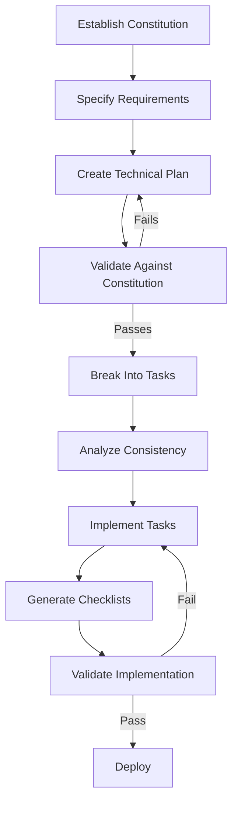
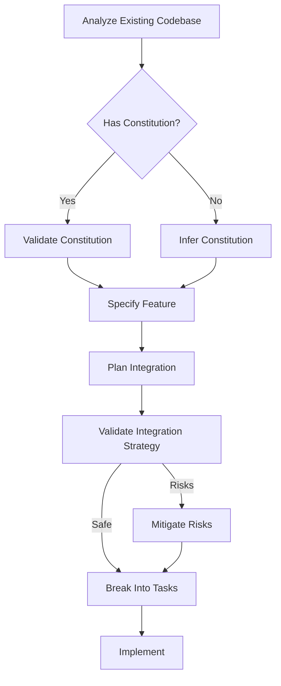
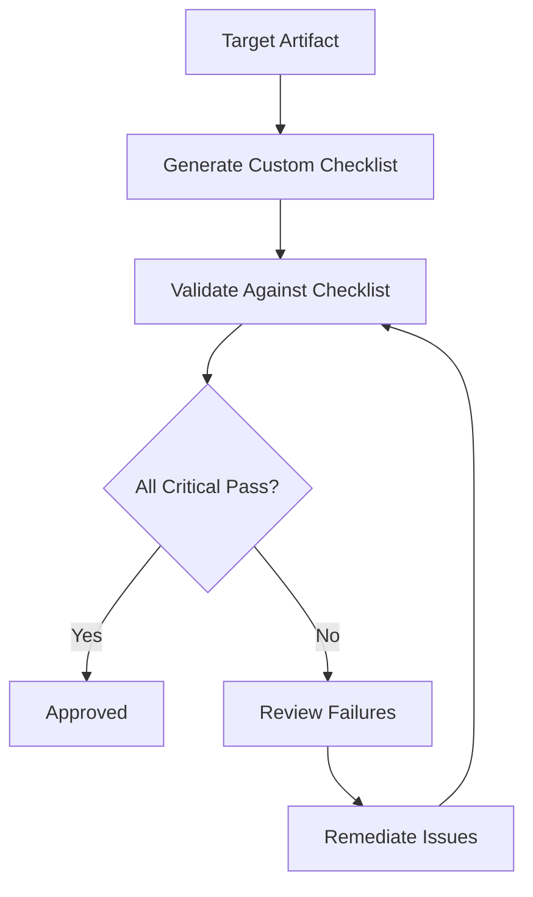

# Spec-Kit Workflows for Babysitter SDK

Workflows adapted from GitHub's [Spec-Kit](https://github.com/github/spec-kit) methodology for the Babysitter SDK orchestration framework.

## Overview

Spec-Kit introduces **Spec-Driven Development** - a paradigm where specifications become executable, directly generating working implementations rather than just guiding them. This flips the traditional development script:

**Traditional**: Requirements → Design → Code → Test → Deploy
**Spec-Driven**: Constitution → Specification → Plan → Tasks → Execute

## Core Philosophy

### "Specifications Become Executable"

Rather than treating specs as throwaway documentation, Spec-Kit makes them:
- **First-class artifacts** that drive the entire development process
- **Executable** through structured task generation
- **Verifiable** through custom quality checklists ("unit tests for English")
- **Persistent** governance documents for the project lifetime

### Intent-First Development

Define **what** and **why** before **how**:
1. Establish governance principles (constitution)
2. Specify outcomes (user stories with acceptance criteria)
3. Plan technical approach
4. Generate actionable tasks
5. Execute systematically

## Available Workflows

### 1. Full Spec-Driven Development

**File:** `methodologies/spec-driven-development.js`

Complete five-step workflow for greenfield or brownfield development.

**Process:**
1. **Constitution** - Establish governance principles
2. **Specification** - Define requirements with user stories
3. **Technical Plan** - Document architecture and stack
4. **Task Breakdown** - Generate ordered, actionable tasks
5. **Implementation** - Execute with quality validation

**Usage:**
```bash
babysitter run:create \
  --process-id methodologies/spec-driven-development \
  --entry .claude/plugins/cache/a5c-ai/babysitter/4.0.42/skills/babysit/process/methodologies/spec-driven-development.js#process \
  --inputs inputs.json
```

**When to Use:**
- New features or projects
- Major refactoring that needs careful planning
- When quality and consistency are critical
- Enterprise projects requiring governance

---

### 2. Constitution Establishment

**File:** `methodologies/spec-kit-constitution.js`

Standalone workflow for establishing or refining project governance.

**Creates:**
- Code quality standards (testing, documentation, reviews)
- UX consistency requirements (design system, accessibility)
- Performance targets (load times, resource usage)
- Security standards (auth, data protection)
- Technical constraints (approved libraries, cloud providers)
- Architecture principles (modularity, coupling)
- Development workflow (branching, deployment)

**Usage:**
```bash
babysitter run:create \
  --process-id methodologies/spec-kit-constitution \
  --entry .claude/plugins/cache/a5c-ai/babysitter/4.0.42/skills/babysit/process/methodologies/spec-kit-constitution.js#process \
  --inputs constitution-inputs.json
```

**When to Use:**
- Starting a new project
- Formalizing implicit standards
- Onboarding new team members
- Compliance requirements need documentation

---

### 3. Quality Checklist Generation

**File:** `methodologies/spec-kit-quality-checklist.js`

Generate and validate custom quality checklists - "unit tests for English."

**Validates:**
- Specifications (user stories, acceptance criteria)
- Implementation plans (architecture, tech stack)
- Task definitions (clarity, dependencies)
- Code implementations (standards, tests, docs)
- Documentation completeness

**Usage:**
```bash
babysitter run:create \
  --process-id methodologies/spec-kit-quality-checklist \
  --entry .claude/plugins/cache/a5c-ai/babysitter/4.0.42/skills/babysit/process/methodologies/spec-kit-quality-checklist.js#process \
  --inputs checklist-inputs.json
```

**When to Use:**
- Before approving specifications
- Validating implementation plans
- Code review automation
- Quality gate enforcement

---

### 4. Brownfield Development

**File:** `methodologies/spec-kit-brownfield.js`

Adding features to existing codebases with careful integration.

**Process:**
1. **Analyze** existing codebase patterns
2. **Adopt/Infer** constitution from existing code
3. **Specify** feature with integration considerations
4. **Plan** implementation maintaining consistency
5. **Validate** integration strategy for risks

**Usage:**
```bash
babysitter run:create \
  --process-id methodologies/spec-kit-brownfield \
  --entry .claude/plugins/cache/a5c-ai/babysitter/4.0.42/skills/babysit/process/methodologies/spec-kit-brownfield.js#process \
  --inputs brownfield-inputs.json
```

**When to Use:**
- Adding features to existing systems
- Modernizing legacy code
- Ensuring new code matches existing patterns
- Refactoring with clear specifications

---

## Key Artifacts Generated

### CONSTITUTION.md
Governance document establishing:
- Standards and principles
- Quality requirements
- Compliance constraints
- Workflow processes

**Example Structure:**
```markdown
# Project Constitution

## Code Quality Standards
- Testing: Minimum 80% coverage, unit + integration tests required
- Documentation: All public APIs documented, architectural decisions recorded
- Review: 2 approvals required for production code

## UX Consistency
- Design System: Material-UI v5 components only
- Accessibility: WCAG 2.1 Level AA compliance required
- Responsiveness: Mobile-first, support down to 320px width

## Performance Requirements
- Load Time: FCP < 1.5s, LCP < 2.5s, TTI < 3.5s
- Bundle Size: Main bundle < 200KB gzipped
- API Response: p95 < 500ms

## Security Standards
- Authentication: JWT with 24-hour expiration
- Data Protection: AES-256 encryption at rest, TLS 1.3 in transit
- Input Validation: All user input sanitized, parameterized queries only

...
```

### SPECIFICATION.md
Feature requirements with:
- Prioritized user stories (P1/P2/P3)
- Given/When/Then acceptance criteria
- Success metrics
- Edge cases

**Example Structure:**
```markdown
# Feature Specification: User Dashboard Analytics

## User Stories

### US1 [P1]: View Engagement Metrics
**Journey:** As a product manager, I want to see user engagement metrics over time so that I can identify trends and make data-driven decisions.

**Justification:** Critical for understanding product usage and ROI.

**Acceptance Criteria:**
- Given I am on the analytics dashboard
- When I select a date range
- Then I see charts showing DAU, MAU, session duration, and feature usage

### US2 [P1]: Filter by Date Range
**Journey:** As an analyst, I want to filter metrics by custom date ranges so that I can analyze specific time periods.

**Acceptance Criteria:**
- Given I am viewing metrics
- When I select start and end dates
- Then all charts update to show data for that period

## Requirements
- REQ-1 [MUST]: Display daily active users (DAU) and monthly active users (MAU)
- REQ-2 [MUST]: Support date range filtering (last 7 days, 30 days, 90 days, custom)
- REQ-3 [MUST]: Export data as CSV or PDF
- REQ-4 [SHOULD]: Set up automated email reports

## Success Criteria
- **User Experience:** Dashboard loads in < 2 seconds, intuitive for non-technical users
- **Performance:** Handles datasets with 1M+ data points smoothly
- **Adoption:** 80% of PMs use dashboard weekly within 1 month of launch

...
```

### PLAN.md
Technical implementation plan:
- Technology stack choices
- Architecture decisions
- Project structure
- Integration approach

**Example Structure:**
```markdown
# Implementation Plan: User Dashboard Analytics

## Summary
Build analytics dashboard using React + D3.js for visualizations, connecting to existing PostgreSQL database via new analytics API endpoints.

## Technical Context
- **Language:** TypeScript 4.9+
- **Framework:** React 18 with hooks
- **Visualization:** D3.js v7 + custom React wrappers
- **Backend:** Node.js/Express API
- **Database:** PostgreSQL 14 with TimescaleDB extension
- **Testing:** Jest + React Testing Library + Cypress

## Architecture
**Pattern:** Client-server with API layer

**Frontend:**
```
src/
  features/
    analytics/
      components/       # Dashboard UI components
      hooks/           # Custom hooks for data fetching
      visualizations/  # D3.js chart components
      types/           # TypeScript interfaces
  services/
    api/
      analytics.ts     # API client for analytics endpoints
```

**Backend:**
```
api/
  routes/
    analytics.ts       # Analytics endpoints
  services/
    metrics.ts         # Business logic for metrics calculation
  repositories/
    analytics.ts       # Database queries
```

## Constitution Compliance
✅ Testing: Unit tests for business logic, integration tests for API, E2E tests for critical paths
✅ Documentation: API endpoints documented with OpenAPI
✅ Performance: Pagination for large datasets, caching with Redis
✅ Security: RBAC for analytics data, no PII exposed

...
```

### TASKS.md
Ordered, actionable tasks:
- Organized in phases
- Dependencies marked
- Parallelizable work identified
- File paths specified

**Example Structure:**
```markdown
# Tasks: User Dashboard Analytics

## Phase 1: Setup
- [T1] Create analytics feature directory structure
  - Files: `src/features/analytics/`, `api/routes/analytics.ts`

- [T2] Set up analytics API route and controller skeleton
  - Files: `api/routes/analytics.ts`, `api/controllers/analytics.ts`

## Phase 2: Foundational
- [T3] Implement database queries for metrics
  - Files: `api/repositories/analytics.ts`
  - Tests: `api/repositories/analytics.test.ts`

- [T4] [P] Create TypeScript interfaces for analytics data
  - Files: `src/features/analytics/types/index.ts`

- [T5] [P] Set up API client for analytics endpoints
  - Files: `src/services/api/analytics.ts`
  - Depends on: T2

## Phase 3: US1 - View Engagement Metrics
- [T6] Implement DAU/MAU calculation service
  - Files: `api/services/metrics.ts`
  - Tests: `api/services/metrics.test.ts`
  - Story: US1

- [T7] Create API endpoint GET /analytics/engagement
  - Files: `api/routes/analytics.ts`, `api/controllers/analytics.ts`
  - Tests: `api/routes/analytics.test.ts`
  - Depends on: T6
  - Story: US1

- [T8] [P] Build line chart component for metrics
  - Files: `src/features/analytics/visualizations/LineChart.tsx`
  - Tests: `src/features/analytics/visualizations/LineChart.test.tsx`
  - Story: US1

...
```

---

## Workflow Patterns

### Greenfield Development (0-to-1)



**Usage:**
```bash
babysitter run:create \
  --process-id methodologies/spec-driven-development \
  --entry methodologies/spec-driven-development.js#process \
  --inputs '{
    "projectName": "New Feature",
    "initialRequirements": "...",
    "developmentPhase": "greenfield"
  }'
```

### Brownfield Development (Incremental)



**Usage:**
```bash
babysitter run:create \
  --process-id methodologies/spec-kit-brownfield \
  --entry methodologies/spec-kit-brownfield.js#process \
  --inputs '{
    "featureName": "New Feature",
    "existingCodebase": "./src",
    "featureDescription": "..."
  }'
```

### Quality Validation



**Usage:**
```bash
babysitter run:create \
  --process-id methodologies/spec-kit-quality-checklist \
  --entry methodologies/spec-kit-quality-checklist.js#process \
  --inputs '{
    "targetType": "specification",
    "target": {...},
    "constitution": {...}
  }'
```

---

## Key Concepts

### 1. Constitution as Contract

The constitution is a living governance document that:
- Establishes project-wide standards
- Provides guardrails for AI-generated code
- Enables objective quality validation
- Documents compliance requirements
- Onboards team members quickly

**Best Practices:**
- Make principles measurable and enforceable
- Include rationale for each principle
- Update as project matures
- Validate code against constitution regularly

### 2. User Stories as Contracts

User stories define outcomes, not implementation:
- **Independent**: Can be developed and deployed separately
- **Testable**: Clear Given/When/Then acceptance criteria
- **Prioritized**: P1 (must-have), P2 (should-have), P3 (nice-to-have)
- **Value-focused**: Describes user benefit, not technical detail

**Example:**
```markdown
### US1 [P1]: Export Report as PDF
**Journey:** As a manager, I want to export analytics reports as PDFs so that I can share insights in presentations.

**Acceptance Criteria:**
- Given I am viewing the analytics dashboard
- When I click "Export as PDF"
- Then a PDF is generated containing all visible charts and data tables

**Justification:** Managers need portable format for stakeholder meetings. Critical for adoption.
```

### 3. Quality Checklists ("Unit Tests for English")

Make specifications objectively verifiable:
- **Generated per artifact type** (spec/plan/task/implementation)
- **Constitution-aligned** (enforces project standards)
- **Actionable** (specific remediation steps)
- **Prioritized** (critical vs. advisory failures)

**Example Checklist Items:**
```markdown
## Specification Checklist

✅ **[CRITICAL]** All user stories have priority (P1/P2/P3)
  - Verification: Regex match for [P\d]
  - Remediation: Add priority to stories US3 and US5

✅ **[HIGH]** Each story has Given/When/Then acceptance criteria
  - Verification: Check for structured acceptance format
  - Remediation: Add acceptance criteria to US2

⚠️ **[MEDIUM]** Success metrics are measurable
  - Verification: Check for quantitative targets
  - Remediation: Convert "users love it" to "NPS > 40 within 3 months"

✅ **[LOW]** Edge cases documented
  - Verification: Section exists with ≥ 3 scenarios
  - Passed: 5 edge cases documented
```

### 4. Phased Task Execution

Tasks organized in phases for systematic delivery:

**Phase 1: Setup**
- Project structure
- Dependencies
- Configuration

**Phase 2: Foundational**
- Core infrastructure
- Data models
- Shared utilities

**Phase 3+: User Stories**
- One phase per priority level
- Tasks grouped by story
- Parallel execution where possible

**Final Phase: Polish**
- Cross-cutting concerns
- Performance optimization
- Documentation

**Dependency Markers:**
- `[P]` - Parallelizable (no blocking dependencies)
- `Depends on: T3, T7` - Explicit dependencies

---

## Integration with Babysitter SDK

### Agent Tasks for Reasoning

Spec-Kit workflows use agent tasks for high-level reasoning:
- **Constitution establishment** (governance decisions)
- **Specification writing** (requirements analysis)
- **Plan creation** (architecture decisions)
- **Task breakdown** (work decomposition)
- **Quality validation** (checklist verification)

### Node Tasks for Execution

Use node tasks for:
- File operations
- Script execution
- State management

### Breakpoints for Approval

Human approval gates at key decision points:
- Constitution approval
- Specification sign-off
- Technical plan review
- Task list approval
- Implementation checkpoints

### Parallel Execution

Maximize efficiency with parallel execution:
- Research agents run simultaneously
- Independent tasks execute in waves
- Quality checks run in parallel

---

## Examples

See `examples/spec-kit-examples.json` for complete working examples:

1. **Full Spec-Driven Development** - Dashboard analytics feature
2. **Constitution Only** - Enterprise SaaS standards
3. **Quality Checklist** - Real-time chat validation
4. **Brownfield Feature** - Adding 2FA to existing app
5. **Mobile App** - Cross-platform fitness tracker
6. **Microservice** - Notification service
7. **Refactoring** - Payment processing modernization
8. **AI Feature** - Document summarization

---

## Comparison: Spec-Kit vs. GSD vs. TDD

| Aspect | Spec-Kit | GSD | TDD |
|--------|----------|-----|-----|
| **Focus** | Executable specifications | Getting things done systematically | Test-first development |
| **Starting Point** | Constitution + Specification | Vision + Research | Test cases |
| **Validation** | Quality checklists | UAT + Automated diagnosis | Test suite |
| **Best For** | Enterprise projects, governance-heavy | Full product development | Technical features |
| **Artifacts** | Constitution, Spec, Plan, Tasks | PROJECT.md, ROADMAP.md, Plans | Tests, Implementation |
| **Human Gates** | Constitution, Spec, Plan, Tasks | Vision, Plans, UAT | Test design |
| **AI Role** | Generate specs, plans, tasks, code | Research, plan, execute, verify | Implement to pass tests |

**Use Spec-Kit when:**
- Governance and compliance are critical
- Multiple stakeholders need alignment
- Quality standards must be enforced
- Documentation is a requirement
- Long-term maintainability matters

**Use GSD when:**
- Building complete products
- Context management is critical
- Parallel research needed
- Atomic commits desired
- Fresh contexts per task needed

**Use TDD when:**
- Requirements are clear and stable
- Focus is on technical correctness
- Test coverage is paramount
- Refactoring confidence needed
- Continuous integration is mature

---

## Best Practices

### 1. Constitution

✅ **DO:**
- Make principles measurable (e.g., "80% test coverage" not "good tests")
- Include rationale for each principle
- Reference industry standards (WCAG, PCI DSS)
- Update as project matures
- Share with all team members

❌ **DON'T:**
- Make it too prescriptive (allow flexibility within bounds)
- Copy-paste without customization
- Set unrealistic standards
- Let it become stale

### 2. Specifications

✅ **DO:**
- Write user stories from user perspective
- Make stories independently valuable
- Use Given/When/Then for acceptance criteria
- Prioritize ruthlessly (P1 = must-have for MVP)
- Document edge cases explicitly

❌ **DON'T:**
- Mix technical details in user stories
- Write stories that depend on each other
- Use vague success criteria ("user-friendly")
- Skip clarification of ambiguities

### 3. Plans

✅ **DO:**
- Validate against constitution explicitly
- Document architecture decisions with rationale
- Consider integration with existing code
- Define clear project structure
- Include performance and security considerations

❌ **DON'T:**
- Choose technologies not in constitution
- Plan in isolation from existing patterns
- Skip validation step
- Defer important decisions

### 4. Tasks

✅ **DO:**
- Make tasks atomic (2-4 hours each)
- Specify exact file paths
- Mark parallelizable work with [P]
- Link tasks to user stories
- Include verification steps

❌ **DON'T:**
- Create mega-tasks (split them)
- Forget dependencies
- Mix setup with feature work
- Skip test tasks

### 5. Implementation

✅ **DO:**
- Follow constitution standards strictly
- Generate custom checklist per task
- Validate before considering complete
- Document decisions made during implementation

❌ **DON'T:**
- Skip checklist generation
- Ignore constitution violations
- Skip tests "temporarily"
- Leave TODOs without issues

---

## Troubleshooting

### Constitution Validation Fails

**Problem:** Technical plan violates constitution principles.

**Solutions:**
1. Revise plan to comply with constitution
2. Update constitution if principle no longer applies
3. Document exception with rationale

### Specifications Need Clarification

**Problem:** Ambiguous requirements identified.

**Solutions:**
1. Run clarification task to generate structured questions
2. Present options with implications
3. Document decisions in specification

### Integration Strategy Has Risks

**Problem:** Brownfield integration identified high-risk integration points.

**Solutions:**
1. Implement recommended mitigations
2. Add integration tests to task list
3. Consider phased rollout with feature flags
4. Document rollback strategy

### Tasks Are Blocked

**Problem:** Can't organize tasks into waves due to dependencies.

**Solutions:**
1. Check for circular dependencies
2. Break large tasks into smaller pieces
3. Add setup tasks to unblock others
4. Review if tasks are truly atomic

### Quality Checklist Fails

**Problem:** Implementation fails multiple checklist items.

**Solutions:**
1. Fix critical and high priority failures first
2. Update checklist if item is no longer relevant
3. Document exceptions for low priority items
4. Re-validate after fixes

---

## Getting Started

### 1. Install Babysitter SDK

```bash
npm i -g @a5c-ai/babysitter-sdk@latest
```

### 2. Try Simple Constitution

```bash
babysitter run:create \
  --process-id methodologies/spec-kit-constitution \
  --entry .claude/plugins/cache/a5c-ai/babysitter/4.0.42/skills/babysit/process/methodologies/spec-kit-constitution.js#process \
  --inputs '{
    "projectName": "My Project",
    "scope": "project",
    "projectType": "web"
  }'
```

### 3. Run Full Workflow

```bash
babysitter run:create \
  --process-id methodologies/spec-driven-development \
  --entry .claude/plugins/cache/a5c-ai/babysitter/4.0.42/skills/babysit/process/methodologies/spec-driven-development.js#process \
  --inputs examples/spec-kit-examples.json#fullSpecDrivenDevelopment.inputs
```

### 4. Review Artifacts

Check `artifacts/specs/` for generated:
- CONSTITUTION.md
- SPECIFICATION.md
- PLAN.md
- TASKS.md

### 5. Iterate

Use feedback from breakpoints to refine specifications until approved.

---

## References

- **GitHub Spec-Kit**: https://github.com/github/spec-kit
- **Babysitter SDK**: npm @a5c-ai/babysitter-sdk
- **Examples**: `process/examples/spec-kit-examples.json`
- **Methodologies**: `process/methodologies/spec-*`

---

**Remember**: Specifications become executable. Invest time in clear, comprehensive specs and watch implementations flow systematically from them.
